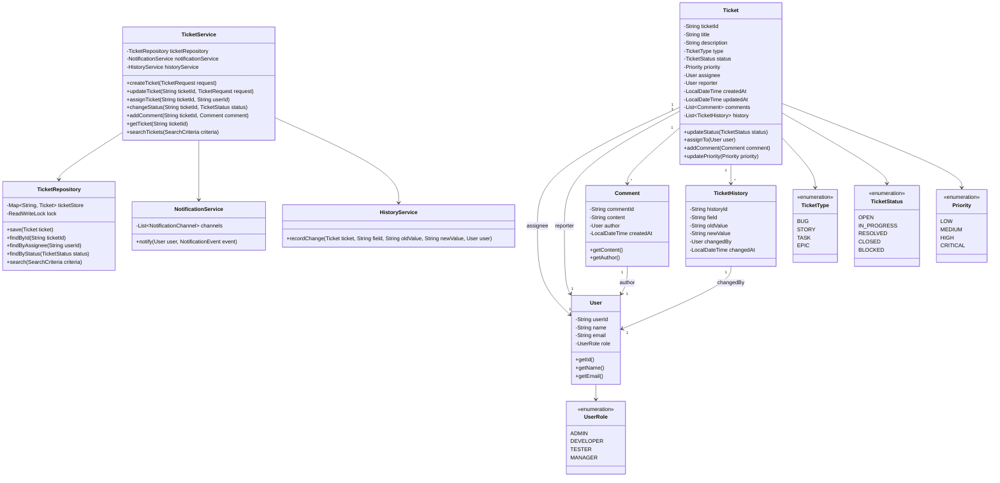

# Ticketing System - Low Level Design

## Problem Statement
Design a ticketing system (similar to JIRA) that allows users to create, update, assign, and track tickets through various statuses.

## Requirements

### Functional Requirements
- Create, update, and delete tickets
- Assign tickets to users
- Change ticket status (Open, In Progress, Resolved, Closed)
- Add comments to tickets
- Support different ticket types (Bug, Story, Task, Epic)
- Support priority levels (Low, Medium, High, Critical)
- Track ticket history/audit trail
- Search and filter tickets

### Non-Functional Requirements
- Thread-safe operations for concurrent updates
- Scalable to handle millions of tickets
- Fast retrieval and search capabilities
- Data consistency and durability

## Core Entities

### Class Diagram



## Design Patterns Used

1. **Repository Pattern**: `TicketRepository` abstracts data access
2. **Service Layer Pattern**: `TicketService` contains business logic
3. **Observer Pattern**: `NotificationService` notifies subscribers of ticket changes
4. **Builder Pattern**: For creating complex `Ticket` objects
5. **Factory Pattern**: For creating different ticket types
6. **Strategy Pattern**: For different search strategies

## Key Implementation

### Ticket.java
```java
public class Ticket {
    private final String ticketId;
    private String title;
    private String description;
    private TicketType type;
    private TicketStatus status;
    private Priority priority;
    private User assignee;
    private final User reporter;
    private final LocalDateTime createdAt;
    private LocalDateTime updatedAt;
    private final List<Comment> comments;
    private final List<TicketHistory> history;

    private Ticket(Builder builder) {
        this.ticketId = builder.ticketId;
        this.title = builder.title;
        this.description = builder.description;
        this.type = builder.type;
        this.status = TicketStatus.OPEN;
        this.priority = builder.priority;
        this.assignee = builder.assignee;
        this.reporter = builder.reporter;
        this.createdAt = LocalDateTime.now();
        this.updatedAt = LocalDateTime.now();
        this.comments = new ArrayList<>();
        this.history = new ArrayList<>();
    }

    public synchronized void updateStatus(TicketStatus newStatus, User user) {
        if (this.status == newStatus) {
            return;
        }
        TicketStatus oldStatus = this.status;
        this.status = newStatus;
        this.updatedAt = LocalDateTime.now();
        addHistory("status", oldStatus.toString(), newStatus.toString(), user);
    }

    public synchronized void assignTo(User user, User changedBy) {
        User oldAssignee = this.assignee;
        this.assignee = user;
        this.updatedAt = LocalDateTime.now();
        String oldValue = oldAssignee != null ? oldAssignee.getName() : "Unassigned";
        addHistory("assignee", oldValue, user.getName(), changedBy);
    }

    public synchronized void addComment(Comment comment) {
        this.comments.add(comment);
        this.updatedAt = LocalDateTime.now();
    }

    public synchronized void updatePriority(Priority newPriority, User user) {
        Priority oldPriority = this.priority;
        this.priority = newPriority;
        this.updatedAt = LocalDateTime.now();
        addHistory("priority", oldPriority.toString(), newPriority.toString(), user);
    }

    private void addHistory(String field, String oldValue, String newValue, User user) {
        TicketHistory historyEntry = new TicketHistory(
            UUID.randomUUID().toString(),
            field,
            oldValue,
            newValue,
            user,
            LocalDateTime.now()
        );
        this.history.add(historyEntry);
    }

    public static class Builder {
        private String ticketId;
        private String title;
        private String description;
        private TicketType type;
        private Priority priority;
        private User assignee;
        private User reporter;

        public Builder ticketId(String ticketId) {
            this.ticketId = ticketId;
            return this;
        }

        public Builder title(String title) {
            this.title = title;
            return this;
        }

        public Builder description(String description) {
            this.description = description;
            return this;
        }

        public Builder type(TicketType type) {
            this.type = type;
            return this;
        }

        public Builder priority(Priority priority) {
            this.priority = priority;
            return this;
        }

        public Builder assignee(User assignee) {
            this.assignee = assignee;
            return this;
        }

        public Builder reporter(User reporter) {
            this.reporter = reporter;
            return this;
        }

        public Ticket build() {
            if (ticketId == null || title == null || reporter == null) {
                throw new IllegalStateException("Required fields missing");
            }
            return new Ticket(this);
        }
    }
}
```

### TicketService.java
```java
public class TicketService {
    private final TicketRepository ticketRepository;
    private final NotificationService notificationService;
    private final HistoryService historyService;

    public TicketService(
            TicketRepository ticketRepository,
            NotificationService notificationService,
            HistoryService historyService) {
        this.ticketRepository = ticketRepository;
        this.notificationService = notificationService;
        this.historyService = historyService;
    }

    public Ticket createTicket(TicketRequest request) {
        String ticketId = generateTicketId();

        Ticket ticket = new Ticket.Builder()
            .ticketId(ticketId)
            .title(request.getTitle())
            .description(request.getDescription())
            .type(request.getType())
            .priority(request.getPriority())
            .reporter(request.getReporter())
            .assignee(request.getAssignee())
            .build();

        ticketRepository.save(ticket);

        if (ticket.getAssignee() != null) {
            notificationService.notify(
                ticket.getAssignee(),
                new TicketAssignedEvent(ticket)
            );
        }

        return ticket;
    }

    public void assignTicket(String ticketId, String userId, User changedBy) {
        Ticket ticket = ticketRepository.findById(ticketId)
            .orElseThrow(() -> new TicketNotFoundException(ticketId));

        User newAssignee = getUserById(userId);
        ticket.assignTo(newAssignee, changedBy);

        ticketRepository.save(ticket);

        notificationService.notify(newAssignee, new TicketAssignedEvent(ticket));
    }

    public void changeStatus(String ticketId, TicketStatus newStatus, User user) {
        Ticket ticket = ticketRepository.findById(ticketId)
            .orElseThrow(() -> new TicketNotFoundException(ticketId));

        TicketStatus oldStatus = ticket.getStatus();
        ticket.updateStatus(newStatus, user);

        ticketRepository.save(ticket);

        if (ticket.getAssignee() != null) {
            notificationService.notify(
                ticket.getAssignee(),
                new TicketStatusChangedEvent(ticket, oldStatus, newStatus)
            );
        }
    }

    public void addComment(String ticketId, Comment comment) {
        Ticket ticket = ticketRepository.findById(ticketId)
            .orElseThrow(() -> new TicketNotFoundException(ticketId));

        ticket.addComment(comment);
        ticketRepository.save(ticket);

        if (ticket.getAssignee() != null &&
            !ticket.getAssignee().equals(comment.getAuthor())) {
            notificationService.notify(
                ticket.getAssignee(),
                new CommentAddedEvent(ticket, comment)
            );
        }
    }

    public List<Ticket> searchTickets(SearchCriteria criteria) {
        return ticketRepository.search(criteria);
    }

    private String generateTicketId() {
        return "TICK-" + System.currentTimeMillis();
    }

    private User getUserById(String userId) {
        return new User(userId, "User " + userId, "user@example.com", UserRole.DEVELOPER);
    }
}
```

### TicketRepository.java
```java
public class TicketRepository {
    private final Map<String, Ticket> ticketStore;
    private final ReadWriteLock lock;
    private final Lock readLock;
    private final Lock writeLock;

    public TicketRepository() {
        this.ticketStore = new ConcurrentHashMap<>();
        this.lock = new ReentrantReadWriteLock();
        this.readLock = lock.readLock();
        this.writeLock = lock.writeLock();
    }

    public void save(Ticket ticket) {
        writeLock.lock();
        try {
            ticketStore.put(ticket.getTicketId(), ticket);
        } finally {
            writeLock.unlock();
        }
    }

    public Optional<Ticket> findById(String ticketId) {
        readLock.lock();
        try {
            return Optional.ofNullable(ticketStore.get(ticketId));
        } finally {
            readLock.unlock();
        }
    }

    public List<Ticket> findByAssignee(String userId) {
        readLock.lock();
        try {
            return ticketStore.values().stream()
                .filter(ticket -> ticket.getAssignee() != null &&
                                 ticket.getAssignee().getUserId().equals(userId))
                .collect(Collectors.toList());
        } finally {
            readLock.unlock();
        }
    }

    public List<Ticket> findByStatus(TicketStatus status) {
        readLock.lock();
        try {
            return ticketStore.values().stream()
                .filter(ticket -> ticket.getStatus() == status)
                .collect(Collectors.toList());
        } finally {
            readLock.unlock();
        }
    }

    public List<Ticket> search(SearchCriteria criteria) {
        readLock.lock();
        try {
            Stream<Ticket> stream = ticketStore.values().stream();

            if (criteria.getStatus() != null) {
                stream = stream.filter(t -> t.getStatus() == criteria.getStatus());
            }
            if (criteria.getPriority() != null) {
                stream = stream.filter(t -> t.getPriority() == criteria.getPriority());
            }
            if (criteria.getAssigneeId() != null) {
                stream = stream.filter(t -> t.getAssignee() != null &&
                    t.getAssignee().getUserId().equals(criteria.getAssigneeId()));
            }
            if (criteria.getType() != null) {
                stream = stream.filter(t -> t.getType() == criteria.getType());
            }

            return stream.collect(Collectors.toList());
        } finally {
            readLock.unlock();
        }
    }
}
```

## Sequence Diagrams

### 1. Create Ticket Flow


### 2. Update Ticket Status Flow


### 3. Add Comment Flow


### 4. Search Tickets Flow


## Database Schema

```sql
-- Tickets table
CREATE TABLE tickets (
    ticket_id VARCHAR(50) PRIMARY KEY,
    title VARCHAR(200) NOT NULL,
    description TEXT,
    type VARCHAR(20) NOT NULL,
    status VARCHAR(20) NOT NULL,
    priority VARCHAR(20) NOT NULL,
    assignee_id VARCHAR(50),
    reporter_id VARCHAR(50) NOT NULL,
    created_at TIMESTAMP NOT NULL,
    updated_at TIMESTAMP NOT NULL,
    INDEX idx_assignee (assignee_id),
    INDEX idx_status (status),
    INDEX idx_priority (priority),
    INDEX idx_created_at (created_at)
);

-- Users table
CREATE TABLE users (
    user_id VARCHAR(50) PRIMARY KEY,
    name VARCHAR(100) NOT NULL,
    email VARCHAR(100) UNIQUE NOT NULL,
    role VARCHAR(20) NOT NULL,
    INDEX idx_email (email)
);

-- Comments table
CREATE TABLE comments (
    comment_id VARCHAR(50) PRIMARY KEY,
    ticket_id VARCHAR(50) NOT NULL,
    author_id VARCHAR(50) NOT NULL,
    content TEXT NOT NULL,
    created_at TIMESTAMP NOT NULL,
    FOREIGN KEY (ticket_id) REFERENCES tickets(ticket_id),
    FOREIGN KEY (author_id) REFERENCES users(user_id),
    INDEX idx_ticket (ticket_id),
    INDEX idx_created_at (created_at)
);

-- Ticket history table
CREATE TABLE ticket_history (
    history_id VARCHAR(50) PRIMARY KEY,
    ticket_id VARCHAR(50) NOT NULL,
    field VARCHAR(50) NOT NULL,
    old_value TEXT,
    new_value TEXT,
    changed_by VARCHAR(50) NOT NULL,
    changed_at TIMESTAMP NOT NULL,
    FOREIGN KEY (ticket_id) REFERENCES tickets(ticket_id),
    FOREIGN KEY (changed_by) REFERENCES users(user_id),
    INDEX idx_ticket (ticket_id),
    INDEX idx_changed_at (changed_at)
);
```

## Thread Safety Considerations

1. **Synchronized Methods**: Critical methods in `Ticket` class are synchronized
2. **ReadWriteLock**: Used in `TicketRepository` for concurrent reads and exclusive writes
3. **ConcurrentHashMap**: Thread-safe data structure for ticket storage
4. **Immutable Fields**: Use `final` for fields that don't change

## Scalability Considerations

### Sharding Strategy
- Shard by `ticket_id` hash for uniform distribution
- Shard by `project_id` to keep project tickets together

### Caching
- Cache frequently accessed tickets using LRU cache
- Cache user information
- Invalidate cache on updates

### Indexing
- Index on `assignee_id`, `status`, `priority`, `created_at`
- Composite index on `(status, priority)` for common queries
- Full-text search index on title and description

### Performance Optimization
- Use database connection pooling
- Implement pagination for search results
- Async notifications to avoid blocking main thread
- Batch updates for bulk operations
