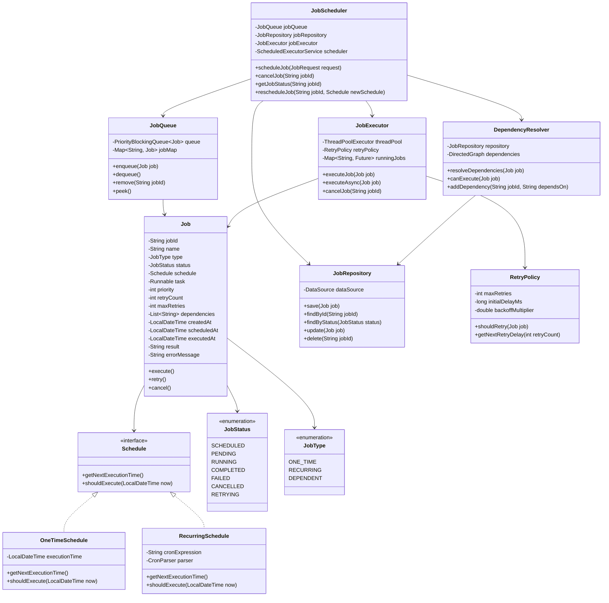
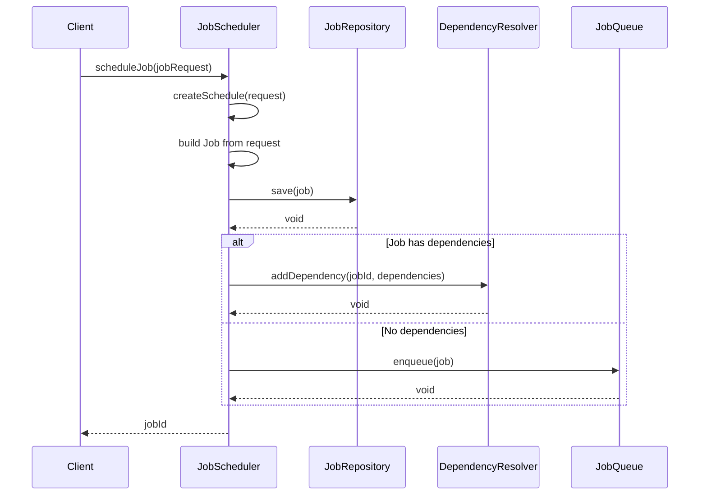
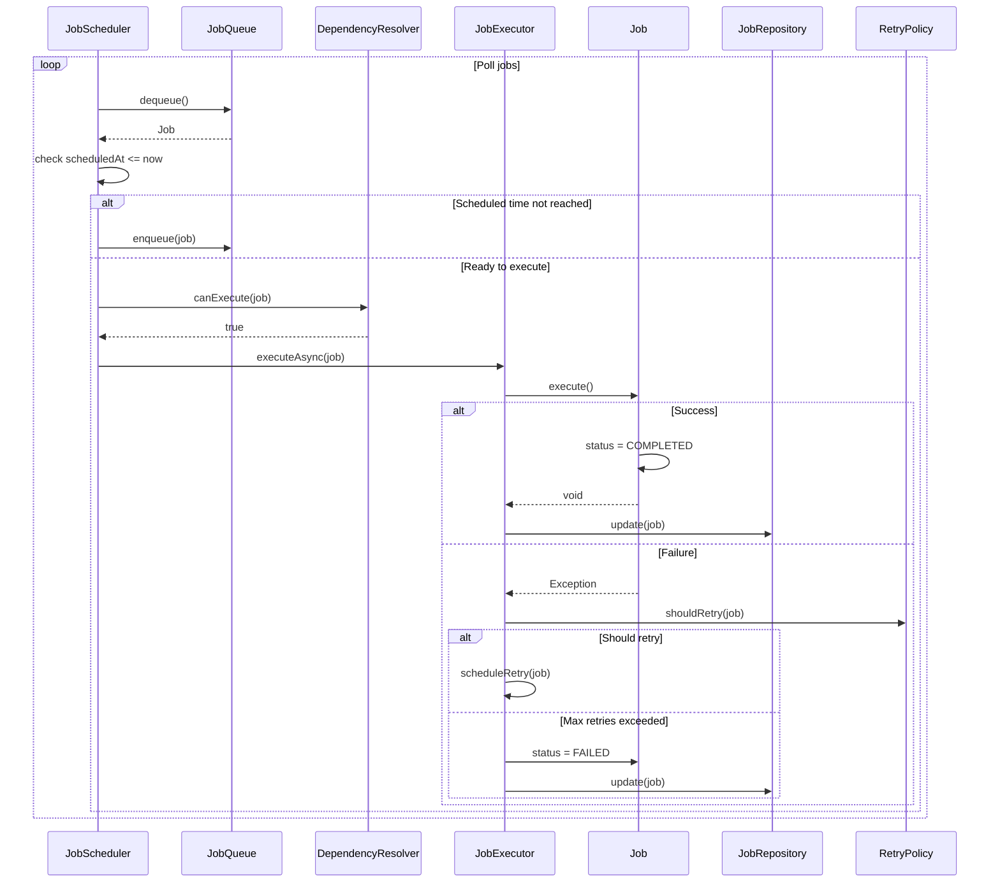
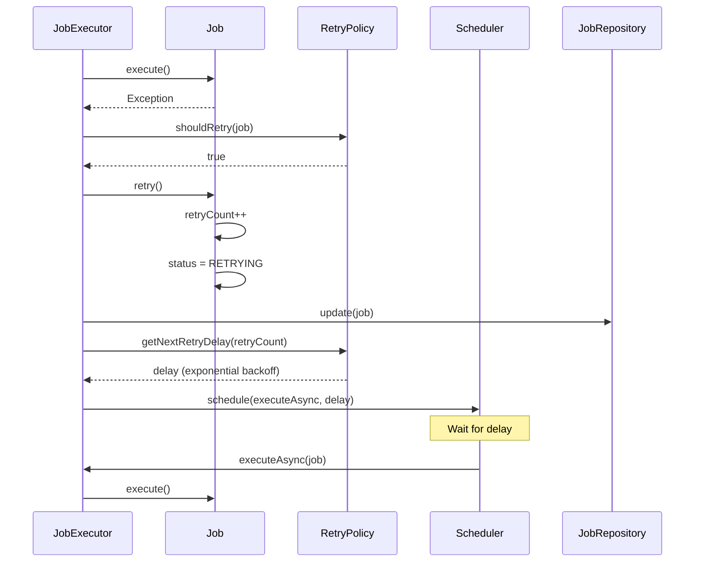

# Job Scheduler System - Low Level Design

## Problem Statement
Design a job scheduler system that can schedule and execute jobs at specific times or intervals. Support one-time jobs, recurring jobs, job dependencies, retry mechanisms, and distributed execution.

## Requirements

### Functional Requirements
- Schedule one-time jobs (run at specific time)
- Schedule recurring jobs (cron-like expressions)
- Job dependencies (job B runs after job A completes)
- Job prioritization
- Retry mechanism for failed jobs
- Job cancellation
- Job status tracking
- Distributed job execution
- Job persistence
- Concurrent job execution with limits

### Non-Functional Requirements
- Handle 100K+ jobs
- Low latency job scheduling (<100ms)
- High availability
- Fault tolerance with retry
- Thread-safe operations
- Scalable across multiple nodes

## High Level Design

### System Components

```
┌─────────────────────────────────────────────────────────┐
│                    API Layer                             │
│  scheduleJob() | cancelJob() | getJobStatus()           │
└─────────────────┬───────────────────────────────────────┘
                  │
┌─────────────────▼───────────────────────────────────────┐
│              Job Scheduler Service                       │
│  - Job validation                                        │
│  - Dependency resolution                                 │
│  - Job persistence                                       │
└─────────────────┬───────────────────────────────────────┘
                  │
        ┌─────────┴─────────┐
        │                   │
┌───────▼──────┐    ┌───────▼──────────┐
│ Job Queue    │    │  Job Repository   │
│ (Priority)   │    │  (Database/Redis) │
└───────┬──────┘    └───────────────────┘
        │
┌───────▼─────────────────────────────────┐
│        Job Executor Service              │
│  - Thread pool management                │
│  - Job execution                         │
│  - Retry handling                        │
└───────┬─────────────────────────────────┘
        │
┌───────▼──────────┐
│  Worker Threads   │
│  Execute jobs     │
└───────────────────┘
```

## Low Level Design - Class Diagram



## Key Implementation

### Job.java
```java
public class Job implements Comparable<Job> {
    private final String jobId;
    private final String name;
    private final JobType type;
    private volatile JobStatus status;
    private final Schedule schedule;
    private final Runnable task;
    private final int priority;
    private int retryCount;
    private final int maxRetries;
    private final List<String> dependencies;
    private final LocalDateTime createdAt;
    private LocalDateTime scheduledAt;
    private LocalDateTime executedAt;
    private String result;
    private String errorMessage;

    private Job(Builder builder) {
        this.jobId = builder.jobId;
        this.name = builder.name;
        this.type = builder.type;
        this.status = JobStatus.SCHEDULED;
        this.schedule = builder.schedule;
        this.task = builder.task;
        this.priority = builder.priority;
        this.retryCount = 0;
        this.maxRetries = builder.maxRetries;
        this.dependencies = builder.dependencies != null ? builder.dependencies : new ArrayList<>();
        this.createdAt = LocalDateTime.now();
        this.scheduledAt = schedule.getNextExecutionTime();
    }

    public void execute() throws Exception {
        this.status = JobStatus.RUNNING;
        this.executedAt = LocalDateTime.now();

        try {
            task.run();
            this.status = JobStatus.COMPLETED;
            this.result = "Success";
        } catch (Exception e) {
            this.status = JobStatus.FAILED;
            this.errorMessage = e.getMessage();
            throw e;
        }
    }

    public void retry() {
        this.retryCount++;
        this.status = JobStatus.RETRYING;
        this.errorMessage = null;
    }

    public void cancel() {
        this.status = JobStatus.CANCELLED;
    }

    public boolean canRetry() {
        return retryCount < maxRetries;
    }

    @Override
    public int compareTo(Job other) {
        int priorityCompare = Integer.compare(other.priority, this.priority);
        if (priorityCompare != 0) {
            return priorityCompare;
        }

        return this.scheduledAt.compareTo(other.scheduledAt);
    }

    public static class Builder {
        private String jobId;
        private String name;
        private JobType type;
        private Schedule schedule;
        private Runnable task;
        private int priority = 5;
        private int maxRetries = 3;
        private List<String> dependencies;

        public Builder jobId(String jobId) {
            this.jobId = jobId;
            return this;
        }

        public Builder name(String name) {
            this.name = name;
            return this;
        }

        public Builder type(JobType type) {
            this.type = type;
            return this;
        }

        public Builder schedule(Schedule schedule) {
            this.schedule = schedule;
            return this;
        }

        public Builder task(Runnable task) {
            this.task = task;
            return this;
        }

        public Builder priority(int priority) {
            this.priority = priority;
            return this;
        }

        public Builder maxRetries(int maxRetries) {
            this.maxRetries = maxRetries;
            return this;
        }

        public Builder dependencies(List<String> dependencies) {
            this.dependencies = dependencies;
            return this;
        }

        public Job build() {
            if (jobId == null) {
                jobId = UUID.randomUUID().toString();
            }
            if (schedule == null || task == null) {
                throw new IllegalStateException("Schedule and task are required");
            }
            return new Job(this);
        }
    }

    public String getJobId() {
        return jobId;
    }

    public JobStatus getStatus() {
        return status;
    }

    public void setStatus(JobStatus status) {
        this.status = status;
    }

    public LocalDateTime getScheduledAt() {
        return scheduledAt;
    }

    public void setScheduledAt(LocalDateTime scheduledAt) {
        this.scheduledAt = scheduledAt;
    }

    public int getRetryCount() {
        return retryCount;
    }

    public List<String> getDependencies() {
        return dependencies;
    }

    public Schedule getSchedule() {
        return schedule;
    }

    public JobType getType() {
        return type;
    }
}
```

### JobScheduler.java
```java
public class JobScheduler {
    private final JobQueue jobQueue;
    private final JobRepository jobRepository;
    private final JobExecutor jobExecutor;
    private final DependencyResolver dependencyResolver;
    private final ScheduledExecutorService scheduler;
    private volatile boolean running;

    public JobScheduler(
            JobQueue jobQueue,
            JobRepository jobRepository,
            JobExecutor jobExecutor,
            DependencyResolver dependencyResolver) {
        this.jobQueue = jobQueue;
        this.jobRepository = jobRepository;
        this.jobExecutor = jobExecutor;
        this.dependencyResolver = dependencyResolver;
        this.scheduler = Executors.newScheduledThreadPool(2);
        this.running = true;

        startScheduling();
    }

    public String scheduleJob(JobRequest request) {
        Schedule schedule = createSchedule(request);

        Job job = new Job.Builder()
            .name(request.getName())
            .type(request.getType())
            .schedule(schedule)
            .task(request.getTask())
            .priority(request.getPriority())
            .maxRetries(request.getMaxRetries())
            .dependencies(request.getDependencies())
            .build();

        jobRepository.save(job);

        if (job.getDependencies().isEmpty()) {
            jobQueue.enqueue(job);
        } else {
            dependencyResolver.addDependency(job.getJobId(), job.getDependencies());
        }

        return job.getJobId();
    }

    public void cancelJob(String jobId) {
        Job job = jobRepository.findById(jobId);
        if (job != null) {
            job.cancel();
            jobRepository.update(job);
            jobQueue.remove(jobId);
            jobExecutor.cancelJob(jobId);
        }
    }

    public JobStatus getJobStatus(String jobId) {
        Job job = jobRepository.findById(jobId);
        return job != null ? job.getStatus() : null;
    }

    public void rescheduleJob(String jobId, Schedule newSchedule) {
        Job job = jobRepository.findById(jobId);
        if (job != null && job.getType() == JobType.RECURRING) {
            job.setScheduledAt(newSchedule.getNextExecutionTime());
            jobRepository.update(job);
        }
    }

    private void startScheduling() {
        scheduler.scheduleAtFixedRate(this::pollAndExecuteJobs, 0, 1, TimeUnit.SECONDS);

        scheduler.scheduleAtFixedRate(this::checkRecurringJobs, 0, 10, TimeUnit.SECONDS);
    }

    private void pollAndExecuteJobs() {
        try {
            while (running) {
                Job job = jobQueue.dequeue();
                if (job == null) {
                    break;
                }

                LocalDateTime now = LocalDateTime.now();
                if (job.getScheduledAt().isAfter(now)) {
                    jobQueue.enqueue(job);
                    break;
                }

                if (!dependencyResolver.canExecute(job)) {
                    job.setStatus(JobStatus.PENDING);
                    jobRepository.update(job);
                    continue;
                }

                jobExecutor.executeAsync(job);
            }
        } catch (Exception e) {
            System.err.println("Error polling jobs: " + e.getMessage());
        }
    }

    private void checkRecurringJobs() {
        List<Job> recurringJobs = jobRepository.findByType(JobType.RECURRING);

        for (Job job : recurringJobs) {
            if (job.getStatus() == JobStatus.COMPLETED) {
                LocalDateTime nextExecution = job.getSchedule().getNextExecutionTime();
                job.setScheduledAt(nextExecution);
                job.setStatus(JobStatus.SCHEDULED);
                jobRepository.update(job);
                jobQueue.enqueue(job);
            }
        }
    }

    private Schedule createSchedule(JobRequest request) {
        if (request.getType() == JobType.ONE_TIME) {
            return new OneTimeSchedule(request.getExecutionTime());
        } else {
            return new RecurringSchedule(request.getCronExpression());
        }
    }

    public void shutdown() {
        running = false;
        scheduler.shutdown();
        jobExecutor.shutdown();
    }
}
```

### JobExecutor.java
```java
public class JobExecutor {
    private final ThreadPoolExecutor threadPool;
    private final RetryPolicy retryPolicy;
    private final Map<String, Future<?>> runningJobs;
    private final JobRepository jobRepository;
    private final ScheduledExecutorService retryScheduler;

    public JobExecutor(int corePoolSize, int maxPoolSize, RetryPolicy retryPolicy, JobRepository repository) {
        this.threadPool = new ThreadPoolExecutor(
            corePoolSize,
            maxPoolSize,
            60L,
            TimeUnit.SECONDS,
            new LinkedBlockingQueue<>(),
            new ThreadPoolExecutor.CallerRunsPolicy()
        );
        this.retryPolicy = retryPolicy;
        this.runningJobs = new ConcurrentHashMap<>();
        this.jobRepository = repository;
        this.retryScheduler = Executors.newScheduledThreadPool(2);
    }

    public void executeJob(Job job) {
        try {
            job.execute();
            jobRepository.update(job);

        } catch (Exception e) {
            handleJobFailure(job, e);
        } finally {
            runningJobs.remove(job.getJobId());
        }
    }

    public CompletableFuture<Void> executeAsync(Job job) {
        CompletableFuture<Void> future = CompletableFuture.runAsync(
            () -> executeJob(job),
            threadPool
        );

        runningJobs.put(job.getJobId(), (Future<?>) future);
        return future;
    }

    private void handleJobFailure(Job job, Exception e) {
        System.err.println("Job " + job.getJobId() + " failed: " + e.getMessage());

        if (retryPolicy.shouldRetry(job)) {
            scheduleRetry(job);
        } else {
            job.setStatus(JobStatus.FAILED);
            jobRepository.update(job);
        }
    }

    private void scheduleRetry(Job job) {
        job.retry();
        jobRepository.update(job);

        long delay = retryPolicy.getNextRetryDelay(job.getRetryCount());

        retryScheduler.schedule(
            () -> executeAsync(job),
            delay,
            TimeUnit.MILLISECONDS
        );
    }

    public void cancelJob(String jobId) {
        Future<?> future = runningJobs.get(jobId);
        if (future != null && !future.isDone()) {
            future.cancel(true);
            runningJobs.remove(jobId);
        }
    }

    public void shutdown() {
        threadPool.shutdown();
        retryScheduler.shutdown();
    }
}
```

### RecurringSchedule.java
```java
public class RecurringSchedule implements Schedule {
    private final String cronExpression;
    private final CronParser parser;

    public RecurringSchedule(String cronExpression) {
        this.cronExpression = cronExpression;
        this.parser = new CronParser();
    }

    @Override
    public LocalDateTime getNextExecutionTime() {
        return parser.getNextExecution(cronExpression, LocalDateTime.now());
    }

    @Override
    public boolean shouldExecute(LocalDateTime now) {
        LocalDateTime nextExecution = getNextExecutionTime();
        return nextExecution.isBefore(now) || nextExecution.isEqual(now);
    }

    public String getCronExpression() {
        return cronExpression;
    }
}

public class CronParser {
    public LocalDateTime getNextExecution(String cronExpression, LocalDateTime from) {
        String[] parts = cronExpression.split(" ");

        if (parts.length != 5) {
            throw new IllegalArgumentException("Invalid cron expression");
        }

        int minute = parseField(parts[0], 0, 59);
        int hour = parseField(parts[1], 0, 23);
        int dayOfMonth = parseField(parts[2], 1, 31);
        int month = parseField(parts[3], 1, 12);
        int dayOfWeek = parseField(parts[4], 0, 6);

        LocalDateTime next = from.plusMinutes(1);

        while (true) {
            if (matches(next, minute, hour, dayOfMonth, month, dayOfWeek)) {
                return next;
            }
            next = next.plusMinutes(1);

            if (next.isAfter(from.plusYears(1))) {
                throw new IllegalStateException("Could not find next execution time");
            }
        }
    }

    private int parseField(String field, int min, int max) {
        if ("*".equals(field)) {
            return -1;
        }
        return Integer.parseInt(field);
    }

    private boolean matches(LocalDateTime time, int minute, int hour, int day, int month, int dayOfWeek) {
        return (minute == -1 || time.getMinute() == minute) &&
               (hour == -1 || time.getHour() == hour) &&
               (day == -1 || time.getDayOfMonth() == day) &&
               (month == -1 || time.getMonthValue() == month);
    }
}
```

### DependencyResolver.java
```java
public class DependencyResolver {
    private final JobRepository repository;
    private final Map<String, List<String>> dependencies;
    private final ReadWriteLock lock;

    public DependencyResolver(JobRepository repository) {
        this.repository = repository;
        this.dependencies = new ConcurrentHashMap<>();
        this.lock = new ReentrantReadWriteLock();
    }

    public void addDependency(String jobId, List<String> dependsOn) {
        lock.writeLock().lock();
        try {
            dependencies.put(jobId, new ArrayList<>(dependsOn));
        } finally {
            lock.writeLock().unlock();
        }
    }

    public boolean canExecute(Job job) {
        lock.readLock().lock();
        try {
            List<String> jobDependencies = dependencies.get(job.getJobId());

            if (jobDependencies == null || jobDependencies.isEmpty()) {
                return true;
            }

            for (String dependencyId : jobDependencies) {
                Job dependency = repository.findById(dependencyId);

                if (dependency == null || dependency.getStatus() != JobStatus.COMPLETED) {
                    return false;
                }
            }

            return true;
        } finally {
            lock.readLock().unlock();
        }
    }

    public void resolveDependencies(Job job) {
        if (canExecute(job)) {
            lock.writeLock().lock();
            try {
                dependencies.remove(job.getJobId());
            } finally {
                lock.writeLock().unlock();
            }
        }
    }
}
```

## Sequence Diagrams

### 1. Schedule Job Flow



### 2. Execute Job Flow



### 3. Retry Flow



## Database Schema

```sql
CREATE TABLE jobs (
    job_id VARCHAR(50) PRIMARY KEY,
    name VARCHAR(200) NOT NULL,
    type VARCHAR(20) NOT NULL,
    status VARCHAR(20) NOT NULL,
    schedule_json JSON NOT NULL,
    priority INT DEFAULT 5,
    retry_count INT DEFAULT 0,
    max_retries INT DEFAULT 3,
    dependencies JSON,
    created_at TIMESTAMP DEFAULT CURRENT_TIMESTAMP,
    scheduled_at TIMESTAMP NOT NULL,
    executed_at TIMESTAMP,
    result TEXT,
    error_message TEXT,
    INDEX idx_status (status),
    INDEX idx_scheduled_at (scheduled_at),
    INDEX idx_type_status (type, status)
);

CREATE TABLE job_executions (
    execution_id BIGINT AUTO_INCREMENT PRIMARY KEY,
    job_id VARCHAR(50) NOT NULL,
    started_at TIMESTAMP NOT NULL,
    completed_at TIMESTAMP,
    status VARCHAR(20) NOT NULL,
    result TEXT,
    error_message TEXT,
    FOREIGN KEY (job_id) REFERENCES jobs(job_id),
    INDEX idx_job_id (job_id),
    INDEX idx_started_at (started_at)
);
```

## Thread Safety & Scalability

### Thread Safety
- ConcurrentHashMap for job storage
- PriorityBlockingQueue for job queue
- ReadWriteLock in DependencyResolver
- ThreadPoolExecutor for concurrent execution

### Scalability
- Distributed job queue (Redis/RabbitMQ)
- Leader election for scheduler
- Horizontal scaling of executors
- Database sharding by job_id
- Partition jobs by priority/type
