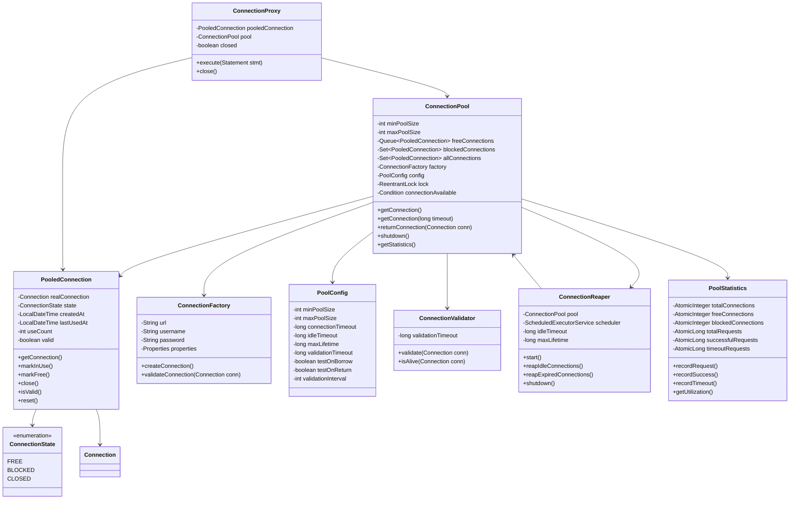
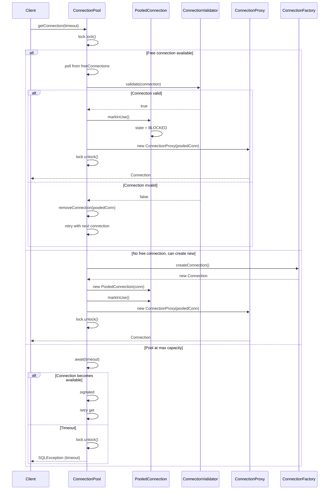
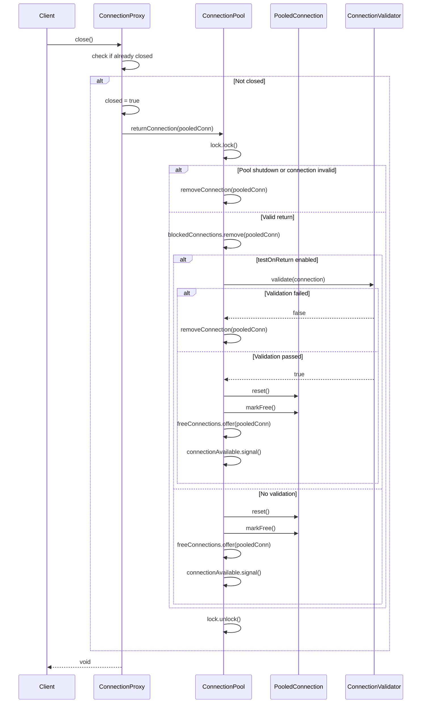
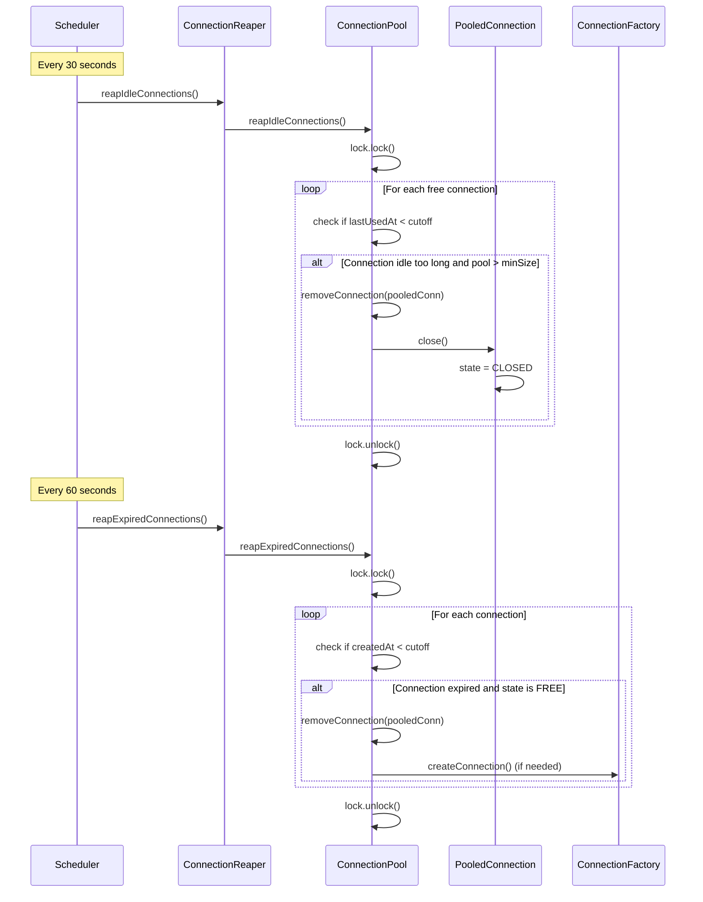

# Connection Pool Manager - Low Level Design

## Problem Statement
Design a database connection pool manager that maintains a pool of reusable database connections with states (FREE, BLOCKED, CLOSED), supports configurable pool size (1000-2000 connections), connection timeouts, health checks, and efficient connection get/return operations.

## Requirements

### Functional Requirements
- Maintain pool of database connections
- Connection states: FREE, BLOCKED, CLOSED
- Get connection from pool
- Return connection to pool
- Connection validation/health check
- Connection timeout handling
- Maximum connections limit (1000-2000)
- Connection lifetime management
- Pool statistics and monitoring
- Graceful shutdown

### Non-Functional Requirements
- Thread-safe operations
- Low latency connection acquisition (<10ms)
- Handle high concurrency (1000+ concurrent requests)
- Automatic connection recovery
- Resource leak prevention
- Connection reuse optimization

## Core Entities

### Class Diagram



## Design Patterns Used

1. **Object Pool Pattern**: Reusing database connections
2. **Proxy Pattern**: ConnectionProxy wraps real connection
3. **Factory Pattern**: ConnectionFactory creates connections
4. **Singleton Pattern**: Single pool instance per datasource
5. **State Pattern**: Connection states (FREE, BLOCKED, CLOSED)
6. **Strategy Pattern**: Different validation strategies

## Key Implementation

### ConnectionPool.java
```java
public class ConnectionPool {
    private final int minPoolSize;
    private final int maxPoolSize;
    private final Queue<PooledConnection> freeConnections;
    private final Set<PooledConnection> blockedConnections;
    private final Set<PooledConnection> allConnections;
    private final ConnectionFactory factory;
    private final PoolConfig config;
    private final ReentrantLock lock;
    private final Condition connectionAvailable;
    private final ConnectionValidator validator;
    private final ConnectionReaper reaper;
    private final PoolStatistics statistics;
    private volatile boolean shutdown;

    public ConnectionPool(ConnectionFactory factory, PoolConfig config) {
        this.factory = factory;
        this.config = config;
        this.minPoolSize = config.getMinPoolSize();
        this.maxPoolSize = config.getMaxPoolSize();
        this.freeConnections = new LinkedList<>();
        this.blockedConnections = new HashSet<>();
        this.allConnections = new HashSet<>();
        this.lock = new ReentrantLock(true);
        this.connectionAvailable = lock.newCondition();
        this.validator = new ConnectionValidator(config.getValidationTimeout());
        this.statistics = new PoolStatistics();
        this.shutdown = false;

        initializePool();

        this.reaper = new ConnectionReaper(this, config);
        this.reaper.start();
    }

    private void initializePool() {
        lock.lock();
        try {
            for (int i = 0; i < minPoolSize; i++) {
                PooledConnection pooledConn = createNewConnection();
                if (pooledConn != null) {
                    freeConnections.offer(pooledConn);
                    allConnections.add(pooledConn);
                }
            }
            System.out.println("Connection pool initialized with " + minPoolSize + " connections");
        } finally {
            lock.unlock();
        }
    }

    public Connection getConnection() throws SQLException {
        return getConnection(config.getConnectionTimeout());
    }

    public Connection getConnection(long timeoutMs) throws SQLException {
        if (shutdown) {
            throw new SQLException("Connection pool has been shutdown");
        }

        statistics.recordRequest();
        long startTime = System.currentTimeMillis();
        long deadline = startTime + timeoutMs;

        lock.lock();
        try {
            while (true) {
                PooledConnection pooledConn = freeConnections.poll();

                if (pooledConn != null) {
                    if (isConnectionValid(pooledConn)) {
                        return prepareConnection(pooledConn);
                    } else {
                        removeConnection(pooledConn);
                        continue;
                    }
                }

                if (allConnections.size() < maxPoolSize) {
                    pooledConn = createNewConnection();
                    if (pooledConn != null) {
                        allConnections.add(pooledConn);
                        return prepareConnection(pooledConn);
                    }
                }

                long remainingTime = deadline - System.currentTimeMillis();
                if (remainingTime <= 0) {
                    statistics.recordTimeout();
                    throw new SQLException("Connection timeout: Could not get connection in " + timeoutMs + "ms");
                }

                try {
                    connectionAvailable.await(remainingTime, TimeUnit.MILLISECONDS);
                } catch (InterruptedException e) {
                    Thread.currentThread().interrupt();
                    throw new SQLException("Interrupted while waiting for connection");
                }
            }
        } finally {
            lock.unlock();
        }
    }

    private Connection prepareConnection(PooledConnection pooledConn) {
        pooledConn.markInUse();
        blockedConnections.add(pooledConn);
        statistics.recordSuccess();
        statistics.updateCounts(freeConnections.size(), blockedConnections.size());

        return new ConnectionProxy(pooledConn, this);
    }

    public void returnConnection(PooledConnection pooledConn) {
        if (pooledConn == null) {
            return;
        }

        lock.lock();
        try {
            if (shutdown || !pooledConn.isValid()) {
                removeConnection(pooledConn);
                return;
            }

            blockedConnections.remove(pooledConn);

            if (config.isTestOnReturn() && !validator.validate(pooledConn.getRealConnection())) {
                removeConnection(pooledConn);
                return;
            }

            pooledConn.reset();
            pooledConn.markFree();
            freeConnections.offer(pooledConn);

            statistics.updateCounts(freeConnections.size(), blockedConnections.size());

            connectionAvailable.signal();

        } finally {
            lock.unlock();
        }
    }

    private PooledConnection createNewConnection() {
        try {
            Connection realConn = factory.createConnection();
            PooledConnection pooledConn = new PooledConnection(realConn);
            System.out.println("Created new connection. Total: " + (allConnections.size() + 1));
            return pooledConn;
        } catch (SQLException e) {
            System.err.println("Failed to create connection: " + e.getMessage());
            return null;
        }
    }

    private boolean isConnectionValid(PooledConnection pooledConn) {
        if (!pooledConn.isValid()) {
            return false;
        }

        if (config.isTestOnBorrow()) {
            return validator.validate(pooledConn.getRealConnection());
        }

        return true;
    }

    void removeConnection(PooledConnection pooledConn) {
        lock.lock();
        try {
            pooledConn.close();
            allConnections.remove(pooledConn);
            freeConnections.remove(pooledConn);
            blockedConnections.remove(pooledConn);

            statistics.updateCounts(freeConnections.size(), blockedConnections.size());

            System.out.println("Removed connection. Total: " + allConnections.size());
        } finally {
            lock.unlock();
        }
    }

    void reapIdleConnections() {
        lock.lock();
        try {
            long idleTimeout = config.getIdleTimeout();
            LocalDateTime cutoff = LocalDateTime.now().minusSeconds(idleTimeout / 1000);

            List<PooledConnection> toRemove = new ArrayList<>();

            for (PooledConnection conn : freeConnections) {
                if (conn.getLastUsedAt().isBefore(cutoff) && allConnections.size() > minPoolSize) {
                    toRemove.add(conn);
                }
            }

            for (PooledConnection conn : toRemove) {
                removeConnection(conn);
            }

        } finally {
            lock.unlock();
        }
    }

    void reapExpiredConnections() {
        lock.lock();
        try {
            long maxLifetime = config.getMaxLifetime();
            LocalDateTime cutoff = LocalDateTime.now().minusSeconds(maxLifetime / 1000);

            List<PooledConnection> toRemove = new ArrayList<>();

            for (PooledConnection conn : allConnections) {
                if (conn.getCreatedAt().isBefore(cutoff)) {
                    toRemove.add(conn);
                }
            }

            for (PooledConnection conn : toRemove) {
                if (conn.getState() == ConnectionState.FREE) {
                    removeConnection(conn);

                    if (allConnections.size() < minPoolSize) {
                        PooledConnection newConn = createNewConnection();
                        if (newConn != null) {
                            freeConnections.offer(newConn);
                            allConnections.add(newConn);
                        }
                    }
                }
            }

        } finally {
            lock.unlock();
        }
    }

    public void shutdown() {
        lock.lock();
        try {
            shutdown = true;

            reaper.shutdown();

            for (PooledConnection conn : allConnections) {
                conn.close();
            }

            freeConnections.clear();
            blockedConnections.clear();
            allConnections.clear();

            System.out.println("Connection pool shutdown complete");

        } finally {
            lock.unlock();
        }
    }

    public PoolStatistics getStatistics() {
        statistics.updateCounts(freeConnections.size(), blockedConnections.size());
        return statistics;
    }

    public int getTotalConnections() {
        lock.lock();
        try {
            return allConnections.size();
        } finally {
            lock.unlock();
        }
    }

    public int getFreeConnections() {
        lock.lock();
        try {
            return freeConnections.size();
        } finally {
            lock.unlock();
        }
    }

    public int getBlockedConnections() {
        lock.lock();
        try {
            return blockedConnections.size();
        } finally {
            lock.unlock();
        }
    }
}
```

### PooledConnection.java
```java
public class PooledConnection {
    private final Connection realConnection;
    private volatile ConnectionState state;
    private final LocalDateTime createdAt;
    private volatile LocalDateTime lastUsedAt;
    private final AtomicInteger useCount;
    private volatile boolean valid;

    public PooledConnection(Connection realConnection) {
        this.realConnection = realConnection;
        this.state = ConnectionState.FREE;
        this.createdAt = LocalDateTime.now();
        this.lastUsedAt = LocalDateTime.now();
        this.useCount = new AtomicInteger(0);
        this.valid = true;
    }

    public Connection getRealConnection() {
        return realConnection;
    }

    public void markInUse() {
        this.state = ConnectionState.BLOCKED;
        this.lastUsedAt = LocalDateTime.now();
        this.useCount.incrementAndGet();
    }

    public void markFree() {
        this.state = ConnectionState.FREE;
        this.lastUsedAt = LocalDateTime.now();
    }

    public void close() {
        this.state = ConnectionState.CLOSED;
        this.valid = false;

        try {
            if (realConnection != null && !realConnection.isClosed()) {
                realConnection.close();
            }
        } catch (SQLException e) {
            System.err.println("Error closing real connection: " + e.getMessage());
        }
    }

    public boolean isValid() {
        if (!valid || state == ConnectionState.CLOSED) {
            return false;
        }

        try {
            return realConnection != null && !realConnection.isClosed();
        } catch (SQLException e) {
            return false;
        }
    }

    public void reset() {
        try {
            if (realConnection != null && !realConnection.getAutoCommit()) {
                realConnection.rollback();
                realConnection.setAutoCommit(true);
            }

            if (realConnection != null && realConnection.isReadOnly()) {
                realConnection.setReadOnly(false);
            }

        } catch (SQLException e) {
            System.err.println("Error resetting connection: " + e.getMessage());
            this.valid = false;
        }
    }

    public ConnectionState getState() {
        return state;
    }

    public LocalDateTime getCreatedAt() {
        return createdAt;
    }

    public LocalDateTime getLastUsedAt() {
        return lastUsedAt;
    }

    public int getUseCount() {
        return useCount.get();
    }
}
```

### ConnectionProxy.java
```java
public class ConnectionProxy implements Connection {
    private final PooledConnection pooledConnection;
    private final ConnectionPool pool;
    private volatile boolean closed;

    public ConnectionProxy(PooledConnection pooledConnection, ConnectionPool pool) {
        this.pooledConnection = pooledConnection;
        this.pool = pool;
        this.closed = false;
    }

    @Override
    public void close() throws SQLException {
        if (closed) {
            return;
        }

        closed = true;
        pool.returnConnection(pooledConnection);
    }

    @Override
    public Statement createStatement() throws SQLException {
        checkClosed();
        return pooledConnection.getRealConnection().createStatement();
    }

    @Override
    public PreparedStatement prepareStatement(String sql) throws SQLException {
        checkClosed();
        return pooledConnection.getRealConnection().prepareStatement(sql);
    }

    @Override
    public void commit() throws SQLException {
        checkClosed();
        pooledConnection.getRealConnection().commit();
    }

    @Override
    public void rollback() throws SQLException {
        checkClosed();
        pooledConnection.getRealConnection().rollback();
    }

    @Override
    public boolean isClosed() throws SQLException {
        return closed;
    }

    private void checkClosed() throws SQLException {
        if (closed) {
            throw new SQLException("Connection has been closed");
        }
    }
}
```

### ConnectionValidator.java
```java
public class ConnectionValidator {
    private final long validationTimeout;

    public ConnectionValidator(long validationTimeout) {
        this.validationTimeout = validationTimeout;
    }

    public boolean validate(Connection connection) {
        if (connection == null) {
            return false;
        }

        try {
            return connection.isValid((int) (validationTimeout / 1000));
        } catch (SQLException e) {
            return false;
        }
    }

    public boolean isAlive(Connection connection) {
        if (connection == null) {
            return false;
        }

        try {
            if (connection.isClosed()) {
                return false;
            }

            try (Statement stmt = connection.createStatement()) {
                stmt.executeQuery("SELECT 1");
                return true;
            }

        } catch (SQLException e) {
            return false;
        }
    }
}
```

### ConnectionReaper.java
```java
public class ConnectionReaper {
    private final ConnectionPool pool;
    private final ScheduledExecutorService scheduler;
    private final long idleTimeout;
    private final long maxLifetime;

    public ConnectionReaper(ConnectionPool pool, PoolConfig config) {
        this.pool = pool;
        this.scheduler = Executors.newScheduledThreadPool(1);
        this.idleTimeout = config.getIdleTimeout();
        this.maxLifetime = config.getMaxLifetime();
    }

    public void start() {
        scheduler.scheduleAtFixedRate(
            this::reapIdleConnections,
            30,
            30,
            TimeUnit.SECONDS
        );

        scheduler.scheduleAtFixedRate(
            this::reapExpiredConnections,
            60,
            60,
            TimeUnit.SECONDS
        );
    }

    private void reapIdleConnections() {
        try {
            pool.reapIdleConnections();
        } catch (Exception e) {
            System.err.println("Error reaping idle connections: " + e.getMessage());
        }
    }

    private void reapExpiredConnections() {
        try {
            pool.reapExpiredConnections();
        } catch (Exception e) {
            System.err.println("Error reaping expired connections: " + e.getMessage());
        }
    }

    public void shutdown() {
        scheduler.shutdown();
        try {
            scheduler.awaitTermination(5, TimeUnit.SECONDS);
        } catch (InterruptedException e) {
            scheduler.shutdownNow();
        }
    }
}
```

### PoolStatistics.java
```java
public class PoolStatistics {
    private final AtomicInteger totalConnections;
    private final AtomicInteger freeConnections;
    private final AtomicInteger blockedConnections;
    private final AtomicLong totalRequests;
    private final AtomicLong successfulRequests;
    private final AtomicLong timeoutRequests;

    public PoolStatistics() {
        this.totalConnections = new AtomicInteger(0);
        this.freeConnections = new AtomicInteger(0);
        this.blockedConnections = new AtomicInteger(0);
        this.totalRequests = new AtomicLong(0);
        this.successfulRequests = new AtomicLong(0);
        this.timeoutRequests = new AtomicLong(0);
    }

    public void recordRequest() {
        totalRequests.incrementAndGet();
    }

    public void recordSuccess() {
        successfulRequests.incrementAndGet();
    }

    public void recordTimeout() {
        timeoutRequests.incrementAndGet();
    }

    public void updateCounts(int free, int blocked) {
        this.freeConnections.set(free);
        this.blockedConnections.set(blocked);
        this.totalConnections.set(free + blocked);
    }

    public double getUtilization() {
        int total = totalConnections.get();
        if (total == 0) {
            return 0.0;
        }
        return (double) blockedConnections.get() / total * 100;
    }

    public double getSuccessRate() {
        long total = totalRequests.get();
        if (total == 0) {
            return 100.0;
        }
        return (double) successfulRequests.get() / total * 100;
    }

    @Override
    public String toString() {
        return String.format(
            "PoolStatistics{total=%d, free=%d, blocked=%d, utilization=%.2f%%, " +
            "totalRequests=%d, successful=%d, timeouts=%d, successRate=%.2f%%}",
            totalConnections.get(),
            freeConnections.get(),
            blockedConnections.get(),
            getUtilization(),
            totalRequests.get(),
            successfulRequests.get(),
            timeoutRequests.get(),
            getSuccessRate()
        );
    }
}
```

## Sequence Diagrams

### 1. Get Connection Flow



### 2. Return Connection Flow



### 3. Connection Reaper Flow



## Thread Safety Considerations

1. **ReentrantLock**: Main lock for pool operations
2. **Condition Variables**: For waiting/signaling connection availability
3. **Atomic Variables**: For statistics counters
4. **Volatile Fields**: For state and flags
5. **Synchronized Collections**: Queue and sets for connections
6. **Lock Fairness**: ReentrantLock(true) for fair acquisition

## Performance Optimizations

1. **Connection Reuse**: Avoid creating new connections
2. **Lazy Validation**: Only validate when configured
3. **Efficient Queue**: LinkedList for O(1) poll/offer
4. **Lock Splitting**: Separate read/write operations if needed
5. **Fast Path**: Skip validation for trusted connections

## Usage Example

```java
public class ConnectionPoolDemo {
    public static void main(String[] args) throws SQLException {
        PoolConfig config = new PoolConfig.Builder()
            .minPoolSize(10)
            .maxPoolSize(100)
            .connectionTimeout(5000)
            .idleTimeout(600000)
            .maxLifetime(1800000)
            .testOnBorrow(true)
            .build();

        ConnectionFactory factory = new ConnectionFactory(
            "jdbc:mysql://localhost:3306/mydb",
            "user",
            "password"
        );

        ConnectionPool pool = new ConnectionPool(factory, config);

        try (Connection conn = pool.getConnection()) {
            PreparedStatement stmt = conn.prepareStatement("SELECT * FROM users WHERE id = ?");
            stmt.setInt(1, 1);
            ResultSet rs = stmt.executeQuery();
        }

        System.out.println(pool.getStatistics());

        pool.shutdown();
    }
}
```
