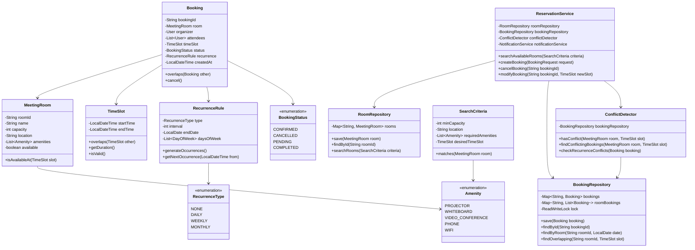
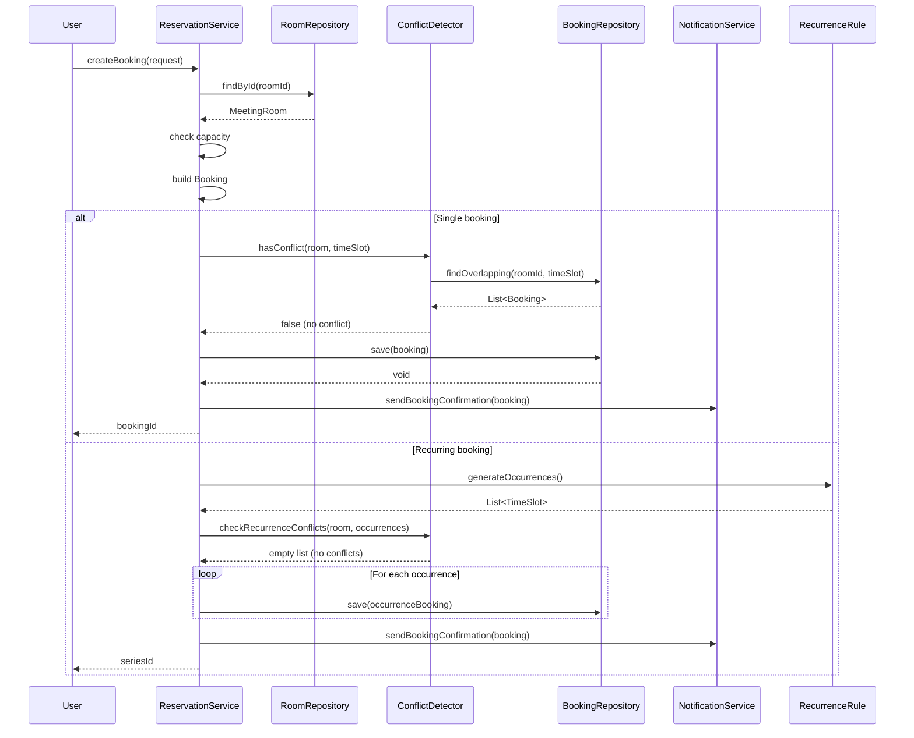
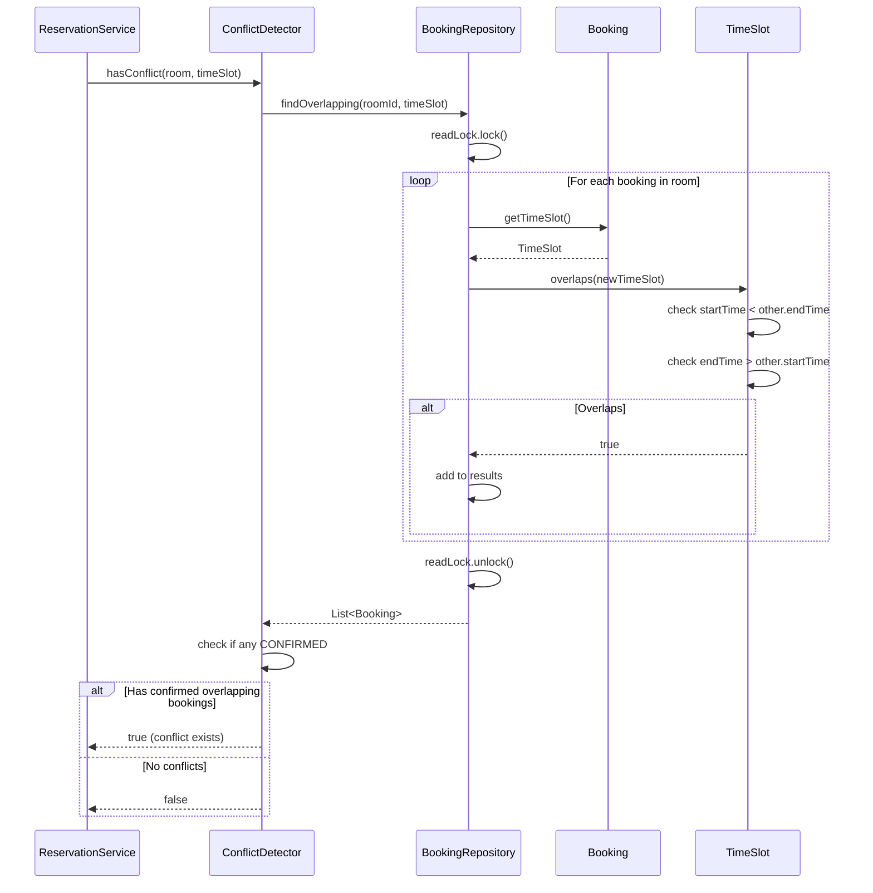
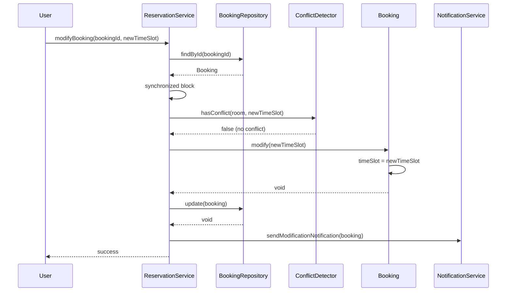

# Meeting Room Reservation System - Low Level Design

## Problem Statement
Design a meeting room reservation system that allows employees to book meeting rooms, handles conflicts, supports recurring meetings, manages room capacity, and provides efficient search and booking capabilities.

## Requirements

### Functional Requirements
- Browse available meeting rooms
- Book meeting rooms for specific time slots
- Cancel/modify bookings
- Handle booking conflicts
- Support recurring meetings (daily, weekly, monthly)
- Room capacity management
- Search rooms by capacity, location, amenities
- Notification for booking confirmations
- Waitlist for fully booked rooms
- Room availability checking

### Non-Functional Requirements
- Handle 1000+ concurrent bookings
- Low latency for conflict detection (<100ms)
- High availability
- Thread-safe operations
- Prevent double booking
- Support 100+ meeting rooms

## Core Entities

### Class Diagram



## Design Patterns Used

1. **Repository Pattern**: RoomRepository, BookingRepository
2. **Strategy Pattern**: Different recurrence strategies
3. **Factory Pattern**: Creating recurring bookings
4. **Observer Pattern**: Booking notifications
5. **Builder Pattern**: Complex booking creation

## Key Implementation

### Booking.java
```java
public class Booking {
    private final String bookingId;
    private final MeetingRoom room;
    private final User organizer;
    private final List<User> attendees;
    private TimeSlot timeSlot;
    private BookingStatus status;
    private final RecurrenceRule recurrence;
    private final LocalDateTime createdAt;
    private String cancellationReason;

    private Booking(Builder builder) {
        this.bookingId = builder.bookingId;
        this.room = builder.room;
        this.organizer = builder.organizer;
        this.attendees = builder.attendees != null ? builder.attendees : new ArrayList<>();
        this.timeSlot = builder.timeSlot;
        this.status = BookingStatus.CONFIRMED;
        this.recurrence = builder.recurrence;
        this.createdAt = LocalDateTime.now();
    }

    public boolean overlaps(Booking other) {
        if (!this.room.getRoomId().equals(other.room.getRoomId())) {
            return false;
        }

        return this.timeSlot.overlaps(other.timeSlot);
    }

    public synchronized void cancel(String reason) {
        if (this.status == BookingStatus.CANCELLED) {
            throw new IllegalStateException("Booking already cancelled");
        }

        this.status = BookingStatus.CANCELLED;
        this.cancellationReason = reason;
    }

    public synchronized void modify(TimeSlot newTimeSlot) {
        this.timeSlot = newTimeSlot;
    }

    public boolean isRecurring() {
        return recurrence != null && recurrence.getType() != RecurrenceType.NONE;
    }

    public static class Builder {
        private String bookingId;
        private MeetingRoom room;
        private User organizer;
        private List<User> attendees;
        private TimeSlot timeSlot;
        private RecurrenceRule recurrence;

        public Builder bookingId(String bookingId) {
            this.bookingId = bookingId;
            return this;
        }

        public Builder room(MeetingRoom room) {
            this.room = room;
            return this;
        }

        public Builder organizer(User organizer) {
            this.organizer = organizer;
            return this;
        }

        public Builder attendees(List<User> attendees) {
            this.attendees = attendees;
            return this;
        }

        public Builder timeSlot(TimeSlot timeSlot) {
            this.timeSlot = timeSlot;
            return this;
        }

        public Builder recurrence(RecurrenceRule recurrence) {
            this.recurrence = recurrence;
            return this;
        }

        public Booking build() {
            if (bookingId == null) {
                bookingId = UUID.randomUUID().toString();
            }
            if (room == null || organizer == null || timeSlot == null) {
                throw new IllegalStateException("Required fields missing");
            }
            return new Booking(this);
        }
    }

    public String getBookingId() {
        return bookingId;
    }

    public MeetingRoom getRoom() {
        return room;
    }

    public TimeSlot getTimeSlot() {
        return timeSlot;
    }

    public BookingStatus getStatus() {
        return status;
    }

    public RecurrenceRule getRecurrence() {
        return recurrence;
    }
}
```

### TimeSlot.java
```java
public class TimeSlot {
    private final LocalDateTime startTime;
    private final LocalDateTime endTime;

    public TimeSlot(LocalDateTime startTime, LocalDateTime endTime) {
        if (startTime.isAfter(endTime) || startTime.isEqual(endTime)) {
            throw new IllegalArgumentException("Start time must be before end time");
        }

        this.startTime = startTime;
        this.endTime = endTime;
    }

    public boolean overlaps(TimeSlot other) {
        return this.startTime.isBefore(other.endTime) &&
               this.endTime.isAfter(other.startTime);
    }

    public Duration getDuration() {
        return Duration.between(startTime, endTime);
    }

    public boolean isValid() {
        return startTime.isBefore(endTime);
    }

    public boolean contains(LocalDateTime time) {
        return !time.isBefore(startTime) && time.isBefore(endTime);
    }

    public LocalDateTime getStartTime() {
        return startTime;
    }

    public LocalDateTime getEndTime() {
        return endTime;
    }

    @Override
    public boolean equals(Object o) {
        if (this == o) return true;
        if (o == null || getClass() != o.getClass()) return false;
        TimeSlot timeSlot = (TimeSlot) o;
        return startTime.equals(timeSlot.startTime) && endTime.equals(timeSlot.endTime);
    }

    @Override
    public int hashCode() {
        return Objects.hash(startTime, endTime);
    }
}
```

### RecurrenceRule.java
```java
public class RecurrenceRule {
    private final RecurrenceType type;
    private final int interval;
    private final LocalDate endDate;
    private final List<DayOfWeek> daysOfWeek;

    public RecurrenceRule(RecurrenceType type, int interval, LocalDate endDate, List<DayOfWeek> daysOfWeek) {
        this.type = type;
        this.interval = interval;
        this.endDate = endDate;
        this.daysOfWeek = daysOfWeek;
    }

    public List<TimeSlot> generateOccurrences(TimeSlot baseSlot, int maxOccurrences) {
        List<TimeSlot> occurrences = new ArrayList<>();
        LocalDateTime current = baseSlot.getStartTime();
        Duration duration = baseSlot.getDuration();

        int count = 0;
        while (count < maxOccurrences) {
            if (endDate != null && current.toLocalDate().isAfter(endDate)) {
                break;
            }

            TimeSlot occurrence = new TimeSlot(current, current.plus(duration));
            occurrences.add(occurrence);

            current = getNextOccurrence(current);
            count++;
        }

        return occurrences;
    }

    public LocalDateTime getNextOccurrence(LocalDateTime from) {
        switch (type) {
            case DAILY:
                return from.plusDays(interval);

            case WEEKLY:
                if (daysOfWeek == null || daysOfWeek.isEmpty()) {
                    return from.plusWeeks(interval);
                }

                LocalDateTime next = from.plusDays(1);
                while (true) {
                    if (daysOfWeek.contains(next.getDayOfWeek())) {
                        return next;
                    }
                    next = next.plusDays(1);

                    if (next.isAfter(from.plusWeeks(interval))) {
                        break;
                    }
                }
                return from.plusWeeks(interval);

            case MONTHLY:
                return from.plusMonths(interval);

            default:
                return from;
        }
    }

    public RecurrenceType getType() {
        return type;
    }

    public LocalDate getEndDate() {
        return endDate;
    }
}
```

### ReservationService.java
```java
public class ReservationService {
    private final RoomRepository roomRepository;
    private final BookingRepository bookingRepository;
    private final ConflictDetector conflictDetector;
    private final NotificationService notificationService;

    public ReservationService(
            RoomRepository roomRepository,
            BookingRepository bookingRepository,
            ConflictDetector conflictDetector,
            NotificationService notificationService) {
        this.roomRepository = roomRepository;
        this.bookingRepository = bookingRepository;
        this.conflictDetector = conflictDetector;
        this.notificationService = notificationService;
    }

    public List<MeetingRoom> searchAvailableRooms(SearchCriteria criteria) {
        List<MeetingRoom> allRooms = roomRepository.searchRooms(criteria);

        return allRooms.stream()
            .filter(room -> !conflictDetector.hasConflict(room, criteria.getDesiredTimeSlot()))
            .collect(Collectors.toList());
    }

    public String createBooking(BookingRequest request) {
        MeetingRoom room = roomRepository.findById(request.getRoomId());
        if (room == null) {
            throw new RoomNotFoundException("Room not found: " + request.getRoomId());
        }

        if (request.getAttendees().size() > room.getCapacity()) {
            throw new CapacityExceededException("Room capacity exceeded");
        }

        Booking booking = new Booking.Builder()
            .room(room)
            .organizer(request.getOrganizer())
            .attendees(request.getAttendees())
            .timeSlot(request.getTimeSlot())
            .recurrence(request.getRecurrence())
            .build();

        if (booking.isRecurring()) {
            return createRecurringBooking(booking);
        } else {
            return createSingleBooking(booking);
        }
    }

    private String createSingleBooking(Booking booking) {
        synchronized (this) {
            if (conflictDetector.hasConflict(booking.getRoom(), booking.getTimeSlot())) {
                throw new BookingConflictException("Time slot not available");
            }

            bookingRepository.save(booking);

            notificationService.sendBookingConfirmation(booking);

            return booking.getBookingId();
        }
    }

    private String createRecurringBooking(Booking booking) {
        synchronized (this) {
            List<TimeSlot> occurrences = booking.getRecurrence().generateOccurrences(
                booking.getTimeSlot(),
                52
            );

            List<Booking> conflictingBookings = conflictDetector.checkRecurrenceConflicts(
                booking.getRoom(),
                occurrences
            );

            if (!conflictingBookings.isEmpty()) {
                throw new BookingConflictException(
                    "Recurring booking has conflicts at " + conflictingBookings.size() + " occurrences"
                );
            }

            String seriesId = UUID.randomUUID().toString();

            for (TimeSlot occurrence : occurrences) {
                Booking occurrenceBooking = new Booking.Builder()
                    .bookingId(seriesId + "-" + occurrence.getStartTime().toLocalDate())
                    .room(booking.getRoom())
                    .organizer(booking.getOrganizer())
                    .attendees(booking.getAttendees())
                    .timeSlot(occurrence)
                    .build();

                bookingRepository.save(occurrenceBooking);
            }

            notificationService.sendBookingConfirmation(booking);

            return seriesId;
        }
    }

    public void cancelBooking(String bookingId, String reason) {
        Booking booking = bookingRepository.findById(bookingId);
        if (booking == null) {
            throw new BookingNotFoundException("Booking not found: " + bookingId);
        }

        booking.cancel(reason);
        bookingRepository.update(booking);

        notificationService.sendCancellationNotification(booking);
    }

    public void modifyBooking(String bookingId, TimeSlot newTimeSlot) {
        Booking booking = bookingRepository.findById(bookingId);
        if (booking == null) {
            throw new BookingNotFoundException("Booking not found: " + bookingId);
        }

        synchronized (this) {
            if (conflictDetector.hasConflict(booking.getRoom(), newTimeSlot)) {
                throw new BookingConflictException("New time slot not available");
            }

            booking.modify(newTimeSlot);
            bookingRepository.update(booking);

            notificationService.sendModificationNotification(booking);
        }
    }

    public List<Booking> getBookingsForRoom(String roomId, LocalDate date) {
        return bookingRepository.findByRoom(roomId, date);
    }

    public List<Booking> getBookingsForUser(String userId) {
        return bookingRepository.findByUser(userId);
    }
}
```

### ConflictDetector.java
```java
public class ConflictDetector {
    private final BookingRepository bookingRepository;

    public ConflictDetector(BookingRepository bookingRepository) {
        this.bookingRepository = bookingRepository;
    }

    public boolean hasConflict(MeetingRoom room, TimeSlot timeSlot) {
        List<Booking> overlappingBookings = bookingRepository.findOverlapping(
            room.getRoomId(),
            timeSlot
        );

        return overlappingBookings.stream()
            .anyMatch(booking -> booking.getStatus() == BookingStatus.CONFIRMED);
    }

    public List<Booking> findConflictingBookings(MeetingRoom room, TimeSlot timeSlot) {
        List<Booking> overlappingBookings = bookingRepository.findOverlapping(
            room.getRoomId(),
            timeSlot
        );

        return overlappingBookings.stream()
            .filter(booking -> booking.getStatus() == BookingStatus.CONFIRMED)
            .collect(Collectors.toList());
    }

    public List<Booking> checkRecurrenceConflicts(MeetingRoom room, List<TimeSlot> occurrences) {
        List<Booking> conflicts = new ArrayList<>();

        for (TimeSlot occurrence : occurrences) {
            List<Booking> occurrenceConflicts = findConflictingBookings(room, occurrence);
            conflicts.addAll(occurrenceConflicts);
        }

        return conflicts;
    }
}
```

### BookingRepository.java
```java
public class BookingRepository {
    private final Map<String, Booking> bookings;
    private final Map<String, List<Booking>> roomBookings;
    private final ReadWriteLock lock;

    public BookingRepository() {
        this.bookings = new ConcurrentHashMap<>();
        this.roomBookings = new ConcurrentHashMap<>();
        this.lock = new ReentrantReadWriteLock();
    }

    public void save(Booking booking) {
        lock.writeLock().lock();
        try {
            bookings.put(booking.getBookingId(), booking);

            String roomId = booking.getRoom().getRoomId();
            roomBookings.computeIfAbsent(roomId, k -> new ArrayList<>()).add(booking);
        } finally {
            lock.writeLock().unlock();
        }
    }

    public Booking findById(String bookingId) {
        lock.readLock().lock();
        try {
            return bookings.get(bookingId);
        } finally {
            lock.readLock().unlock();
        }
    }

    public List<Booking> findByRoom(String roomId, LocalDate date) {
        lock.readLock().lock();
        try {
            List<Booking> roomBookingsList = roomBookings.getOrDefault(roomId, new ArrayList<>());

            return roomBookingsList.stream()
                .filter(booking -> booking.getTimeSlot().getStartTime().toLocalDate().equals(date))
                .filter(booking -> booking.getStatus() == BookingStatus.CONFIRMED)
                .collect(Collectors.toList());
        } finally {
            lock.readLock().unlock();
        }
    }

    public List<Booking> findOverlapping(String roomId, TimeSlot timeSlot) {
        lock.readLock().lock();
        try {
            List<Booking> roomBookingsList = roomBookings.getOrDefault(roomId, new ArrayList<>());

            return roomBookingsList.stream()
                .filter(booking -> booking.getTimeSlot().overlaps(timeSlot))
                .collect(Collectors.toList());
        } finally {
            lock.readLock().unlock();
        }
    }

    public List<Booking> findByUser(String userId) {
        lock.readLock().lock();
        try {
            return bookings.values().stream()
                .filter(booking -> booking.getOrganizer().getUserId().equals(userId))
                .filter(booking -> booking.getStatus() == BookingStatus.CONFIRMED)
                .collect(Collectors.toList());
        } finally {
            lock.readLock().unlock();
        }
    }

    public void update(Booking booking) {
        lock.writeLock().lock();
        try {
            bookings.put(booking.getBookingId(), booking);
        } finally {
            lock.writeLock().unlock();
        }
    }
}
```

## Sequence Diagrams

### 1. Create Booking Flow



### 2. Overlap Detection Flow



### 3. Modify Booking Flow



## Database Schema

```sql
CREATE TABLE meeting_rooms (
    room_id VARCHAR(50) PRIMARY KEY,
    name VARCHAR(100) NOT NULL,
    capacity INT NOT NULL,
    location VARCHAR(100),
    amenities JSON,
    available BOOLEAN DEFAULT TRUE,
    INDEX idx_capacity (capacity),
    INDEX idx_location (location)
);

CREATE TABLE bookings (
    booking_id VARCHAR(50) PRIMARY KEY,
    room_id VARCHAR(50) NOT NULL,
    organizer_id VARCHAR(50) NOT NULL,
    start_time TIMESTAMP NOT NULL,
    end_time TIMESTAMP NOT NULL,
    status VARCHAR(20) NOT NULL,
    recurrence_json JSON,
    series_id VARCHAR(50),
    created_at TIMESTAMP DEFAULT CURRENT_TIMESTAMP,
    cancellation_reason TEXT,
    FOREIGN KEY (room_id) REFERENCES meeting_rooms(room_id),
    INDEX idx_room_time (room_id, start_time, end_time),
    INDEX idx_organizer (organizer_id),
    INDEX idx_status (status),
    INDEX idx_series (series_id)
);

CREATE TABLE booking_attendees (
    booking_id VARCHAR(50),
    user_id VARCHAR(50),
    PRIMARY KEY (booking_id, user_id),
    FOREIGN KEY (booking_id) REFERENCES bookings(booking_id)
);
```

## Thread Safety & Scalability

### Thread Safety
- ReadWriteLock in repositories
- Synchronized blocks for conflict checking
- ConcurrentHashMap for storage

### Scalability
- Index on (room_id, start_time, end_time)
- Partition by date range
- Cache frequently accessed rooms
- Distributed locking for bookings
