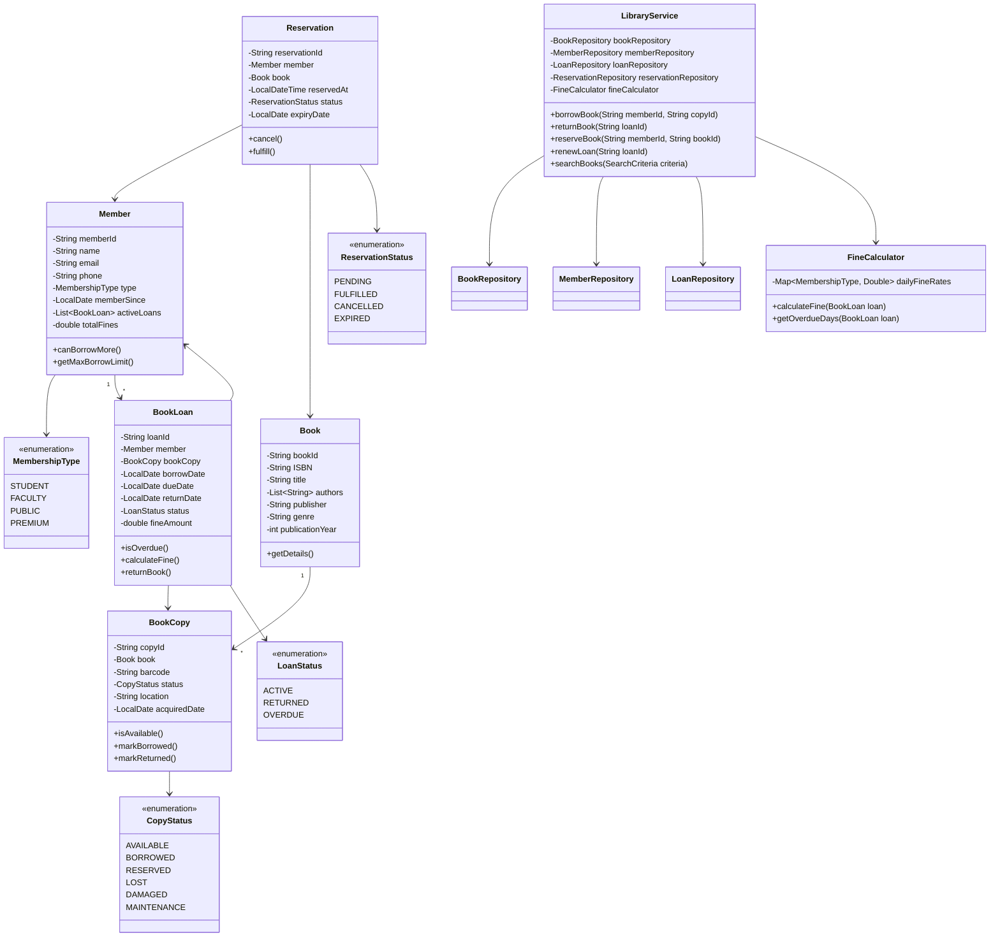
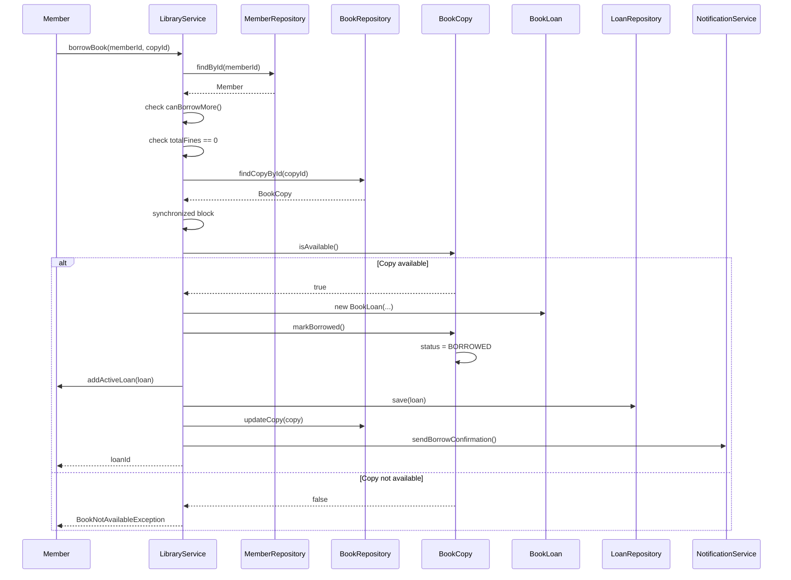
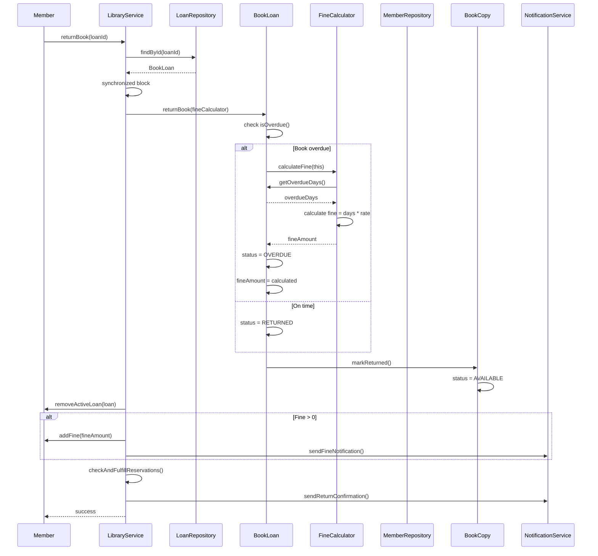
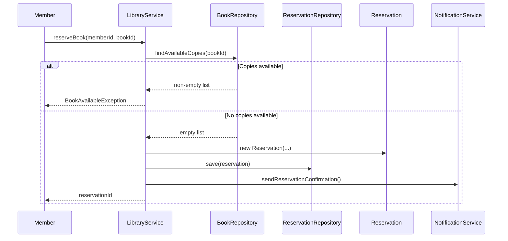

# Library Management System - Low Level Design

## Problem Statement
Design a library management system that allows members to borrow and return books, tracks book availability, handles reservations, manages multiple copies of books, calculates penalties for late returns, and provides search capabilities.

## Requirements

### Functional Requirements
- Member registration and management
- Book catalog management
- Borrow/return books
- Track book availability (multiple copies)
- Handle book reservations/holds
- Calculate penalties for late returns
- Search books by title, author, ISBN, genre
- Due date management
- Renewal of borrowed books
- Fine payment processing

### Non-Functional Requirements
- Handle 10,000+ books and 1,000+ members
- Thread-safe operations
- Fast search (<100ms)
- Accurate penalty calculation
- High availability
- Support multiple library branches

## Core Entities

### Class Diagram



## Design Patterns Used

1. **Repository Pattern**: BookRepository, MemberRepository, LoanRepository
2. **Factory Pattern**: Creating loans with different terms
3. **Strategy Pattern**: Different fine calculation strategies
4. **State Pattern**: Book copy states
5. **Observer Pattern**: Notification on book availability

## Key Implementation

### BookLoan.java
```java
public class BookLoan {
    private final String loanId;
    private final Member member;
    private final BookCopy bookCopy;
    private final LocalDate borrowDate;
    private LocalDate dueDate;
    private LocalDate returnDate;
    private LoanStatus status;
    private double fineAmount;
    private int renewalCount;
    private static final int MAX_RENEWALS = 2;

    public BookLoan(String loanId, Member member, BookCopy bookCopy, int loanPeriodDays) {
        this.loanId = loanId;
        this.member = member;
        this.bookCopy = bookCopy;
        this.borrowDate = LocalDate.now();
        this.dueDate = borrowDate.plusDays(loanPeriodDays);
        this.status = LoanStatus.ACTIVE;
        this.fineAmount = 0.0;
        this.renewalCount = 0;
    }

    public boolean isOverdue() {
        return status == LoanStatus.ACTIVE &&
               LocalDate.now().isAfter(dueDate);
    }

    public double calculateFine(FineCalculator calculator) {
        if (!isOverdue()) {
            return 0.0;
        }

        this.fineAmount = calculator.calculateFine(this);
        return this.fineAmount;
    }

    public synchronized void returnBook(FineCalculator calculator) {
        if (status != LoanStatus.ACTIVE) {
            throw new IllegalStateException("Loan is not active");
        }

        this.returnDate = LocalDate.now();

        if (isOverdue()) {
            this.status = LoanStatus.OVERDUE;
            this.fineAmount = calculator.calculateFine(this);
        } else {
            this.status = LoanStatus.RETURNED;
        }

        bookCopy.markReturned();
    }

    public synchronized boolean renew(int additionalDays) {
        if (renewalCount >= MAX_RENEWALS) {
            return false;
        }

        if (isOverdue()) {
            return false;
        }

        this.dueDate = dueDate.plusDays(additionalDays);
        this.renewalCount++;
        return true;
    }

    public long getOverdueDays() {
        if (!isOverdue()) {
            return 0;
        }

        return ChronoUnit.DAYS.between(dueDate, LocalDate.now());
    }

    public String getLoanId() {
        return loanId;
    }

    public Member getMember() {
        return member;
    }

    public BookCopy getBookCopy() {
        return bookCopy;
    }

    public LocalDate getDueDate() {
        return dueDate;
    }

    public LoanStatus getStatus() {
        return status;
    }

    public double getFineAmount() {
        return fineAmount;
    }
}
```

### LibraryService.java
```java
public class LibraryService {
    private final BookRepository bookRepository;
    private final MemberRepository memberRepository;
    private final LoanRepository loanRepository;
    private final ReservationRepository reservationRepository;
    private final FineCalculator fineCalculator;
    private final NotificationService notificationService;

    public LibraryService(
            BookRepository bookRepository,
            MemberRepository memberRepository,
            LoanRepository loanRepository,
            ReservationRepository reservationRepository,
            FineCalculator fineCalculator,
            NotificationService notificationService) {
        this.bookRepository = bookRepository;
        this.memberRepository = memberRepository;
        this.loanRepository = loanRepository;
        this.reservationRepository = reservationRepository;
        this.fineCalculator = fineCalculator;
        this.notificationService = notificationService;
    }

    public String borrowBook(String memberId, String copyId) {
        Member member = memberRepository.findById(memberId);
        if (member == null) {
            throw new MemberNotFoundException("Member not found: " + memberId);
        }

        if (!member.canBorrowMore()) {
            throw new BorrowLimitExceededException("Member has reached borrow limit");
        }

        if (member.getTotalFines() > 0) {
            throw new OutstandingFinesException("Member has outstanding fines");
        }

        BookCopy copy = bookRepository.findCopyById(copyId);
        if (copy == null) {
            throw new BookCopyNotFoundException("Book copy not found: " + copyId);
        }

        synchronized (this) {
            if (!copy.isAvailable()) {
                throw new BookNotAvailableException("Book copy is not available");
            }

            int loanPeriod = member.getMaxBorrowLimit();
            BookLoan loan = new BookLoan(
                UUID.randomUUID().toString(),
                member,
                copy,
                loanPeriod
            );

            copy.markBorrowed();
            member.addActiveLoan(loan);

            loanRepository.save(loan);
            bookRepository.updateCopy(copy);
            memberRepository.update(member);

            notificationService.sendBorrowConfirmation(member, copy.getBook(), loan.getDueDate());

            return loan.getLoanId();
        }
    }

    public void returnBook(String loanId) {
        BookLoan loan = loanRepository.findById(loanId);
        if (loan == null) {
            throw new LoanNotFoundException("Loan not found: " + loanId);
        }

        synchronized (this) {
            loan.returnBook(fineCalculator);

            Member member = loan.getMember();
            member.removeActiveLoan(loan);

            if (loan.getFineAmount() > 0) {
                member.addFine(loan.getFineAmount());
                notificationService.sendFineNotification(member, loan.getFineAmount());
            }

            loanRepository.update(loan);
            memberRepository.update(member);

            checkAndFulfillReservations(loan.getBookCopy().getBook());

            notificationService.sendReturnConfirmation(member, loan.getBookCopy().getBook());
        }
    }

    public String reserveBook(String memberId, String bookId) {
        Member member = memberRepository.findById(memberId);
        if (member == null) {
            throw new MemberNotFoundException("Member not found: " + memberId);
        }

        Book book = bookRepository.findById(bookId);
        if (book == null) {
            throw new BookNotFoundException("Book not found: " + bookId);
        }

        synchronized (this) {
            List<BookCopy> availableCopies = bookRepository.findAvailableCopies(bookId);
            if (!availableCopies.isEmpty()) {
                throw new BookAvailableException("Book is available for immediate borrowing");
            }

            Reservation reservation = new Reservation(
                UUID.randomUUID().toString(),
                member,
                book,
                LocalDateTime.now(),
                LocalDate.now().plusDays(7)
            );

            reservationRepository.save(reservation);

            notificationService.sendReservationConfirmation(member, book);

            return reservation.getReservationId();
        }
    }

    public boolean renewLoan(String loanId) {
        BookLoan loan = loanRepository.findById(loanId);
        if (loan == null) {
            throw new LoanNotFoundException("Loan not found: " + loanId);
        }

        synchronized (this) {
            List<Reservation> pendingReservations = reservationRepository.findPendingByBook(
                loan.getBookCopy().getBook().getBookId()
            );

            if (!pendingReservations.isEmpty()) {
                return false;
            }

            boolean renewed = loan.renew(14);

            if (renewed) {
                loanRepository.update(loan);
                notificationService.sendRenewalConfirmation(
                    loan.getMember(),
                    loan.getBookCopy().getBook(),
                    loan.getDueDate()
                );
            }

            return renewed;
        }
    }

    private void checkAndFulfillReservations(Book book) {
        List<Reservation> pendingReservations = reservationRepository.findPendingByBook(
            book.getBookId()
        );

        if (pendingReservations.isEmpty()) {
            return;
        }

        pendingReservations.sort(Comparator.comparing(Reservation::getReservedAt));

        Reservation firstReservation = pendingReservations.get(0);
        firstReservation.fulfill();
        reservationRepository.update(firstReservation);

        List<BookCopy> availableCopies = bookRepository.findAvailableCopies(book.getBookId());
        if (!availableCopies.isEmpty()) {
            BookCopy copy = availableCopies.get(0);
            copy.setStatus(CopyStatus.RESERVED);
            bookRepository.updateCopy(copy);
        }

        notificationService.sendReservationFulfillment(
            firstReservation.getMember(),
            book
        );
    }

    public List<Book> searchBooks(SearchCriteria criteria) {
        return bookRepository.search(criteria);
    }

    public void payFine(String memberId, double amount) {
        Member member = memberRepository.findById(memberId);
        if (member == null) {
            throw new MemberNotFoundException("Member not found: " + memberId);
        }

        member.payFine(amount);
        memberRepository.update(member);
    }

    public List<BookLoan> getOverdueLoans() {
        return loanRepository.findAll().stream()
            .filter(BookLoan::isOverdue)
            .collect(Collectors.toList());
    }
}
```

### Member.java
```java
public class Member {
    private final String memberId;
    private String name;
    private String email;
    private String phone;
    private final MembershipType type;
    private final LocalDate memberSince;
    private final List<BookLoan> activeLoans;
    private double totalFines;
    private static final Map<MembershipType, Integer> BORROW_LIMITS = Map.of(
        MembershipType.STUDENT, 5,
        MembershipType.FACULTY, 10,
        MembershipType.PUBLIC, 3,
        MembershipType.PREMIUM, 15
    );

    public Member(String memberId, String name, String email, MembershipType type) {
        this.memberId = memberId;
        this.name = name;
        this.email = email;
        this.type = type;
        this.memberSince = LocalDate.now();
        this.activeLoans = new ArrayList<>();
        this.totalFines = 0.0;
    }

    public synchronized boolean canBorrowMore() {
        return activeLoans.size() < getMaxBorrowLimit();
    }

    public int getMaxBorrowLimit() {
        return BORROW_LIMITS.getOrDefault(type, 3);
    }

    public synchronized void addActiveLoan(BookLoan loan) {
        activeLoans.add(loan);
    }

    public synchronized void removeActiveLoan(BookLoan loan) {
        activeLoans.remove(loan);
    }

    public synchronized void addFine(double amount) {
        this.totalFines += amount;
    }

    public synchronized void payFine(double amount) {
        if (amount > totalFines) {
            throw new IllegalArgumentException("Payment exceeds fine amount");
        }
        this.totalFines -= amount;
    }

    public String getMemberId() {
        return memberId;
    }

    public String getName() {
        return name;
    }

    public String getEmail() {
        return email;
    }

    public MembershipType getType() {
        return type;
    }

    public List<BookLoan> getActiveLoans() {
        return new ArrayList<>(activeLoans);
    }

    public double getTotalFines() {
        return totalFines;
    }
}
```

### FineCalculator.java
```java
public class FineCalculator {
    private final Map<MembershipType, Double> dailyFineRates;

    public FineCalculator() {
        this.dailyFineRates = new HashMap<>();
        dailyFineRates.put(MembershipType.STUDENT, 0.50);
        dailyFineRates.put(MembershipType.FACULTY, 0.75);
        dailyFineRates.put(MembershipType.PUBLIC, 1.00);
        dailyFineRates.put(MembershipType.PREMIUM, 0.25);
    }

    public double calculateFine(BookLoan loan) {
        if (!loan.isOverdue()) {
            return 0.0;
        }

        long overdueDays = loan.getOverdueDays();
        double dailyRate = dailyFineRates.getOrDefault(
            loan.getMember().getType(),
            1.00
        );

        double baseFine = overdueDays * dailyRate;

        if (overdueDays > 30) {
            baseFine += (overdueDays - 30) * dailyRate * 0.5;
        }

        return Math.round(baseFine * 100.0) / 100.0;
    }

    public long getOverdueDays(BookLoan loan) {
        return loan.getOverdueDays();
    }

    public void updateFineRate(MembershipType type, double newRate) {
        dailyFineRates.put(type, newRate);
    }
}
```

### BookCopy.java
```java
public class BookCopy {
    private final String copyId;
    private final Book book;
    private final String barcode;
    private volatile CopyStatus status;
    private final String location;
    private final LocalDate acquiredDate;

    public BookCopy(String copyId, Book book, String barcode, String location) {
        this.copyId = copyId;
        this.book = book;
        this.barcode = barcode;
        this.status = CopyStatus.AVAILABLE;
        this.location = location;
        this.acquiredDate = LocalDate.now();
    }

    public synchronized boolean isAvailable() {
        return status == CopyStatus.AVAILABLE;
    }

    public synchronized void markBorrowed() {
        if (status != CopyStatus.AVAILABLE) {
            throw new IllegalStateException("Book copy is not available");
        }
        this.status = CopyStatus.BORROWED;
    }

    public synchronized void markReturned() {
        this.status = CopyStatus.AVAILABLE;
    }

    public synchronized void markLost() {
        this.status = CopyStatus.LOST;
    }

    public synchronized void markDamaged() {
        this.status = CopyStatus.DAMAGED;
    }

    public String getCopyId() {
        return copyId;
    }

    public Book getBook() {
        return book;
    }

    public CopyStatus getStatus() {
        return status;
    }

    public void setStatus(CopyStatus status) {
        this.status = status;
    }
}
```

### Reservation.java
```java
public class Reservation {
    private final String reservationId;
    private final Member member;
    private final Book book;
    private final LocalDateTime reservedAt;
    private ReservationStatus status;
    private final LocalDate expiryDate;

    public Reservation(
            String reservationId,
            Member member,
            Book book,
            LocalDateTime reservedAt,
            LocalDate expiryDate) {
        this.reservationId = reservationId;
        this.member = member;
        this.book = book;
        this.reservedAt = reservedAt;
        this.status = ReservationStatus.PENDING;
        this.expiryDate = expiryDate;
    }

    public synchronized void cancel() {
        if (status != ReservationStatus.PENDING) {
            throw new IllegalStateException("Cannot cancel non-pending reservation");
        }
        this.status = ReservationStatus.CANCELLED;
    }

    public synchronized void fulfill() {
        if (status != ReservationStatus.PENDING) {
            throw new IllegalStateException("Cannot fulfill non-pending reservation");
        }
        this.status = ReservationStatus.FULFILLED;
    }

    public boolean isExpired() {
        return LocalDate.now().isAfter(expiryDate) &&
               status == ReservationStatus.PENDING;
    }

    public String getReservationId() {
        return reservationId;
    }

    public Member getMember() {
        return member;
    }

    public Book getBook() {
        return book;
    }

    public LocalDateTime getReservedAt() {
        return reservedAt;
    }

    public ReservationStatus getStatus() {
        return status;
    }
}
```

## Sequence Diagrams

### 1. Borrow Book Flow



### 2. Return Book with Fine Calculation Flow



### 3. Reserve Book Flow



## Database Schema

```sql
CREATE TABLE books (
    book_id VARCHAR(50) PRIMARY KEY,
    isbn VARCHAR(13) UNIQUE,
    title VARCHAR(200) NOT NULL,
    authors JSON,
    publisher VARCHAR(100),
    genre VARCHAR(50),
    publication_year INT,
    INDEX idx_title (title),
    INDEX idx_isbn (isbn),
    INDEX idx_genre (genre)
);

CREATE TABLE book_copies (
    copy_id VARCHAR(50) PRIMARY KEY,
    book_id VARCHAR(50) NOT NULL,
    barcode VARCHAR(50) UNIQUE,
    status VARCHAR(20) NOT NULL,
    location VARCHAR(100),
    acquired_date DATE,
    FOREIGN KEY (book_id) REFERENCES books(book_id),
    INDEX idx_book_status (book_id, status),
    INDEX idx_barcode (barcode)
);

CREATE TABLE members (
    member_id VARCHAR(50) PRIMARY KEY,
    name VARCHAR(100) NOT NULL,
    email VARCHAR(100) UNIQUE NOT NULL,
    phone VARCHAR(20),
    membership_type VARCHAR(20) NOT NULL,
    member_since DATE NOT NULL,
    total_fines DECIMAL(10,2) DEFAULT 0.00,
    INDEX idx_email (email)
);

CREATE TABLE book_loans (
    loan_id VARCHAR(50) PRIMARY KEY,
    member_id VARCHAR(50) NOT NULL,
    copy_id VARCHAR(50) NOT NULL,
    borrow_date DATE NOT NULL,
    due_date DATE NOT NULL,
    return_date DATE,
    status VARCHAR(20) NOT NULL,
    fine_amount DECIMAL(10,2) DEFAULT 0.00,
    renewal_count INT DEFAULT 0,
    FOREIGN KEY (member_id) REFERENCES members(member_id),
    FOREIGN KEY (copy_id) REFERENCES book_copies(copy_id),
    INDEX idx_member (member_id),
    INDEX idx_copy (copy_id),
    INDEX idx_due_date (due_date),
    INDEX idx_status (status)
);

CREATE TABLE reservations (
    reservation_id VARCHAR(50) PRIMARY KEY,
    member_id VARCHAR(50) NOT NULL,
    book_id VARCHAR(50) NOT NULL,
    reserved_at TIMESTAMP NOT NULL,
    status VARCHAR(20) NOT NULL,
    expiry_date DATE NOT NULL,
    FOREIGN KEY (member_id) REFERENCES members(member_id),
    FOREIGN KEY (book_id) REFERENCES books(book_id),
    INDEX idx_member (member_id),
    INDEX idx_book_status (book_id, status),
    INDEX idx_reserved_at (reserved_at)
);
```

## Thread Safety Considerations

1. **Synchronized Methods**: In Member, BookCopy for state changes
2. **Synchronized Blocks**: In LibraryService for critical sections
3. **Volatile Fields**: For status fields in BookCopy
4. **ReadWriteLock**: In repositories for concurrent access
5. **Atomic Operations**: For counter updates

## Key Features

### Fine Calculation
- Different rates for member types
- Progressive penalty for extended delays
- Automatic calculation on return

### Reservation System
- FIFO queue for reservations
- Automatic fulfillment when book available
- Expiry handling

### Multi-Copy Management
- Track individual copies
- Status management per copy
- Location tracking

## Scalability Considerations

- Index on frequently queried fields
- Cache popular book information
- Partition loans by date
- Archive old loan records
