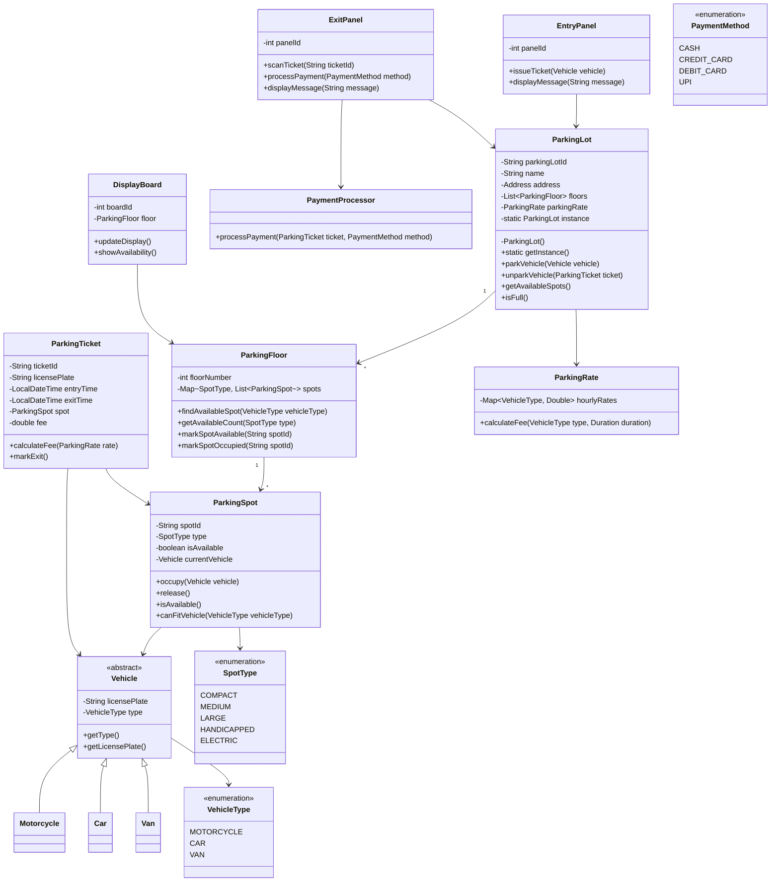
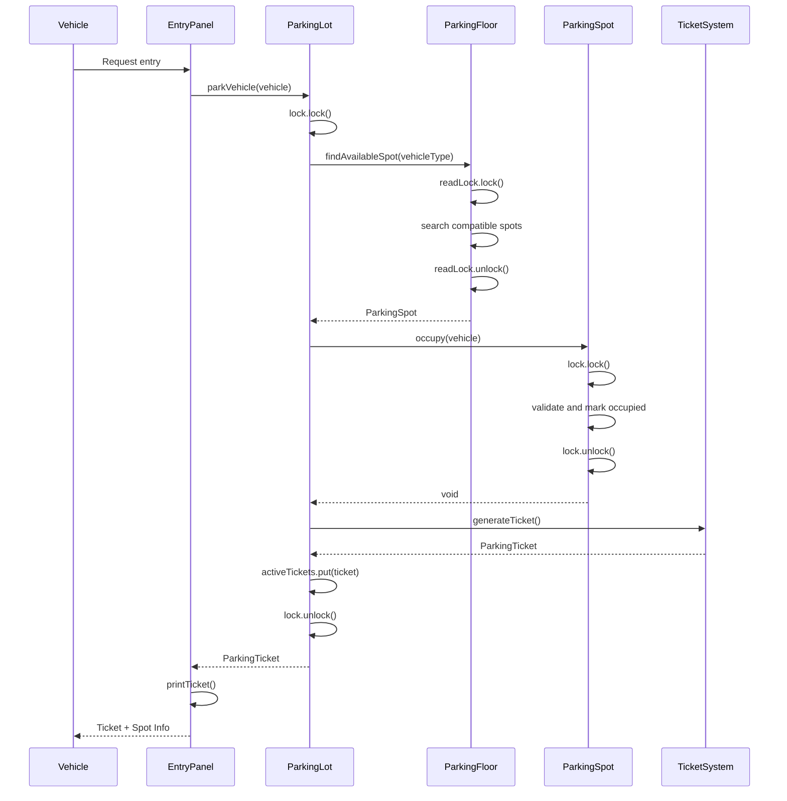
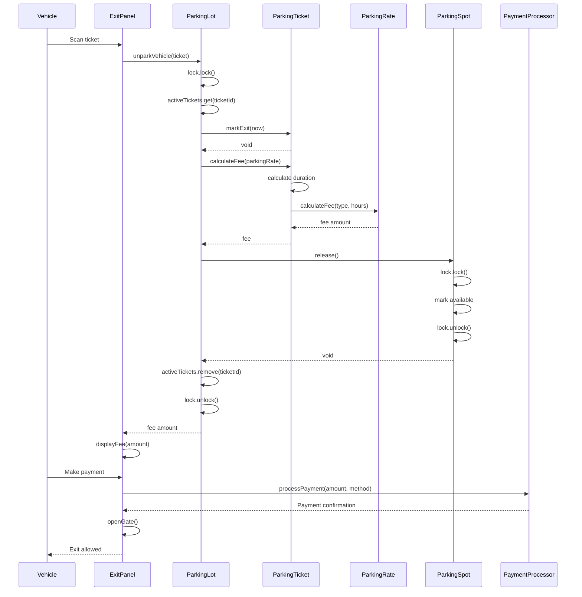
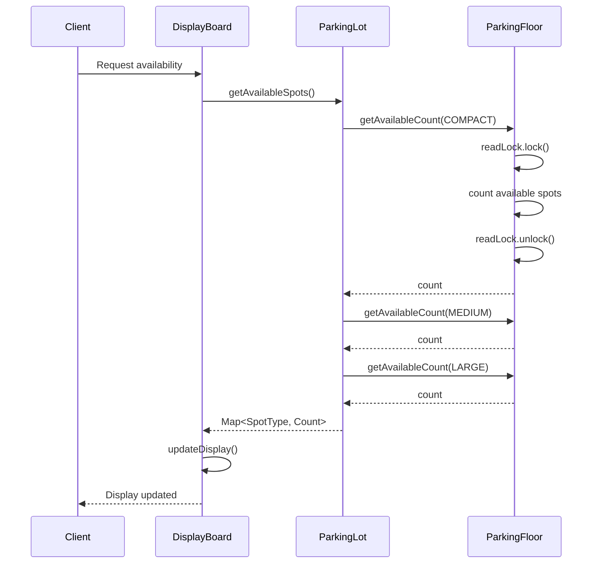

# Car Parking System - Low Level Design

## Problem Statement
Design a multi-level car parking system that can accommodate different vehicle types, track available spots, handle entry/exit, and calculate parking fees.

## Requirements

### Functional Requirements
- Multiple parking levels/floors
- Different spot sizes (compact, medium, large, handicapped)
- Support multiple vehicle types (motorcycle, car, van/truck)
- Track available spots in real-time
- Issue parking tickets on entry
- Calculate fees based on duration
- Handle payment processing
- Display availability per floor and spot type

### Non-Functional Requirements
- Thread-safe for concurrent vehicle entries/exits
- Fast spot allocation (<100ms)
- High availability (99.9%)
- Support 1000+ parking spots
- Real-time updates to displays

## Core Entities

### Class Diagram



## Design Patterns Used

1. **Singleton Pattern**: `ParkingLot` ensures single instance
2. **Factory Pattern**: For creating different vehicle types
3. **Strategy Pattern**: Different parking fee calculation strategies
4. **Observer Pattern**: Display boards observe parking spot changes
5. **State Pattern**: Parking spot states (Available/Occupied)

## Key Implementation

### ParkingLot.java (Singleton)
```java
public class ParkingLot {
    private static ParkingLot instance;
    private final String parkingLotId;
    private final String name;
    private final Address address;
    private final List<ParkingFloor> floors;
    private final ParkingRate parkingRate;
    private final Map<String, ParkingTicket> activeTickets;
    private final Lock lock;

    private ParkingLot(String id, String name, Address address, int numFloors) {
        this.parkingLotId = id;
        this.name = name;
        this.address = address;
        this.floors = new ArrayList<>();
        this.parkingRate = new ParkingRate();
        this.activeTickets = new ConcurrentHashMap<>();
        this.lock = new ReentrantLock();

        for (int i = 0; i < numFloors; i++) {
            floors.add(new ParkingFloor(i));
        }
    }

    public static synchronized ParkingLot getInstance(String id, String name, Address address, int numFloors) {
        if (instance == null) {
            instance = new ParkingLot(id, name, address, numFloors);
        }
        return instance;
    }

    public static ParkingLot getInstance() {
        if (instance == null) {
            throw new IllegalStateException("ParkingLot not initialized");
        }
        return instance;
    }

    public ParkingTicket parkVehicle(Vehicle vehicle) {
        lock.lock();
        try {
            ParkingSpot spot = findAvailableSpot(vehicle.getType());
            if (spot == null) {
                throw new NoAvailableSpotException("No spot available for " + vehicle.getType());
            }

            spot.occupy(vehicle);

            ParkingTicket ticket = new ParkingTicket(
                generateTicketId(),
                vehicle.getLicensePlate(),
                LocalDateTime.now(),
                spot
            );

            activeTickets.put(ticket.getTicketId(), ticket);
            return ticket;
        } finally {
            lock.unlock();
        }
    }

    public double unparkVehicle(ParkingTicket ticket) {
        lock.lock();
        try {
            ParkingTicket activeTicket = activeTickets.get(ticket.getTicketId());
            if (activeTicket == null) {
                throw new InvalidTicketException("Invalid ticket");
            }

            activeTicket.markExit(LocalDateTime.now());
            double fee = activeTicket.calculateFee(parkingRate);

            ParkingSpot spot = activeTicket.getSpot();
            spot.release();

            activeTickets.remove(ticket.getTicketId());
            return fee;
        } finally {
            lock.unlock();
        }
    }

    private ParkingSpot findAvailableSpot(VehicleType vehicleType) {
        for (ParkingFloor floor : floors) {
            ParkingSpot spot = floor.findAvailableSpot(vehicleType);
            if (spot != null) {
                return spot;
            }
        }
        return null;
    }

    public Map<SpotType, Integer> getAvailableSpots() {
        Map<SpotType, Integer> availability = new HashMap<>();
        for (SpotType type : SpotType.values()) {
            int count = floors.stream()
                .mapToInt(floor -> floor.getAvailableCount(type))
                .sum();
            availability.put(type, count);
        }
        return availability;
    }

    public boolean isFull() {
        return floors.stream().allMatch(ParkingFloor::isFull);
    }

    private String generateTicketId() {
        return "TKT-" + System.currentTimeMillis() + "-" + UUID.randomUUID().toString().substring(0, 8);
    }
}
```

### ParkingFloor.java
```java
public class ParkingFloor {
    private final int floorNumber;
    private final Map<SpotType, List<ParkingSpot>> spots;
    private final ReadWriteLock lock;
    private final Lock readLock;
    private final Lock writeLock;

    public ParkingFloor(int floorNumber) {
        this.floorNumber = floorNumber;
        this.spots = new ConcurrentHashMap<>();
        this.lock = new ReentrantReadWriteLock();
        this.readLock = lock.readLock();
        this.writeLock = lock.writeLock();

        initializeSpots();
    }

    private void initializeSpots() {
        spots.put(SpotType.COMPACT, createSpots(SpotType.COMPACT, 50));
        spots.put(SpotType.MEDIUM, createSpots(SpotType.MEDIUM, 100));
        spots.put(SpotType.LARGE, createSpots(SpotType.LARGE, 30));
        spots.put(SpotType.HANDICAPPED, createSpots(SpotType.HANDICAPPED, 10));
        spots.put(SpotType.ELECTRIC, createSpots(SpotType.ELECTRIC, 10));
    }

    private List<ParkingSpot> createSpots(SpotType type, int count) {
        List<ParkingSpot> spotList = new ArrayList<>();
        for (int i = 0; i < count; i++) {
            String spotId = String.format("F%d-%s-%03d", floorNumber, type.name(), i);
            spotList.add(new ParkingSpot(spotId, type));
        }
        return spotList;
    }

    public ParkingSpot findAvailableSpot(VehicleType vehicleType) {
        readLock.lock();
        try {
            List<SpotType> compatibleSpots = getCompatibleSpotTypes(vehicleType);

            for (SpotType spotType : compatibleSpots) {
                List<ParkingSpot> spotList = spots.get(spotType);
                if (spotList != null) {
                    for (ParkingSpot spot : spotList) {
                        if (spot.isAvailable() && spot.canFitVehicle(vehicleType)) {
                            return spot;
                        }
                    }
                }
            }
            return null;
        } finally {
            readLock.unlock();
        }
    }

    private List<SpotType> getCompatibleSpotTypes(VehicleType vehicleType) {
        switch (vehicleType) {
            case MOTORCYCLE:
                return Arrays.asList(SpotType.COMPACT, SpotType.MEDIUM, SpotType.LARGE);
            case CAR:
                return Arrays.asList(SpotType.MEDIUM, SpotType.LARGE);
            case VAN:
                return Arrays.asList(SpotType.LARGE);
            default:
                return Collections.emptyList();
        }
    }

    public int getAvailableCount(SpotType type) {
        readLock.lock();
        try {
            List<ParkingSpot> spotList = spots.get(type);
            if (spotList == null) {
                return 0;
            }
            return (int) spotList.stream()
                .filter(ParkingSpot::isAvailable)
                .count();
        } finally {
            readLock.unlock();
        }
    }

    public boolean isFull() {
        readLock.lock();
        try {
            return spots.values().stream()
                .flatMap(List::stream)
                .noneMatch(ParkingSpot::isAvailable);
        } finally {
            readLock.unlock();
        }
    }
}
```

### ParkingSpot.java
```java
public class ParkingSpot {
    private final String spotId;
    private final SpotType type;
    private volatile boolean isAvailable;
    private Vehicle currentVehicle;
    private final Lock lock;

    public ParkingSpot(String spotId, SpotType type) {
        this.spotId = spotId;
        this.type = type;
        this.isAvailable = true;
        this.lock = new ReentrantLock();
    }

    public void occupy(Vehicle vehicle) {
        lock.lock();
        try {
            if (!isAvailable) {
                throw new SpotNotAvailableException("Spot " + spotId + " is not available");
            }
            if (!canFitVehicle(vehicle.getType())) {
                throw new InvalidVehicleException("Vehicle cannot fit in this spot");
            }

            this.currentVehicle = vehicle;
            this.isAvailable = false;
        } finally {
            lock.unlock();
        }
    }

    public void release() {
        lock.lock();
        try {
            this.currentVehicle = null;
            this.isAvailable = true;
        } finally {
            lock.unlock();
        }
    }

    public boolean isAvailable() {
        return isAvailable;
    }

    public boolean canFitVehicle(VehicleType vehicleType) {
        switch (type) {
            case COMPACT:
                return vehicleType == VehicleType.MOTORCYCLE;
            case MEDIUM:
                return vehicleType == VehicleType.MOTORCYCLE || vehicleType == VehicleType.CAR;
            case LARGE:
            case HANDICAPPED:
            case ELECTRIC:
                return true;
            default:
                return false;
        }
    }

    public String getSpotId() {
        return spotId;
    }

    public SpotType getType() {
        return type;
    }
}
```

### ParkingTicket.java
```java
public class ParkingTicket {
    private final String ticketId;
    private final String licensePlate;
    private final LocalDateTime entryTime;
    private LocalDateTime exitTime;
    private final ParkingSpot spot;
    private double fee;

    public ParkingTicket(String ticketId, String licensePlate,
                        LocalDateTime entryTime, ParkingSpot spot) {
        this.ticketId = ticketId;
        this.licensePlate = licensePlate;
        this.entryTime = entryTime;
        this.spot = spot;
        this.fee = 0.0;
    }

    public void markExit(LocalDateTime exitTime) {
        this.exitTime = exitTime;
    }

    public double calculateFee(ParkingRate rate) {
        if (exitTime == null) {
            exitTime = LocalDateTime.now();
        }

        Duration duration = Duration.between(entryTime, exitTime);
        long hours = duration.toHours();
        if (duration.toMinutes() % 60 > 0) {
            hours++;
        }

        VehicleType vehicleType = determineVehicleType(spot.getType());
        this.fee = rate.calculateFee(vehicleType, hours);
        return this.fee;
    }

    private VehicleType determineVehicleType(SpotType spotType) {
        switch (spotType) {
            case COMPACT:
                return VehicleType.MOTORCYCLE;
            case MEDIUM:
                return VehicleType.CAR;
            case LARGE:
                return VehicleType.VAN;
            default:
                return VehicleType.CAR;
        }
    }

    public String getTicketId() {
        return ticketId;
    }

    public ParkingSpot getSpot() {
        return spot;
    }

    public LocalDateTime getEntryTime() {
        return entryTime;
    }

    public LocalDateTime getExitTime() {
        return exitTime;
    }

    public double getFee() {
        return fee;
    }
}
```

### ParkingRate.java
```java
public class ParkingRate {
    private final Map<VehicleType, Double> hourlyRates;

    public ParkingRate() {
        this.hourlyRates = new HashMap<>();
        hourlyRates.put(VehicleType.MOTORCYCLE, 10.0);
        hourlyRates.put(VehicleType.CAR, 20.0);
        hourlyRates.put(VehicleType.VAN, 30.0);
    }

    public double calculateFee(VehicleType vehicleType, long hours) {
        double hourlyRate = hourlyRates.getOrDefault(vehicleType, 20.0);
        return hourlyRate * hours;
    }

    public void updateRate(VehicleType vehicleType, double newRate) {
        hourlyRates.put(vehicleType, newRate);
    }
}
```

### Vehicle Hierarchy
```java
public abstract class Vehicle {
    protected final String licensePlate;
    protected final VehicleType type;

    public Vehicle(String licensePlate, VehicleType type) {
        this.licensePlate = licensePlate;
        this.type = type;
    }

    public String getLicensePlate() {
        return licensePlate;
    }

    public VehicleType getType() {
        return type;
    }
}

public class Motorcycle extends Vehicle {
    public Motorcycle(String licensePlate) {
        super(licensePlate, VehicleType.MOTORCYCLE);
    }
}

public class Car extends Vehicle {
    public Car(String licensePlate) {
        super(licensePlate, VehicleType.CAR);
    }
}

public class Van extends Vehicle {
    public Van(String licensePlate) {
        super(licensePlate, VehicleType.VAN);
    }
}
```

## Sequence Diagrams

### 1. Vehicle Entry Flow



### 2. Vehicle Exit Flow



### 3. Check Availability Flow



## Database Schema

```sql
-- Parking lots table
CREATE TABLE parking_lots (
    lot_id VARCHAR(50) PRIMARY KEY,
    name VARCHAR(100) NOT NULL,
    address VARCHAR(200),
    total_floors INT NOT NULL,
    created_at TIMESTAMP DEFAULT CURRENT_TIMESTAMP
);

-- Parking floors table
CREATE TABLE parking_floors (
    floor_id VARCHAR(50) PRIMARY KEY,
    lot_id VARCHAR(50) NOT NULL,
    floor_number INT NOT NULL,
    total_spots INT NOT NULL,
    FOREIGN KEY (lot_id) REFERENCES parking_lots(lot_id),
    UNIQUE (lot_id, floor_number)
);

-- Parking spots table
CREATE TABLE parking_spots (
    spot_id VARCHAR(50) PRIMARY KEY,
    floor_id VARCHAR(50) NOT NULL,
    spot_type VARCHAR(20) NOT NULL,
    is_available BOOLEAN DEFAULT TRUE,
    current_vehicle_plate VARCHAR(20),
    FOREIGN KEY (floor_id) REFERENCES parking_floors(floor_id),
    INDEX idx_floor_type (floor_id, spot_type),
    INDEX idx_available (is_available)
);

-- Parking tickets table
CREATE TABLE parking_tickets (
    ticket_id VARCHAR(50) PRIMARY KEY,
    license_plate VARCHAR(20) NOT NULL,
    spot_id VARCHAR(50) NOT NULL,
    entry_time TIMESTAMP NOT NULL,
    exit_time TIMESTAMP,
    fee DECIMAL(10, 2),
    payment_status VARCHAR(20) DEFAULT 'PENDING',
    FOREIGN KEY (spot_id) REFERENCES parking_spots(spot_id),
    INDEX idx_license (license_plate),
    INDEX idx_entry_time (entry_time),
    INDEX idx_payment_status (payment_status)
);

-- Payment transactions table
CREATE TABLE payment_transactions (
    transaction_id VARCHAR(50) PRIMARY KEY,
    ticket_id VARCHAR(50) NOT NULL,
    amount DECIMAL(10, 2) NOT NULL,
    payment_method VARCHAR(20) NOT NULL,
    transaction_time TIMESTAMP DEFAULT CURRENT_TIMESTAMP,
    status VARCHAR(20) NOT NULL,
    FOREIGN KEY (ticket_id) REFERENCES parking_tickets(ticket_id),
    INDEX idx_ticket (ticket_id)
);
```

## Thread Safety Considerations

1. **Singleton Double-Check Locking**: Synchronized getInstance() for thread safety
2. **ReentrantLock**: Used in ParkingLot for parking/unparking operations
3. **ReadWriteLock**: Used in ParkingFloor for concurrent reads, exclusive writes
4. **ConcurrentHashMap**: For activeTickets map
5. **Volatile keyword**: For isAvailable flag in ParkingSpot
6. **Lock per Spot**: Each ParkingSpot has its own lock to minimize contention

## Scalability Considerations

### Horizontal Scaling
- Multiple parking lots can operate independently
- Each floor can be managed by separate service instances

### Caching Strategy
- Cache available spot counts per floor
- Invalidate cache on spot occupation/release
- Use Redis for distributed caching

### Database Optimization
- Partition parking_tickets table by entry_time (monthly partitions)
- Index on (is_available, spot_type) for fast spot lookup
- Archive old tickets to separate table

### Performance Optimization
- Use optimistic locking for spot allocation (reduce lock contention)
- Implement spot reservation with TTL (30 seconds) during entry
- Async notification to display boards
- Connection pooling for database access

### Load Distribution
- Round-robin floor assignment for better distribution
- Prioritize lower floors to reduce elevator usage
