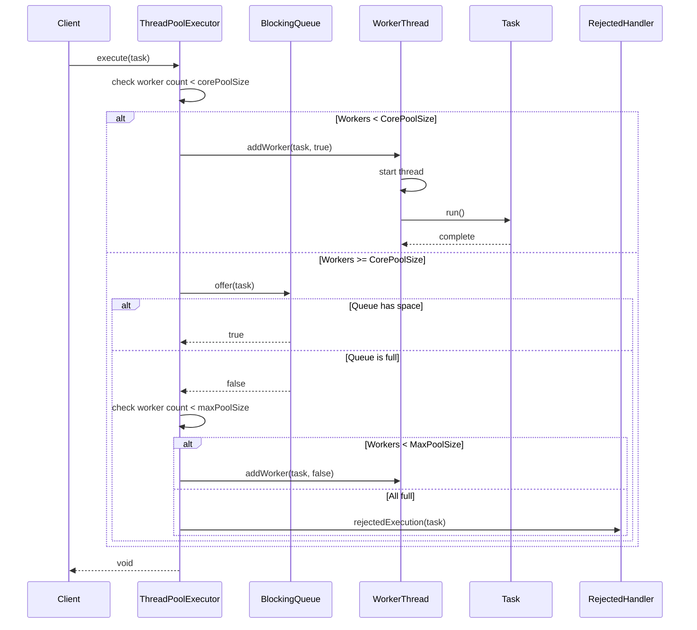
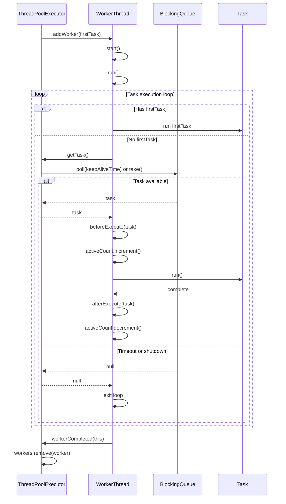
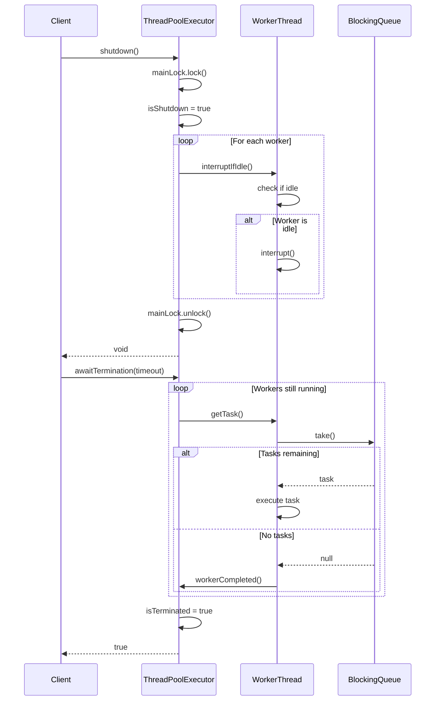
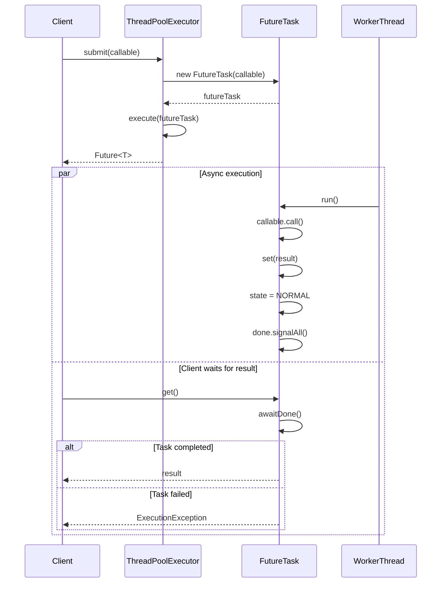

# Thread Pool / Task Executor - Low Level Design

## Problem Statement
Design a thread pool executor that manages a pool of worker threads to execute tasks asynchronously with queueing, task prioritization, and graceful shutdown capabilities.

## Requirements

### Functional Requirements
- Fixed-size thread pool with configurable worker threads
- Task queueing when all threads are busy
- Support for different queue types (bounded, unbounded, priority)
- Task submission (submit, execute)
- Task cancellation and timeout
- Graceful and immediate shutdown
- Thread lifecycle management
- Rejected task handling policies
- Task prioritization support

### Non-Functional Requirements
- Thread-safe operations
- Efficient task distribution
- Minimal task scheduling overhead
- Support for 1000+ concurrent tasks
- Resource cleanup on shutdown

## Core Entities

### Class Diagram

```mermaid
classDiagram
    class ThreadPoolExecutor {
        -int corePoolSize
        -int maximumPoolSize
        -long keepAliveTime
        -BlockingQueue~Runnable~ workQueue
        -List~WorkerThread~ workers
        -ThreadFactory threadFactory
        -RejectedExecutionHandler rejectedHandler
        -volatile boolean isShutdown
        -volatile boolean isTerminated
        -ReentrantLock mainLock
        +execute(Runnable task)
        +submit(Callable task)
        +shutdown()
        +shutdownNow()
        +awaitTermination(timeout)
        +isShutdown()
        +isTerminated()
    }

    class WorkerThread {
        -Thread thread
        -Runnable firstTask
        -volatile boolean running
        -ThreadPoolExecutor executor
        +run()
        +interrupt()
        +isAlive()
    }

    class BlockingQueue~T~ {
        <<interface>>
        +put(T item)
        +take()
        +offer(T item, timeout)
        +poll(timeout)
        +size()
        +isEmpty()
    }

    class ArrayBlockingQueue {
        -Object[] items
        -int count
        -ReentrantLock lock
        -Condition notEmpty
        -Condition notFull
        +put(T item)
        +take()
        +offer(T item, timeout)
        +poll(timeout)
    }

    class LinkedBlockingQueue {
        -Node~T~ head
        -Node~T~ tail
        -AtomicInteger count
        -ReentrantLock takeLock
        -ReentrantLock putLock
        -Condition notEmpty
        -Condition notFull
        +put(T item)
        +take()
    }

    class PriorityBlockingQueue {
        -Object[] queue
        -int size
        -Comparator comparator
        -ReentrantLock lock
        +put(T item)
        +take()
    }

    class ThreadFactory {
        <<interface>>
        +newThread(Runnable r)
    }

    class DefaultThreadFactory {
        -AtomicInteger threadNumber
        -String namePrefix
        +newThread(Runnable r)
    }

    class RejectedExecutionHandler {
        <<interface>>
        +rejectedExecution(Runnable r, ThreadPoolExecutor executor)
    }

    class AbortPolicy {
        +rejectedExecution(Runnable r, ThreadPoolExecutor executor)
    }

    class CallerRunsPolicy {
        +rejectedExecution(Runnable r, ThreadPoolExecutor executor)
    }

    class DiscardPolicy {
        +rejectedExecution(Runnable r, ThreadPoolExecutor executor)
    }

    class DiscardOldestPolicy {
        +rejectedExecution(Runnable r, ThreadPoolExecutor executor)
    }

    class Future~T~ {
        <<interface>>
        +get()
        +get(timeout)
        +cancel(mayInterrupt)
        +isCancelled()
        +isDone()
    }

    class FutureTask~T~ {
        -Callable~T~ callable
        -volatile int state
        -Object outcome
        -Thread runner
        -WaitNode waiters
        +run()
        +get()
        +cancel(mayInterrupt)
    }

    ThreadPoolExecutor "1" --> "*" WorkerThread
    ThreadPoolExecutor --> BlockingQueue
    ThreadPoolExecutor --> ThreadFactory
    ThreadPoolExecutor --> RejectedExecutionHandler
    BlockingQueue <|.. ArrayBlockingQueue
    BlockingQueue <|.. LinkedBlockingQueue
    BlockingQueue <|.. PriorityBlockingQueue
    ThreadFactory <|.. DefaultThreadFactory
    RejectedExecutionHandler <|.. AbortPolicy
    RejectedExecutionHandler <|.. CallerRunsPolicy
    RejectedExecutionHandler <|.. DiscardPolicy
    RejectedExecutionHandler <|.. DiscardOldestPolicy
    WorkerThread --> ThreadPoolExecutor
    Future <|.. FutureTask
    ThreadPoolExecutor --> FutureTask
```



## Design Patterns Used

1. **Object Pool Pattern**: Thread pooling to reuse worker threads
2. **Producer-Consumer Pattern**: Task submission and execution
3. **Factory Pattern**: ThreadFactory for creating threads
4. **Strategy Pattern**: RejectedExecutionHandler for different rejection policies
5. **Future Pattern**: Asynchronous result retrieval
6. **Template Method Pattern**: Worker thread execution template

## Key Implementation

### ThreadPoolExecutor.java
```java
public class ThreadPoolExecutor {
    private final int corePoolSize;
    private final int maximumPoolSize;
    private final long keepAliveTime;
    private final TimeUnit unit;
    private final BlockingQueue<Runnable> workQueue;
    private final Set<WorkerThread> workers;
    private final ThreadFactory threadFactory;
    private final RejectedExecutionHandler rejectedHandler;
    private final ReentrantLock mainLock;
    private volatile boolean isShutdown;
    private volatile boolean isTerminated;
    private final AtomicInteger activeThreadCount;

    public ThreadPoolExecutor(
            int corePoolSize,
            int maximumPoolSize,
            long keepAliveTime,
            TimeUnit unit,
            BlockingQueue<Runnable> workQueue,
            ThreadFactory threadFactory,
            RejectedExecutionHandler rejectedHandler) {

        if (corePoolSize < 0 || maximumPoolSize <= 0 ||
            maximumPoolSize < corePoolSize || keepAliveTime < 0) {
            throw new IllegalArgumentException();
        }

        this.corePoolSize = corePoolSize;
        this.maximumPoolSize = maximumPoolSize;
        this.keepAliveTime = keepAliveTime;
        this.unit = unit;
        this.workQueue = workQueue;
        this.threadFactory = threadFactory;
        this.rejectedHandler = rejectedHandler;
        this.workers = new HashSet<>();
        this.mainLock = new ReentrantLock();
        this.isShutdown = false;
        this.isTerminated = false;
        this.activeThreadCount = new AtomicInteger(0);
    }

    public void execute(Runnable task) {
        if (task == null) {
            throw new NullPointerException();
        }

        if (isShutdown) {
            rejectedHandler.rejectedExecution(task, this);
            return;
        }

        int currentThreadCount = workers.size();

        if (currentThreadCount < corePoolSize) {
            if (addWorker(task, true)) {
                return;
            }
        }

        if (workQueue.offer(task)) {
            if (isShutdown && workQueue.remove(task)) {
                rejectedHandler.rejectedExecution(task, this);
            }
            return;
        }

        if (currentThreadCount < maximumPoolSize) {
            if (addWorker(task, false)) {
                return;
            }
        }

        rejectedHandler.rejectedExecution(task, this);
    }

    public <T> Future<T> submit(Callable<T> task) {
        if (task == null) {
            throw new NullPointerException();
        }

        FutureTask<T> futureTask = new FutureTask<>(task);
        execute(futureTask);
        return futureTask;
    }

    public Future<?> submit(Runnable task) {
        if (task == null) {
            throw new NullPointerException();
        }

        FutureTask<Void> futureTask = new FutureTask<>(task, null);
        execute(futureTask);
        return futureTask;
    }

    private boolean addWorker(Runnable firstTask, boolean core) {
        mainLock.lock();
        try {
            if (isShutdown) {
                return false;
            }

            int currentSize = workers.size();
            int limit = core ? corePoolSize : maximumPoolSize;

            if (currentSize >= limit) {
                return false;
            }

            WorkerThread worker = new WorkerThread(this, firstTask);
            workers.add(worker);
            worker.start();
            return true;
        } finally {
            mainLock.unlock();
        }
    }

    Runnable getTask() {
        boolean timedOut = false;

        for (;;) {
            if (isShutdown && workQueue.isEmpty()) {
                return null;
            }

            int currentSize = workers.size();
            boolean allowCoreTimeout = currentSize > corePoolSize;

            if (allowCoreTimeout && timedOut) {
                return null;
            }

            try {
                Runnable task = allowCoreTimeout ?
                    workQueue.poll(keepAliveTime, unit) :
                    workQueue.take();

                if (task != null) {
                    return task;
                }

                timedOut = true;
            } catch (InterruptedException e) {
                timedOut = false;
            }
        }
    }

    void workerCompleted(WorkerThread worker) {
        mainLock.lock();
        try {
            workers.remove(worker);

            if (workers.isEmpty()) {
                isTerminated = true;
                mainLock.notifyAll();
            }
        } finally {
            mainLock.unlock();
        }
    }

    public void shutdown() {
        mainLock.lock();
        try {
            isShutdown = true;

            for (WorkerThread worker : workers) {
                worker.interruptIfIdle();
            }
        } finally {
            mainLock.unlock();
        }
    }

    public List<Runnable> shutdownNow() {
        mainLock.lock();
        try {
            isShutdown = true;

            for (WorkerThread worker : workers) {
                worker.interrupt();
            }

            List<Runnable> remainingTasks = new ArrayList<>();
            workQueue.drainTo(remainingTasks);
            return remainingTasks;
        } finally {
            mainLock.unlock();
        }
    }

    public boolean awaitTermination(long timeout, TimeUnit unit) throws InterruptedException {
        long nanos = unit.toNanos(timeout);
        mainLock.lock();
        try {
            while (!isTerminated) {
                if (nanos <= 0) {
                    return false;
                }
                long deadline = System.nanoTime() + nanos;
                mainLock.wait(nanos / 1_000_000);
                nanos = deadline - System.nanoTime();
            }
            return true;
        } finally {
            mainLock.unlock();
        }
    }

    public boolean isShutdown() {
        return isShutdown;
    }

    public boolean isTerminated() {
        return isTerminated;
    }

    public int getActiveCount() {
        return activeThreadCount.get();
    }

    public int getPoolSize() {
        mainLock.lock();
        try {
            return workers.size();
        } finally {
            mainLock.unlock();
        }
    }

    public int getQueueSize() {
        return workQueue.size();
    }
}
```

### WorkerThread.java
```java
public class WorkerThread implements Runnable {
    private final Thread thread;
    private Runnable firstTask;
    private final ThreadPoolExecutor executor;
    private volatile boolean running;

    public WorkerThread(ThreadPoolExecutor executor, Runnable firstTask) {
        this.executor = executor;
        this.firstTask = firstTask;
        this.thread = executor.threadFactory.newThread(this);
        this.running = true;
    }

    public void start() {
        thread.start();
    }

    @Override
    public void run() {
        try {
            runWorker();
        } finally {
            executor.workerCompleted(this);
        }
    }

    private void runWorker() {
        Runnable task = firstTask;
        firstTask = null;

        while (running && (task != null || (task = executor.getTask()) != null)) {
            try {
                beforeExecute(task);
                executor.activeThreadCount.incrementAndGet();

                task.run();

                afterExecute(task, null);
            } catch (Exception e) {
                afterExecute(task, e);
            } finally {
                executor.activeThreadCount.decrementAndGet();
                task = null;
            }
        }
    }

    protected void beforeExecute(Runnable task) {
    }

    protected void afterExecute(Runnable task, Throwable t) {
        if (t != null) {
            System.err.println("Task execution failed: " + t.getMessage());
        }
    }

    public void interrupt() {
        running = false;
        thread.interrupt();
    }

    public void interruptIfIdle() {
        if (firstTask == null) {
            interrupt();
        }
    }

    public boolean isAlive() {
        return thread.isAlive();
    }
}
```

### ArrayBlockingQueue.java
```java
public class ArrayBlockingQueue<T> implements BlockingQueue<T> {
    private final Object[] items;
    private int count;
    private int takeIndex;
    private int putIndex;
    private final ReentrantLock lock;
    private final Condition notEmpty;
    private final Condition notFull;

    public ArrayBlockingQueue(int capacity) {
        if (capacity <= 0) {
            throw new IllegalArgumentException();
        }
        this.items = new Object[capacity];
        this.lock = new ReentrantLock();
        this.notEmpty = lock.newCondition();
        this.notFull = lock.newCondition();
    }

    @Override
    public void put(T item) throws InterruptedException {
        if (item == null) {
            throw new NullPointerException();
        }

        lock.lock();
        try {
            while (count == items.length) {
                notFull.await();
            }

            enqueue(item);
        } finally {
            lock.unlock();
        }
    }

    @Override
    public T take() throws InterruptedException {
        lock.lock();
        try {
            while (count == 0) {
                notEmpty.await();
            }

            return dequeue();
        } finally {
            lock.unlock();
        }
    }

    @Override
    public boolean offer(T item) {
        if (item == null) {
            throw new NullPointerException();
        }

        lock.lock();
        try {
            if (count == items.length) {
                return false;
            }

            enqueue(item);
            return true;
        } finally {
            lock.unlock();
        }
    }

    @Override
    public T poll(long timeout, TimeUnit unit) throws InterruptedException {
        long nanos = unit.toNanos(timeout);
        lock.lock();
        try {
            while (count == 0) {
                if (nanos <= 0) {
                    return null;
                }
                nanos = notEmpty.awaitNanos(nanos);
            }

            return dequeue();
        } finally {
            lock.unlock();
        }
    }

    private void enqueue(T item) {
        items[putIndex] = item;
        if (++putIndex == items.length) {
            putIndex = 0;
        }
        count++;
        notEmpty.signal();
    }

    @SuppressWarnings("unchecked")
    private T dequeue() {
        T item = (T) items[takeIndex];
        items[takeIndex] = null;
        if (++takeIndex == items.length) {
            takeIndex = 0;
        }
        count--;
        notFull.signal();
        return item;
    }

    @Override
    public int size() {
        lock.lock();
        try {
            return count;
        } finally {
            lock.unlock();
        }
    }

    @Override
    public boolean isEmpty() {
        lock.lock();
        try {
            return count == 0;
        } finally {
            lock.unlock();
        }
    }

    public void drainTo(Collection<? super T> collection) {
        lock.lock();
        try {
            while (count > 0) {
                collection.add(dequeue());
            }
        } finally {
            lock.unlock();
        }
    }

    public boolean remove(T item) {
        lock.lock();
        try {
            for (int i = 0; i < count; i++) {
                int index = (takeIndex + i) % items.length;
                if (item.equals(items[index])) {
                    removeAt(index);
                    return true;
                }
            }
            return false;
        } finally {
            lock.unlock();
        }
    }

    private void removeAt(int index) {
        if (index == takeIndex) {
            items[takeIndex] = null;
            if (++takeIndex == items.length) {
                takeIndex = 0;
            }
            count--;
            notFull.signal();
        } else {
            for (int i = index; i != putIndex;) {
                int next = (i + 1) % items.length;
                items[i] = items[next];
                i = next;
            }
            items[putIndex] = null;
            if (--putIndex < 0) {
                putIndex = items.length - 1;
            }
            count--;
            notFull.signal();
        }
    }
}
```

### RejectedExecutionHandler Implementations
```java
public interface RejectedExecutionHandler {
    void rejectedExecution(Runnable r, ThreadPoolExecutor executor);
}

public class AbortPolicy implements RejectedExecutionHandler {
    @Override
    public void rejectedExecution(Runnable r, ThreadPoolExecutor executor) {
        throw new RejectedExecutionException("Task " + r.toString() +
            " rejected from " + executor.toString());
    }
}

public class CallerRunsPolicy implements RejectedExecutionHandler {
    @Override
    public void rejectedExecution(Runnable r, ThreadPoolExecutor executor) {
        if (!executor.isShutdown()) {
            r.run();
        }
    }
}

public class DiscardPolicy implements RejectedExecutionHandler {
    @Override
    public void rejectedExecution(Runnable r, ThreadPoolExecutor executor) {
    }
}

public class DiscardOldestPolicy implements RejectedExecutionHandler {
    @Override
    public void rejectedExecution(Runnable r, ThreadPoolExecutor executor) {
        if (!executor.isShutdown()) {
            executor.workQueue.poll();
            executor.execute(r);
        }
    }
}
```

### FutureTask.java
```java
public class FutureTask<V> implements Future<V>, Runnable {
    private static final int NEW = 0;
    private static final int COMPLETING = 1;
    private static final int NORMAL = 2;
    private static final int EXCEPTIONAL = 3;
    private static final int CANCELLED = 4;

    private volatile int state;
    private Callable<V> callable;
    private Object outcome;
    private volatile Thread runner;
    private final ReentrantLock lock;
    private final Condition done;

    public FutureTask(Callable<V> callable) {
        if (callable == null) {
            throw new NullPointerException();
        }
        this.callable = callable;
        this.state = NEW;
        this.lock = new ReentrantLock();
        this.done = lock.newCondition();
    }

    public FutureTask(Runnable runnable, V result) {
        this.callable = () -> {
            runnable.run();
            return result;
        };
        this.state = NEW;
        this.lock = new ReentrantLock();
        this.done = lock.newCondition();
    }

    @Override
    public void run() {
        if (state != NEW || !casRunner(null, Thread.currentThread())) {
            return;
        }

        try {
            Callable<V> c = callable;
            if (c != null && state == NEW) {
                V result;
                boolean ran;
                try {
                    result = c.call();
                    ran = true;
                } catch (Throwable ex) {
                    result = null;
                    ran = false;
                    setException(ex);
                }

                if (ran) {
                    set(result);
                }
            }
        } finally {
            runner = null;
            int s = state;
            if (s >= COMPLETING) {
                handleCompletion();
            }
        }
    }

    protected void set(V v) {
        if (casState(NEW, COMPLETING)) {
            outcome = v;
            state = NORMAL;
            finishCompletion();
        }
    }

    protected void setException(Throwable t) {
        if (casState(NEW, COMPLETING)) {
            outcome = t;
            state = EXCEPTIONAL;
            finishCompletion();
        }
    }

    @Override
    @SuppressWarnings("unchecked")
    public V get() throws InterruptedException, ExecutionException {
        int s = state;
        if (s <= COMPLETING) {
            s = awaitDone(false, 0L);
        }
        return report(s);
    }

    @Override
    @SuppressWarnings("unchecked")
    public V get(long timeout, TimeUnit unit)
            throws InterruptedException, ExecutionException, TimeoutException {
        if (unit == null) {
            throw new NullPointerException();
        }

        int s = state;
        if (s <= COMPLETING &&
            (s = awaitDone(true, unit.toNanos(timeout))) <= COMPLETING) {
            throw new TimeoutException();
        }
        return report(s);
    }

    @SuppressWarnings("unchecked")
    private V report(int s) throws ExecutionException {
        Object x = outcome;
        if (s == NORMAL) {
            return (V) x;
        }
        if (s >= CANCELLED) {
            throw new CancellationException();
        }
        throw new ExecutionException((Throwable) x);
    }

    private int awaitDone(boolean timed, long nanos) throws InterruptedException {
        lock.lock();
        try {
            while (state <= COMPLETING) {
                if (Thread.interrupted()) {
                    throw new InterruptedException();
                }

                if (timed) {
                    if (nanos <= 0L) {
                        return state;
                    }
                    nanos = done.awaitNanos(nanos);
                } else {
                    done.await();
                }
            }
            return state;
        } finally {
            lock.unlock();
        }
    }

    private void finishCompletion() {
        lock.lock();
        try {
            done.signalAll();
        } finally {
            lock.unlock();
        }
        callable = null;
    }

    private void handleCompletion() {
    }

    @Override
    public boolean cancel(boolean mayInterruptIfRunning) {
        if (state != NEW) {
            return false;
        }

        if (!casState(NEW, CANCELLED)) {
            return false;
        }

        if (mayInterruptIfRunning) {
            Thread t = runner;
            if (t != null) {
                t.interrupt();
            }
        }

        finishCompletion();
        return true;
    }

    @Override
    public boolean isCancelled() {
        return state >= CANCELLED;
    }

    @Override
    public boolean isDone() {
        return state != NEW;
    }

    private boolean casState(int expect, int update) {
        return state == expect && (state = update) == update;
    }

    private boolean casRunner(Thread expect, Thread update) {
        return runner == expect && (runner = update) == update;
    }
}
```

## Sequence Diagrams

### 1. Task Submission and Execution Flow



### 2. Worker Thread Lifecycle Flow



### 3. Graceful Shutdown Flow



### 4. Future Task Submission Flow



## Thread Safety Considerations

1. **ReentrantLock in ThreadPoolExecutor**: Protects worker set modifications
2. **Atomic Variables**: For counters (activeThreadCount)
3. **Volatile Fields**: For shutdown flags and state variables
4. **Blocking Queue Synchronization**: Built-in thread safety
5. **CAS Operations**: In FutureTask for state transitions
6. **Condition Variables**: For wait/notify in queues and futures

## Performance Optimizations

1. **Lock-Free Operations**: Use atomic operations where possible
2. **Separate Locks**: takeLock and putLock in LinkedBlockingQueue
3. **Bounded Queues**: Prevent memory exhaustion
4. **Keep-Alive Time**: Terminate idle threads beyond core size
5. **Local Task Queue**: Per-thread work-stealing queues (advanced)

## Usage Example

```java
public class ThreadPoolExample {
    public static void main(String[] args) throws InterruptedException {
        ThreadPoolExecutor executor = new ThreadPoolExecutor(
            5,
            10,
            60L,
            TimeUnit.SECONDS,
            new ArrayBlockingQueue<>(100),
            new DefaultThreadFactory(),
            new AbortPolicy()
        );

        for (int i = 0; i < 20; i++) {
            final int taskId = i;
            executor.execute(() -> {
                System.out.println("Executing task " + taskId +
                    " on thread " + Thread.currentThread().getName());
                try {
                    Thread.sleep(1000);
                } catch (InterruptedException e) {
                    Thread.currentThread().interrupt();
                }
            });
        }

        Future<Integer> future = executor.submit(() -> {
            Thread.sleep(2000);
            return 42;
        });

        try {
            Integer result = future.get(3, TimeUnit.SECONDS);
            System.out.println("Future result: " + result);
        } catch (Exception e) {
            e.printStackTrace();
        }

        executor.shutdown();
        executor.awaitTermination(1, TimeUnit.MINUTES);
    }
}
```
