# Workflow / Rules Engine - Low Level Design

## Problem Statement
Design a workflow and rules engine that automates business processes by evaluating conditions (triggers) and executing actions based on predefined rules. The system should support complex rule chains, dynamic rule configuration, and extensible action handlers.

## Requirements

### Functional Requirements
- Define rules with conditions (triggers) and actions
- Support multiple condition types (field equals, greater than, contains, etc.)
- Support multiple action types (send email, update field, create task, webhook)
- Chain multiple rules together
- Support AND/OR logical operators for conditions
- Priority-based rule execution
- Rule versioning and activation/deactivation
- Context-based rule evaluation
- Support for scheduled rules (time-based triggers)
- Rule audit trail

### Non-Functional Requirements
- Thread-safe rule execution
- Fast rule evaluation (<50ms for simple rules)
- Support 10,000+ rules
- Extensible architecture for new conditions and actions
- Rule configuration via JSON/DSL

## Core Entities

### Class Diagram

```mermaid
classDiagram
    class RuleEngine {
        -RuleRepository ruleRepository
        -ConditionEvaluator conditionEvaluator
        -ActionExecutor actionExecutor
        -ExecutionContext context
        +evaluateRules(Event event)
        +addRule(Rule rule)
        +removeRule(String ruleId)
        +activateRule(String ruleId)
        +deactivateRule(String ruleId)
    }

    class Rule {
        -String ruleId
        -String name
        -String description
        -int priority
        -boolean active
        -Condition condition
        -List~Action~ actions
        -RuleMetadata metadata
        +evaluate(ExecutionContext context)
        +execute(ExecutionContext context)
        +isActive()
    }

    class Condition {
        <<interface>>
        +evaluate(ExecutionContext context)
    }

    class SimpleCondition {
        -String field
        -Operator operator
        -Object value
        +evaluate(ExecutionContext context)
    }

    class CompositeCondition {
        -List~Condition~ conditions
        -LogicalOperator operator
        +evaluate(ExecutionContext context)
        +addCondition(Condition condition)
    }

    class Operator {
        <<enumeration>>
        EQUALS
        NOT_EQUALS
        GREATER_THAN
        LESS_THAN
        CONTAINS
        STARTS_WITH
        REGEX_MATCH
    }

    class LogicalOperator {
        <<enumeration>>
        AND
        OR
        NOT
    }

    class Action {
        <<interface>>
        +execute(ExecutionContext context)
        +rollback(ExecutionContext context)
    }

    class EmailAction {
        -String to
        -String subject
        -String body
        -EmailService emailService
        +execute(ExecutionContext context)
    }

    class WebhookAction {
        -String url
        -HttpMethod method
        -Map~String, String~ headers
        -String payload
        +execute(ExecutionContext context)
    }

    class UpdateFieldAction {
        -String entityType
        -String entityId
        -String fieldName
        -Object newValue
        +execute(ExecutionContext context)
    }

    class CreateTaskAction {
        -String title
        -String assignee
        -String description
        -TaskService taskService
        +execute(ExecutionContext context)
    }

    class ExecutionContext {
        -Map~String, Object~ data
        -Event triggerEvent
        -User currentUser
        -LocalDateTime timestamp
        +get(String key)
        +put(String key, Object value)
        +getEvent()
    }

    class Event {
        -String eventId
        -EventType type
        -String source
        -Map~String, Object~ payload
        -LocalDateTime timestamp
    }

    class RuleRepository {
        -Map~String, Rule~ rules
        -ReadWriteLock lock
        +save(Rule rule)
        +findById(String ruleId)
        +findActiveRules()
        +findByPriority()
    }

    class ConditionEvaluator {
        -Map~String, ConditionHandler~ handlers
        +evaluate(Condition condition, ExecutionContext context)
        +registerHandler(String type, ConditionHandler handler)
    }

    class ActionExecutor {
        -Map~String, ActionHandler~ handlers
        -ExecutorService executorService
        +execute(Action action, ExecutionContext context)
        +executeAsync(Action action, ExecutionContext context)
        +registerHandler(String type, ActionHandler handler)
    }

    class RuleMetadata {
        -String createdBy
        -LocalDateTime createdAt
        -String lastModifiedBy
        -LocalDateTime lastModifiedAt
        -int version
        -int executionCount
    }

    class RuleAuditLog {
        -String logId
        -String ruleId
        -ExecutionContext context
        -boolean success
        -String errorMessage
        -LocalDateTime executedAt
        -long executionTimeMs
    }

    class ConditionHandler {
        <<interface>>
        +handle(Condition condition, ExecutionContext context)
    }

    class ActionHandler {
        <<interface>>
        +handle(Action action, ExecutionContext context)
    }

    RuleEngine --> RuleRepository
    RuleEngine --> ConditionEvaluator
    RuleEngine --> ActionExecutor
    RuleEngine --> ExecutionContext
    Rule --> Condition
    Rule --> Action
    Rule --> RuleMetadata
    Condition <|.. SimpleCondition
    Condition <|.. CompositeCondition
    SimpleCondition --> Operator
    CompositeCondition --> LogicalOperator
    CompositeCondition "1" --> "*" Condition
    Action <|.. EmailAction
    Action <|.. WebhookAction
    Action <|.. UpdateFieldAction
    Action <|.. CreateTaskAction
    ExecutionContext --> Event
    ConditionEvaluator --> ConditionHandler
    ActionExecutor --> ActionHandler
```



## Design Patterns Used

1. **Strategy Pattern**: Different condition and action implementations
2. **Composite Pattern**: CompositeCondition for combining conditions
3. **Chain of Responsibility**: Rule execution chain based on priority
4. **Command Pattern**: Actions as executable commands
5. **Observer Pattern**: Event-driven rule triggering
6. **Factory Pattern**: Creating conditions and actions from configuration
7. **Repository Pattern**: RuleRepository for data access
8. **Template Method**: Base rule evaluation template

## Key Implementation

### RuleEngine.java
```java
public class RuleEngine {
    private final RuleRepository ruleRepository;
    private final ConditionEvaluator conditionEvaluator;
    private final ActionExecutor actionExecutor;
    private final RuleAuditService auditService;

    public RuleEngine(RuleRepository ruleRepository,
                     ConditionEvaluator conditionEvaluator,
                     ActionExecutor actionExecutor,
                     RuleAuditService auditService) {
        this.ruleRepository = ruleRepository;
        this.conditionEvaluator = conditionEvaluator;
        this.actionExecutor = actionExecutor;
        this.auditService = auditService;
    }

    public void evaluateRules(Event event) {
        ExecutionContext context = new ExecutionContext(event);
        List<Rule> activeRules = ruleRepository.findActiveRules();

        activeRules.sort(Comparator.comparingInt(Rule::getPriority).reversed());

        for (Rule rule : activeRules) {
            evaluateRule(rule, context);
        }
    }

    private void evaluateRule(Rule rule, ExecutionContext context) {
        long startTime = System.currentTimeMillis();
        boolean success = false;
        String errorMessage = null;

        try {
            boolean conditionMet = conditionEvaluator.evaluate(
                rule.getCondition(),
                context
            );

            if (conditionMet) {
                executeActions(rule, context);
                success = true;
            }

            rule.incrementExecutionCount();
        } catch (Exception e) {
            success = false;
            errorMessage = e.getMessage();
            handleRuleExecutionError(rule, context, e);
        } finally {
            long executionTime = System.currentTimeMillis() - startTime;
            auditService.logExecution(
                rule.getRuleId(),
                context,
                success,
                errorMessage,
                executionTime
            );
        }
    }

    private void executeActions(Rule rule, ExecutionContext context) {
        List<Action> actions = rule.getActions();

        for (Action action : actions) {
            try {
                actionExecutor.execute(action, context);
            } catch (Exception e) {
                handleActionExecutionError(rule, action, context, e);
            }
        }
    }

    private void handleRuleExecutionError(Rule rule, ExecutionContext context, Exception e) {
        System.err.println("Rule execution failed: " + rule.getRuleId() + ", Error: " + e.getMessage());
    }

    private void handleActionExecutionError(Rule rule, Action action, ExecutionContext context, Exception e) {
        System.err.println("Action execution failed in rule: " + rule.getRuleId() +
            ", Action: " + action.getClass().getSimpleName() + ", Error: " + e.getMessage());
    }

    public void addRule(Rule rule) {
        ruleRepository.save(rule);
    }

    public void removeRule(String ruleId) {
        ruleRepository.delete(ruleId);
    }

    public void activateRule(String ruleId) {
        Rule rule = ruleRepository.findById(ruleId)
            .orElseThrow(() -> new RuleNotFoundException(ruleId));
        rule.activate();
        ruleRepository.save(rule);
    }

    public void deactivateRule(String ruleId) {
        Rule rule = ruleRepository.findById(ruleId)
            .orElseThrow(() -> new RuleNotFoundException(ruleId));
        rule.deactivate();
        ruleRepository.save(rule);
    }
}
```

### Rule.java
```java
public class Rule {
    private final String ruleId;
    private String name;
    private String description;
    private int priority;
    private boolean active;
    private Condition condition;
    private List<Action> actions;
    private RuleMetadata metadata;
    private final AtomicInteger executionCount;

    public Rule(String ruleId, String name, Condition condition, List<Action> actions) {
        this.ruleId = ruleId;
        this.name = name;
        this.condition = condition;
        this.actions = actions;
        this.priority = 0;
        this.active = true;
        this.metadata = new RuleMetadata();
        this.executionCount = new AtomicInteger(0);
    }

    public boolean evaluate(ExecutionContext context) {
        return condition.evaluate(context);
    }

    public void execute(ExecutionContext context) {
        for (Action action : actions) {
            action.execute(context);
        }
    }

    public void activate() {
        this.active = true;
    }

    public void deactivate() {
        this.active = false;
    }

    public boolean isActive() {
        return active;
    }

    public void incrementExecutionCount() {
        executionCount.incrementAndGet();
    }

    public String getRuleId() {
        return ruleId;
    }

    public int getPriority() {
        return priority;
    }

    public void setPriority(int priority) {
        this.priority = priority;
    }

    public Condition getCondition() {
        return condition;
    }

    public List<Action> getActions() {
        return actions;
    }
}
```

### SimpleCondition.java
```java
public class SimpleCondition implements Condition {
    private final String field;
    private final Operator operator;
    private final Object value;

    public SimpleCondition(String field, Operator operator, Object value) {
        this.field = field;
        this.operator = operator;
        this.value = value;
    }

    @Override
    public boolean evaluate(ExecutionContext context) {
        Object actualValue = context.get(field);

        if (actualValue == null) {
            return false;
        }

        switch (operator) {
            case EQUALS:
                return actualValue.equals(value);

            case NOT_EQUALS:
                return !actualValue.equals(value);

            case GREATER_THAN:
                return compareValues(actualValue, value) > 0;

            case LESS_THAN:
                return compareValues(actualValue, value) < 0;

            case CONTAINS:
                return actualValue.toString().contains(value.toString());

            case STARTS_WITH:
                return actualValue.toString().startsWith(value.toString());

            case REGEX_MATCH:
                return actualValue.toString().matches(value.toString());

            default:
                return false;
        }
    }

    @SuppressWarnings("unchecked")
    private int compareValues(Object actual, Object expected) {
        if (actual instanceof Comparable && expected instanceof Comparable) {
            return ((Comparable) actual).compareTo(expected);
        }
        throw new IllegalArgumentException("Values are not comparable");
    }

    public String getField() {
        return field;
    }

    public Operator getOperator() {
        return operator;
    }

    public Object getValue() {
        return value;
    }
}
```

### CompositeCondition.java
```java
public class CompositeCondition implements Condition {
    private final List<Condition> conditions;
    private final LogicalOperator operator;

    public CompositeCondition(LogicalOperator operator) {
        this.operator = operator;
        this.conditions = new ArrayList<>();
    }

    public void addCondition(Condition condition) {
        conditions.add(condition);
    }

    @Override
    public boolean evaluate(ExecutionContext context) {
        if (conditions.isEmpty()) {
            return true;
        }

        switch (operator) {
            case AND:
                return conditions.stream()
                    .allMatch(condition -> condition.evaluate(context));

            case OR:
                return conditions.stream()
                    .anyMatch(condition -> condition.evaluate(context));

            case NOT:
                if (conditions.size() != 1) {
                    throw new IllegalStateException("NOT operator requires exactly one condition");
                }
                return !conditions.get(0).evaluate(context);

            default:
                return false;
        }
    }

    public List<Condition> getConditions() {
        return conditions;
    }

    public LogicalOperator getOperator() {
        return operator;
    }
}
```

### ExecutionContext.java
```java
public class ExecutionContext {
    private final Map<String, Object> data;
    private final Event triggerEvent;
    private final User currentUser;
    private final LocalDateTime timestamp;

    public ExecutionContext(Event event) {
        this.data = new ConcurrentHashMap<>();
        this.triggerEvent = event;
        this.currentUser = null;
        this.timestamp = LocalDateTime.now();

        if (event != null && event.getPayload() != null) {
            data.putAll(event.getPayload());
        }
    }

    public Object get(String key) {
        if (key.contains(".")) {
            return getNestedValue(key);
        }
        return data.get(key);
    }

    private Object getNestedValue(String path) {
        String[] parts = path.split("\\.");
        Object current = data.get(parts[0]);

        for (int i = 1; i < parts.length && current != null; i++) {
            if (current instanceof Map) {
                current = ((Map<?, ?>) current).get(parts[i]);
            } else {
                try {
                    Field field = current.getClass().getDeclaredField(parts[i]);
                    field.setAccessible(true);
                    current = field.get(current);
                } catch (Exception e) {
                    return null;
                }
            }
        }

        return current;
    }

    public void put(String key, Object value) {
        data.put(key, value);
    }

    public Event getEvent() {
        return triggerEvent;
    }

    public User getCurrentUser() {
        return currentUser;
    }

    public LocalDateTime getTimestamp() {
        return timestamp;
    }
}
```

### Action Implementations

```java
public class EmailAction implements Action {
    private final String to;
    private final String subject;
    private final String body;
    private final EmailService emailService;

    public EmailAction(String to, String subject, String body, EmailService emailService) {
        this.to = to;
        this.subject = subject;
        this.body = body;
        this.emailService = emailService;
    }

    @Override
    public void execute(ExecutionContext context) {
        String resolvedTo = resolveTemplate(to, context);
        String resolvedSubject = resolveTemplate(subject, context);
        String resolvedBody = resolveTemplate(body, context);

        emailService.sendEmail(resolvedTo, resolvedSubject, resolvedBody);
    }

    @Override
    public void rollback(ExecutionContext context) {
    }

    private String resolveTemplate(String template, ExecutionContext context) {
        String result = template;
        Pattern pattern = Pattern.compile("\\$\\{([^}]+)\\}");
        Matcher matcher = pattern.matcher(template);

        while (matcher.find()) {
            String key = matcher.group(1);
            Object value = context.get(key);
            if (value != null) {
                result = result.replace("${" + key + "}", value.toString());
            }
        }

        return result;
    }
}

public class WebhookAction implements Action {
    private final String url;
    private final HttpMethod method;
    private final Map<String, String> headers;
    private final String payload;

    public WebhookAction(String url, HttpMethod method, Map<String, String> headers, String payload) {
        this.url = url;
        this.method = method;
        this.headers = headers;
        this.payload = payload;
    }

    @Override
    public void execute(ExecutionContext context) {
        String resolvedPayload = resolvePayload(payload, context);

        HttpClient client = HttpClient.newHttpClient();
        HttpRequest.Builder requestBuilder = HttpRequest.newBuilder()
            .uri(URI.create(url));

        headers.forEach(requestBuilder::header);

        HttpRequest request = requestBuilder
            .method(method.name(), HttpRequest.BodyPublishers.ofString(resolvedPayload))
            .build();

        try {
            HttpResponse<String> response = client.send(request, HttpResponse.BodyHandlers.ofString());
            if (response.statusCode() >= 400) {
                throw new ActionExecutionException("Webhook failed with status: " + response.statusCode());
            }
        } catch (Exception e) {
            throw new ActionExecutionException("Webhook execution failed", e);
        }
    }

    @Override
    public void rollback(ExecutionContext context) {
    }

    private String resolvePayload(String template, ExecutionContext context) {
        return template;
    }
}

public class UpdateFieldAction implements Action {
    private final String entityType;
    private final String entityId;
    private final String fieldName;
    private final Object newValue;

    public UpdateFieldAction(String entityType, String entityId, String fieldName, Object newValue) {
        this.entityType = entityType;
        this.entityId = entityId;
        this.fieldName = fieldName;
        this.newValue = newValue;
    }

    @Override
    public void execute(ExecutionContext context) {
        System.out.println("Updating " + entityType + " [" + entityId + "] field " +
            fieldName + " to " + newValue);
    }

    @Override
    public void rollback(ExecutionContext context) {
    }
}

public class CreateTaskAction implements Action {
    private final String title;
    private final String assignee;
    private final String description;
    private final TaskService taskService;

    public CreateTaskAction(String title, String assignee, String description, TaskService taskService) {
        this.title = title;
        this.assignee = assignee;
        this.description = description;
        this.taskService = taskService;
    }

    @Override
    public void execute(ExecutionContext context) {
        taskService.createTask(title, assignee, description);
    }

    @Override
    public void rollback(ExecutionContext context) {
    }
}
```

### ConditionEvaluator.java
```java
public class ConditionEvaluator {
    private final Map<String, ConditionHandler> handlers;

    public ConditionEvaluator() {
        this.handlers = new ConcurrentHashMap<>();
        registerDefaultHandlers();
    }

    private void registerDefaultHandlers() {
        handlers.put("simple", (condition, context) -> {
            if (condition instanceof SimpleCondition) {
                return ((SimpleCondition) condition).evaluate(context);
            }
            return false;
        });

        handlers.put("composite", (condition, context) -> {
            if (condition instanceof CompositeCondition) {
                return ((CompositeCondition) condition).evaluate(context);
            }
            return false;
        });
    }

    public boolean evaluate(Condition condition, ExecutionContext context) {
        if (condition == null) {
            return true;
        }

        return condition.evaluate(context);
    }

    public void registerHandler(String type, ConditionHandler handler) {
        handlers.put(type, handler);
    }
}
```

### ActionExecutor.java
```java
public class ActionExecutor {
    private final Map<String, ActionHandler> handlers;
    private final ExecutorService executorService;

    public ActionExecutor() {
        this.handlers = new ConcurrentHashMap<>();
        this.executorService = Executors.newFixedThreadPool(10);
    }

    public void execute(Action action, ExecutionContext context) {
        if (action == null) {
            return;
        }

        action.execute(context);
    }

    public CompletableFuture<Void> executeAsync(Action action, ExecutionContext context) {
        return CompletableFuture.runAsync(() -> execute(action, context), executorService);
    }

    public void registerHandler(String type, ActionHandler handler) {
        handlers.put(type, handler);
    }

    public void shutdown() {
        executorService.shutdown();
    }
}
```

## Sequence Diagrams

### 1. Rule Evaluation Flow


### 2. Composite Condition Evaluation Flow


### 3. Action Execution Flow


### 4. Rule Creation and Registration Flow


## Database Schema

```sql
-- Rules table
CREATE TABLE rules (
    rule_id VARCHAR(50) PRIMARY KEY,
    name VARCHAR(200) NOT NULL,
    description TEXT,
    priority INT DEFAULT 0,
    active BOOLEAN DEFAULT TRUE,
    condition_json JSON NOT NULL,
    actions_json JSON NOT NULL,
    created_by VARCHAR(50),
    created_at TIMESTAMP DEFAULT CURRENT_TIMESTAMP,
    updated_by VARCHAR(50),
    updated_at TIMESTAMP DEFAULT CURRENT_TIMESTAMP ON UPDATE CURRENT_TIMESTAMP,
    version INT DEFAULT 1,
    execution_count INT DEFAULT 0,
    INDEX idx_active (active),
    INDEX idx_priority (priority)
);

-- Rule execution audit log
CREATE TABLE rule_execution_logs (
    log_id VARCHAR(50) PRIMARY KEY,
    rule_id VARCHAR(50) NOT NULL,
    context_json JSON,
    success BOOLEAN NOT NULL,
    error_message TEXT,
    executed_at TIMESTAMP DEFAULT CURRENT_TIMESTAMP,
    execution_time_ms BIGINT,
    FOREIGN KEY (rule_id) REFERENCES rules(rule_id),
    INDEX idx_rule_executed (rule_id, executed_at),
    INDEX idx_executed_at (executed_at)
);

-- Events table
CREATE TABLE events (
    event_id VARCHAR(50) PRIMARY KEY,
    event_type VARCHAR(50) NOT NULL,
    source VARCHAR(100),
    payload JSON,
    created_at TIMESTAMP DEFAULT CURRENT_TIMESTAMP,
    INDEX idx_type_created (event_type, created_at)
);
```

## Thread Safety Considerations

1. **ReadWriteLock in RuleRepository**: Concurrent reads, exclusive writes
2. **AtomicInteger**: For execution counts
3. **ConcurrentHashMap**: For rule storage and handler registrations
4. **Immutable Conditions**: Conditions are immutable after creation
5. **ThreadLocal ExecutionContext**: Separate context per thread if needed
6. **Synchronized Rule Updates**: Lock during activation/deactivation

## Scalability Considerations

### Performance Optimization
- Cache compiled conditions
- Index rules by trigger event type
- Lazy load actions
- Batch rule evaluations
- Async action execution

### Horizontal Scaling
- Partition rules by event type
- Distributed rule execution using message queue
- Cache rule definitions in Redis
- Use rule sharding for large rule sets

### Rule Optimization
- Pre-compile regex patterns
- Cache frequently accessed context values
- Short-circuit evaluation in composite conditions
- Rule priority to execute critical rules first
