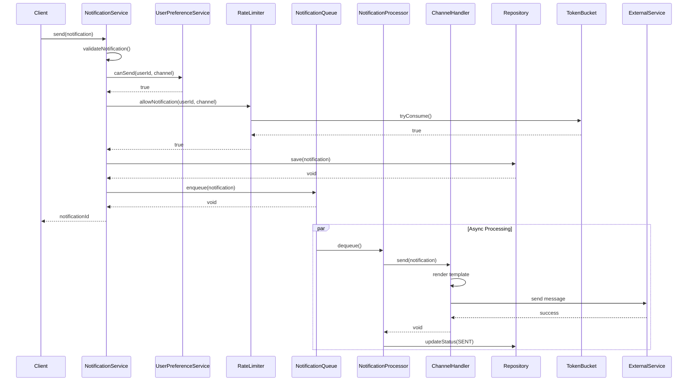
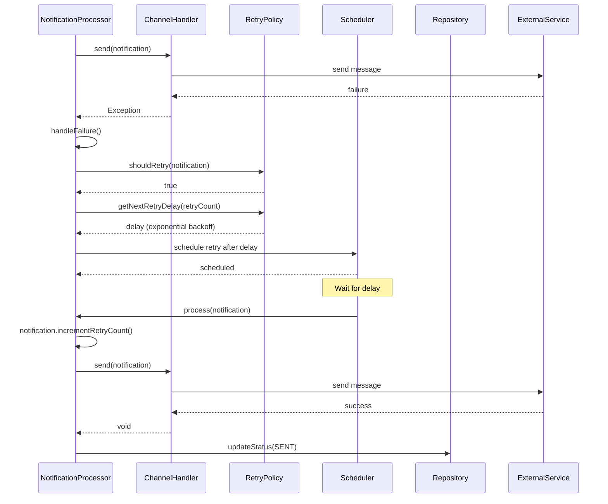
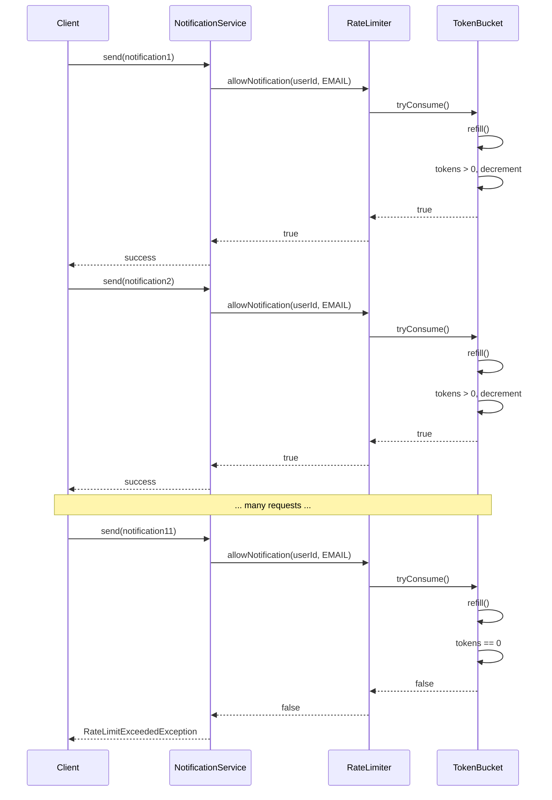

# Notification System - Low Level Design

## Problem Statement
Design a scalable notification system that supports multiple channels (email, SMS, push notifications), handles failures with retry logic, respects user preferences, and implements rate limiting to prevent notification spam.

## Requirements

### Functional Requirements
- Support multiple notification channels (Email, SMS, Push, In-App)
- User preference management (opt-in/opt-out per channel)
- Template-based notifications
- Priority levels (Low, Medium, High, Critical)
- Retry mechanism for failed notifications
- Rate limiting per user and channel
- Notification scheduling (immediate, delayed, scheduled)
- Notification history and delivery status tracking
- Batch notifications
- Notification grouping and digests

### Non-Functional Requirements
- High availability (99.9%)
- Handle 1M+ notifications per day
- Low latency for critical notifications (<1s)
- Thread-safe operations
- Fault tolerance with retry and fallback
- Scalable architecture

## Core Entities

### Class Diagram

```mermaid
classDiagram
    class NotificationService {
        -NotificationQueue queue
        -NotificationProcessor processor
        -UserPreferenceService preferenceService
        -RateLimiter rateLimiter
        +send(Notification notification)
        +sendBatch(List~Notification~ notifications)
        +schedule(Notification notification, LocalDateTime time)
        +retry(String notificationId)
    }

    class Notification {
        -String notificationId
        -String userId
        -NotificationType type
        -NotificationChannel channel
        -Priority priority
        -String templateId
        -Map~String, Object~ data
        -NotificationStatus status
        -int retryCount
        -LocalDateTime createdAt
        -LocalDateTime scheduledAt
        +toChannelMessage()
    }

    class NotificationQueue {
        -PriorityBlockingQueue~Notification~ queue
        +enqueue(Notification notification)
        +dequeue()
        +size()
    }

    class NotificationProcessor {
        -Map~NotificationChannel, ChannelHandler~ handlers
        -ExecutorService executorService
        -RetryPolicy retryPolicy
        +process(Notification notification)
        +processAsync(Notification notification)
    }

    class ChannelHandler {
        <<interface>>
        +send(Notification notification)
        +validate(Notification notification)
        +supports(NotificationChannel channel)
    }

    class EmailChannelHandler {
        -EmailService emailService
        -TemplateEngine templateEngine
        +send(Notification notification)
        +validate(Notification notification)
    }

    class SmsChannelHandler {
        -SmsService smsService
        -TemplateEngine templateEngine
        +send(Notification notification)
        +validate(Notification notification)
    }

    class PushChannelHandler {
        -PushService pushService
        -DeviceTokenService deviceService
        +send(Notification notification)
        +validate(Notification notification)
    }

    class InAppChannelHandler {
        -InAppNotificationRepository repository
        +send(Notification notification)
        +validate(Notification notification)
    }

    class UserPreferenceService {
        -UserPreferenceRepository repository
        +getPreferences(String userId)
        +updatePreference(String userId, NotificationChannel channel, boolean enabled)
        +canSend(String userId, NotificationChannel channel)
    }

    class UserPreference {
        -String userId
        -Map~NotificationChannel, Boolean~ channelPreferences
        -Map~NotificationType, Boolean~ typePreferences
        -QuietHours quietHours
        +isChannelEnabled(NotificationChannel channel)
        +isTypeEnabled(NotificationType type)
    }

    class RateLimiter {
        -Map~String, TokenBucket~ userBuckets
        -Map~NotificationChannel, RateLimit~ channelLimits
        +allowNotification(String userId, NotificationChannel channel)
        +resetLimits(String userId)
    }

    class TokenBucket {
        -int capacity
        -int tokens
        -long lastRefillTime
        -long refillRate
        +tryConsume()
        +refill()
    }

    class RetryPolicy {
        -int maxRetries
        -long initialDelay
        -double backoffMultiplier
        -long maxDelay
        +shouldRetry(Notification notification)
        +getNextRetryDelay(int retryCount)
    }

    class NotificationRepository {
        -Map~String, Notification~ notifications
        -ReadWriteLock lock
        +save(Notification notification)
        +findById(String notificationId)
        +findByUser(String userId)
        +updateStatus(String notificationId, NotificationStatus status)
    }

    class TemplateEngine {
        -Map~String, Template~ templates
        +render(String templateId, Map~String, Object~ data)
        +registerTemplate(String templateId, Template template)
    }

    class Template {
        -String templateId
        -String subject
        -String body
        -String channel
        +render(Map~String, Object~ data)
    }

    class NotificationChannel {
        <<enumeration>>
        EMAIL
        SMS
        PUSH
        IN_APP
    }

    class NotificationType {
        <<enumeration>>
        ACCOUNT_UPDATE
        ORDER_STATUS
        PAYMENT_REMINDER
        MARKETING
        SYSTEM_ALERT
    }

    class NotificationStatus {
        <<enumeration>>
        PENDING
        PROCESSING
        SENT
        DELIVERED
        FAILED
        CANCELLED
    }

    class Priority {
        <<enumeration>>
        LOW
        MEDIUM
        HIGH
        CRITICAL
    }

    NotificationService --> NotificationQueue
    NotificationService --> NotificationProcessor
    NotificationService --> UserPreferenceService
    NotificationService --> RateLimiter
    NotificationService --> NotificationRepository
    NotificationProcessor --> ChannelHandler
    NotificationProcessor --> RetryPolicy
    ChannelHandler <|.. EmailChannelHandler
    ChannelHandler <|.. SmsChannelHandler
    ChannelHandler <|.. PushChannelHandler
    ChannelHandler <|.. InAppChannelHandler
    EmailChannelHandler --> TemplateEngine
    SmsChannelHandler --> TemplateEngine
    TemplateEngine --> Template
    UserPreferenceService --> UserPreference
    RateLimiter --> TokenBucket
    Notification --> NotificationChannel
    Notification --> NotificationType
    Notification --> NotificationStatus
    Notification --> Priority
```



## Design Patterns Used

1. **Strategy Pattern**: Different channel handlers for each notification type
2. **Observer Pattern**: Notification delivery status updates
3. **Factory Pattern**: Creating notifications from templates
4. **Command Pattern**: Notification as executable command
5. **Chain of Responsibility**: Validation and filtering chain
6. **Template Method**: Base notification sending template
7. **Retry Pattern**: Exponential backoff for failed notifications
8. **Circuit Breaker**: Prevent cascading failures

## Key Implementation

### NotificationService.java
```java
public class NotificationService {
    private final NotificationQueue queue;
    private final NotificationProcessor processor;
    private final UserPreferenceService preferenceService;
    private final RateLimiter rateLimiter;
    private final NotificationRepository repository;
    private final ScheduledExecutorService scheduler;

    public NotificationService(
            NotificationQueue queue,
            NotificationProcessor processor,
            UserPreferenceService preferenceService,
            RateLimiter rateLimiter,
            NotificationRepository repository) {
        this.queue = queue;
        this.processor = processor;
        this.preferenceService = preferenceService;
        this.rateLimiter = rateLimiter;
        this.repository = repository;
        this.scheduler = Executors.newScheduledThreadPool(5);

        startProcessing();
    }

    public String send(Notification notification) {
        if (!validateNotification(notification)) {
            throw new InvalidNotificationException("Invalid notification");
        }

        if (!preferenceService.canSend(notification.getUserId(), notification.getChannel())) {
            notification.setStatus(NotificationStatus.CANCELLED);
            repository.save(notification);
            return notification.getNotificationId();
        }

        if (!rateLimiter.allowNotification(notification.getUserId(), notification.getChannel())) {
            throw new RateLimitExceededException("Rate limit exceeded for user: " + notification.getUserId());
        }

        repository.save(notification);
        queue.enqueue(notification);

        return notification.getNotificationId();
    }

    public List<String> sendBatch(List<Notification> notifications) {
        List<String> notificationIds = new ArrayList<>();

        for (Notification notification : notifications) {
            try {
                String id = send(notification);
                notificationIds.add(id);
            } catch (Exception e) {
                System.err.println("Failed to send notification: " + e.getMessage());
            }
        }

        return notificationIds;
    }

    public String schedule(Notification notification, LocalDateTime scheduledTime) {
        notification.setScheduledAt(scheduledTime);
        repository.save(notification);

        long delay = Duration.between(LocalDateTime.now(), scheduledTime).toMillis();

        scheduler.schedule(() -> {
            try {
                send(notification);
            } catch (Exception e) {
                System.err.println("Failed to send scheduled notification: " + e.getMessage());
            }
        }, delay, TimeUnit.MILLISECONDS);

        return notification.getNotificationId();
    }

    public void retry(String notificationId) {
        Notification notification = repository.findById(notificationId)
            .orElseThrow(() -> new NotificationNotFoundException(notificationId));

        if (notification.getStatus() == NotificationStatus.FAILED) {
            notification.incrementRetryCount();
            queue.enqueue(notification);
        }
    }

    private void startProcessing() {
        int workerThreads = 10;
        for (int i = 0; i < workerThreads; i++) {
            Thread worker = new Thread(() -> {
                while (!Thread.currentThread().isInterrupted()) {
                    try {
                        Notification notification = queue.dequeue();
                        processor.processAsync(notification);
                    } catch (InterruptedException e) {
                        Thread.currentThread().interrupt();
                        break;
                    } catch (Exception e) {
                        System.err.println("Worker thread error: " + e.getMessage());
                    }
                }
            });
            worker.setDaemon(true);
            worker.start();
        }
    }

    private boolean validateNotification(Notification notification) {
        return notification != null &&
               notification.getUserId() != null &&
               notification.getChannel() != null &&
               notification.getType() != null;
    }
}
```

### Notification.java
```java
public class Notification implements Comparable<Notification> {
    private final String notificationId;
    private final String userId;
    private final NotificationType type;
    private final NotificationChannel channel;
    private final Priority priority;
    private final String templateId;
    private final Map<String, Object> data;
    private NotificationStatus status;
    private int retryCount;
    private final LocalDateTime createdAt;
    private LocalDateTime scheduledAt;
    private LocalDateTime sentAt;
    private String errorMessage;

    public Notification(Builder builder) {
        this.notificationId = builder.notificationId;
        this.userId = builder.userId;
        this.type = builder.type;
        this.channel = builder.channel;
        this.priority = builder.priority;
        this.templateId = builder.templateId;
        this.data = builder.data;
        this.status = NotificationStatus.PENDING;
        this.retryCount = 0;
        this.createdAt = LocalDateTime.now();
    }

    @Override
    public int compareTo(Notification other) {
        int priorityCompare = Integer.compare(
            other.priority.ordinal(),
            this.priority.ordinal()
        );

        if (priorityCompare != 0) {
            return priorityCompare;
        }

        return this.createdAt.compareTo(other.createdAt);
    }

    public void setStatus(NotificationStatus status) {
        this.status = status;
    }

    public void incrementRetryCount() {
        this.retryCount++;
    }

    public void setErrorMessage(String errorMessage) {
        this.errorMessage = errorMessage;
    }

    public void setScheduledAt(LocalDateTime scheduledAt) {
        this.scheduledAt = scheduledAt;
    }

    public void setSentAt(LocalDateTime sentAt) {
        this.sentAt = sentAt;
    }

    public static class Builder {
        private String notificationId;
        private String userId;
        private NotificationType type;
        private NotificationChannel channel;
        private Priority priority = Priority.MEDIUM;
        private String templateId;
        private Map<String, Object> data = new HashMap<>();

        public Builder notificationId(String notificationId) {
            this.notificationId = notificationId;
            return this;
        }

        public Builder userId(String userId) {
            this.userId = userId;
            return this;
        }

        public Builder type(NotificationType type) {
            this.type = type;
            return this;
        }

        public Builder channel(NotificationChannel channel) {
            this.channel = channel;
            return this;
        }

        public Builder priority(Priority priority) {
            this.priority = priority;
            return this;
        }

        public Builder templateId(String templateId) {
            this.templateId = templateId;
            return this;
        }

        public Builder data(Map<String, Object> data) {
            this.data = data;
            return this;
        }

        public Notification build() {
            if (notificationId == null) {
                notificationId = UUID.randomUUID().toString();
            }
            return new Notification(this);
        }
    }

    public String getNotificationId() {
        return notificationId;
    }

    public String getUserId() {
        return userId;
    }

    public NotificationType getType() {
        return type;
    }

    public NotificationChannel getChannel() {
        return channel;
    }

    public Priority getPriority() {
        return priority;
    }

    public String getTemplateId() {
        return templateId;
    }

    public Map<String, Object> getData() {
        return data;
    }

    public NotificationStatus getStatus() {
        return status;
    }

    public int getRetryCount() {
        return retryCount;
    }
}
```

### NotificationProcessor.java
```java
public class NotificationProcessor {
    private final Map<NotificationChannel, ChannelHandler> handlers;
    private final ExecutorService executorService;
    private final RetryPolicy retryPolicy;
    private final NotificationRepository repository;

    public NotificationProcessor(
            Map<NotificationChannel, ChannelHandler> handlers,
            RetryPolicy retryPolicy,
            NotificationRepository repository) {
        this.handlers = handlers;
        this.executorService = Executors.newFixedThreadPool(20);
        this.retryPolicy = retryPolicy;
        this.repository = repository;
    }

    public void process(Notification notification) {
        try {
            notification.setStatus(NotificationStatus.PROCESSING);
            repository.updateStatus(notification.getNotificationId(), NotificationStatus.PROCESSING);

            ChannelHandler handler = handlers.get(notification.getChannel());
            if (handler == null) {
                throw new UnsupportedChannelException("No handler for channel: " + notification.getChannel());
            }

            if (!handler.validate(notification)) {
                throw new ValidationException("Notification validation failed");
            }

            handler.send(notification);

            notification.setStatus(NotificationStatus.SENT);
            notification.setSentAt(LocalDateTime.now());
            repository.updateStatus(notification.getNotificationId(), NotificationStatus.SENT);

        } catch (Exception e) {
            handleFailure(notification, e);
        }
    }

    public CompletableFuture<Void> processAsync(Notification notification) {
        return CompletableFuture.runAsync(() -> process(notification), executorService);
    }

    private void handleFailure(Notification notification, Exception e) {
        notification.setErrorMessage(e.getMessage());

        if (retryPolicy.shouldRetry(notification)) {
            scheduleRetry(notification);
        } else {
            notification.setStatus(NotificationStatus.FAILED);
            repository.updateStatus(notification.getNotificationId(), NotificationStatus.FAILED);
        }
    }

    private void scheduleRetry(Notification notification) {
        long delay = retryPolicy.getNextRetryDelay(notification.getRetryCount());

        ScheduledExecutorService scheduler = Executors.newSingleThreadScheduledExecutor();
        scheduler.schedule(() -> {
            notification.incrementRetryCount();
            process(notification);
        }, delay, TimeUnit.MILLISECONDS);
    }

    public void shutdown() {
        executorService.shutdown();
    }
}
```

### Channel Handler Implementations

```java
public class EmailChannelHandler implements ChannelHandler {
    private final EmailService emailService;
    private final TemplateEngine templateEngine;

    public EmailChannelHandler(EmailService emailService, TemplateEngine templateEngine) {
        this.emailService = emailService;
        this.templateEngine = templateEngine;
    }

    @Override
    public void send(Notification notification) {
        String content = templateEngine.render(
            notification.getTemplateId(),
            notification.getData()
        );

        String recipient = (String) notification.getData().get("email");
        String subject = (String) notification.getData().get("subject");

        emailService.sendEmail(recipient, subject, content);
    }

    @Override
    public boolean validate(Notification notification) {
        Map<String, Object> data = notification.getData();
        return data.containsKey("email") && data.containsKey("subject");
    }

    @Override
    public boolean supports(NotificationChannel channel) {
        return channel == NotificationChannel.EMAIL;
    }
}

public class SmsChannelHandler implements ChannelHandler {
    private final SmsService smsService;
    private final TemplateEngine templateEngine;

    public SmsChannelHandler(SmsService smsService, TemplateEngine templateEngine) {
        this.smsService = smsService;
        this.templateEngine = templateEngine;
    }

    @Override
    public void send(Notification notification) {
        String content = templateEngine.render(
            notification.getTemplateId(),
            notification.getData()
        );

        String phoneNumber = (String) notification.getData().get("phoneNumber");
        smsService.sendSms(phoneNumber, content);
    }

    @Override
    public boolean validate(Notification notification) {
        Map<String, Object> data = notification.getData();
        return data.containsKey("phoneNumber");
    }

    @Override
    public boolean supports(NotificationChannel channel) {
        return channel == NotificationChannel.SMS;
    }
}

public class PushChannelHandler implements ChannelHandler {
    private final PushService pushService;
    private final DeviceTokenService deviceService;

    public PushChannelHandler(PushService pushService, DeviceTokenService deviceService) {
        this.pushService = pushService;
        this.deviceService = deviceService;
    }

    @Override
    public void send(Notification notification) {
        List<String> deviceTokens = deviceService.getDeviceTokens(notification.getUserId());

        String title = (String) notification.getData().get("title");
        String body = (String) notification.getData().get("body");

        for (String token : deviceTokens) {
            pushService.sendPushNotification(token, title, body);
        }
    }

    @Override
    public boolean validate(Notification notification) {
        Map<String, Object> data = notification.getData();
        return data.containsKey("title") && data.containsKey("body");
    }

    @Override
    public boolean supports(NotificationChannel channel) {
        return channel == NotificationChannel.PUSH;
    }
}
```

### RateLimiter.java
```java
public class RateLimiter {
    private final Map<String, Map<NotificationChannel, TokenBucket>> userBuckets;
    private final Map<NotificationChannel, RateLimit> channelLimits;
    private final ReadWriteLock lock;

    public RateLimiter() {
        this.userBuckets = new ConcurrentHashMap<>();
        this.channelLimits = new HashMap<>();
        this.lock = new ReentrantReadWriteLock();

        initializeDefaultLimits();
    }

    private void initializeDefaultLimits() {
        channelLimits.put(NotificationChannel.EMAIL, new RateLimit(10, 60));
        channelLimits.put(NotificationChannel.SMS, new RateLimit(5, 60));
        channelLimits.put(NotificationChannel.PUSH, new RateLimit(20, 60));
        channelLimits.put(NotificationChannel.IN_APP, new RateLimit(50, 60));
    }

    public boolean allowNotification(String userId, NotificationChannel channel) {
        lock.readLock().lock();
        try {
            TokenBucket bucket = getOrCreateBucket(userId, channel);
            return bucket.tryConsume();
        } finally {
            lock.readLock().unlock();
        }
    }

    private TokenBucket getOrCreateBucket(String userId, NotificationChannel channel) {
        userBuckets.putIfAbsent(userId, new ConcurrentHashMap<>());
        Map<NotificationChannel, TokenBucket> channelBuckets = userBuckets.get(userId);

        return channelBuckets.computeIfAbsent(channel, ch -> {
            RateLimit limit = channelLimits.get(channel);
            return new TokenBucket(limit.getMaxRequests(), limit.getWindowSeconds());
        });
    }

    public void resetLimits(String userId) {
        lock.writeLock().lock();
        try {
            userBuckets.remove(userId);
        } finally {
            lock.writeLock().unlock();
        }
    }
}
```

### TokenBucket.java
```java
public class TokenBucket {
    private final int capacity;
    private int tokens;
    private long lastRefillTime;
    private final long refillRate;
    private final Lock lock;

    public TokenBucket(int capacity, long windowSeconds) {
        this.capacity = capacity;
        this.tokens = capacity;
        this.lastRefillTime = System.currentTimeMillis();
        this.refillRate = TimeUnit.SECONDS.toMillis(windowSeconds) / capacity;
        this.lock = new ReentrantLock();
    }

    public boolean tryConsume() {
        lock.lock();
        try {
            refill();

            if (tokens > 0) {
                tokens--;
                return true;
            }

            return false;
        } finally {
            lock.unlock();
        }
    }

    private void refill() {
        long now = System.currentTimeMillis();
        long timePassed = now - lastRefillTime;

        if (timePassed > refillRate) {
            int tokensToAdd = (int) (timePassed / refillRate);
            tokens = Math.min(capacity, tokens + tokensToAdd);
            lastRefillTime = now;
        }
    }
}
```

### RetryPolicy.java
```java
public class RetryPolicy {
    private final int maxRetries;
    private final long initialDelayMs;
    private final double backoffMultiplier;
    private final long maxDelayMs;

    public RetryPolicy(int maxRetries, long initialDelayMs, double backoffMultiplier, long maxDelayMs) {
        this.maxRetries = maxRetries;
        this.initialDelayMs = initialDelayMs;
        this.backoffMultiplier = backoffMultiplier;
        this.maxDelayMs = maxDelayMs;
    }

    public boolean shouldRetry(Notification notification) {
        return notification.getRetryCount() < maxRetries;
    }

    public long getNextRetryDelay(int retryCount) {
        long delay = (long) (initialDelayMs * Math.pow(backoffMultiplier, retryCount));
        return Math.min(delay, maxDelayMs);
    }
}
```

## Sequence Diagrams

### 1. Send Notification Flow



### 2. Retry Flow



### 3. Rate Limiting Flow



## Database Schema

```sql
-- Notifications table
CREATE TABLE notifications (
    notification_id VARCHAR(50) PRIMARY KEY,
    user_id VARCHAR(50) NOT NULL,
    type VARCHAR(50) NOT NULL,
    channel VARCHAR(20) NOT NULL,
    priority VARCHAR(20) NOT NULL,
    template_id VARCHAR(50),
    data JSON,
    status VARCHAR(20) NOT NULL,
    retry_count INT DEFAULT 0,
    error_message TEXT,
    created_at TIMESTAMP DEFAULT CURRENT_TIMESTAMP,
    scheduled_at TIMESTAMP,
    sent_at TIMESTAMP,
    INDEX idx_user_status (user_id, status),
    INDEX idx_status_created (status, created_at),
    INDEX idx_scheduled (scheduled_at)
);

-- User preferences table
CREATE TABLE user_preferences (
    user_id VARCHAR(50) PRIMARY KEY,
    channel_preferences JSON,
    type_preferences JSON,
    quiet_hours_start TIME,
    quiet_hours_end TIME,
    updated_at TIMESTAMP DEFAULT CURRENT_TIMESTAMP ON UPDATE CURRENT_TIMESTAMP
);

-- Templates table
CREATE TABLE notification_templates (
    template_id VARCHAR(50) PRIMARY KEY,
    name VARCHAR(100) NOT NULL,
    channel VARCHAR(20) NOT NULL,
    subject VARCHAR(200),
    body TEXT NOT NULL,
    variables JSON,
    created_at TIMESTAMP DEFAULT CURRENT_TIMESTAMP,
    INDEX idx_channel (channel)
);
```

## Thread Safety Considerations

1. **ConcurrentHashMap**: For handlers and user buckets
2. **ReadWriteLock**: In repository and rate limiter
3. **ReentrantLock**: In TokenBucket for token operations
4. **PriorityBlockingQueue**: Thread-safe notification queue
5. **Atomic Operations**: For status updates
6. **Synchronized Methods**: For critical sections

## Scalability Considerations

### Performance Optimization
- Async processing with worker threads
- Priority queue for critical notifications
- Batch processing for non-critical notifications
- Template caching
- Connection pooling for external services

### Horizontal Scaling
- Use message queue (Kafka/RabbitMQ) instead of in-memory queue
- Distributed rate limiting with Redis
- Separate services per channel
- Database sharding by user_id
- Cache user preferences in Redis

### Reliability
- Dead letter queue for failed notifications
- Circuit breaker for external service failures
- Idempotency for retry scenarios
- Health checks for channel services
- Fallback channels (SMS if push fails)
