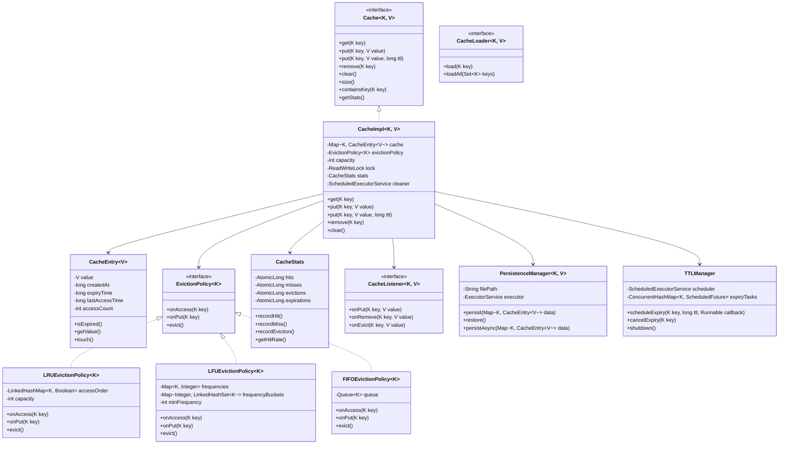
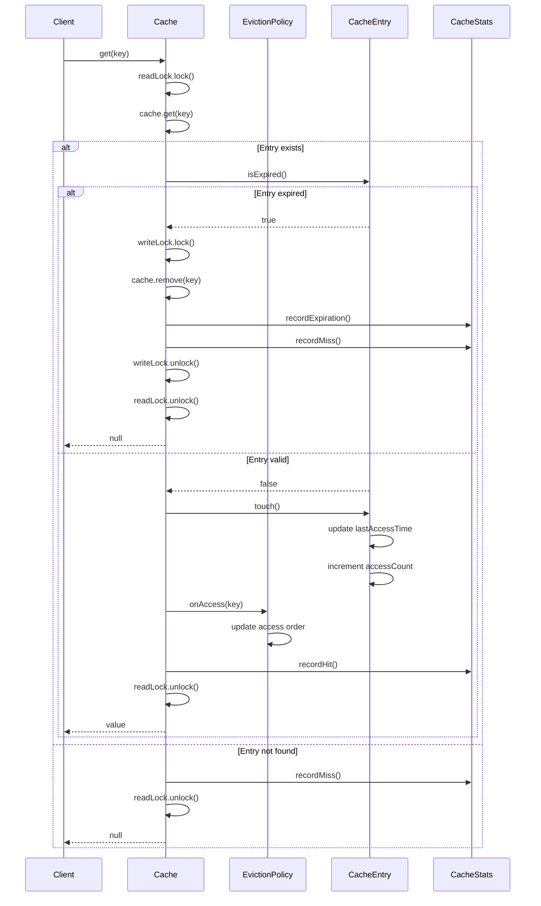
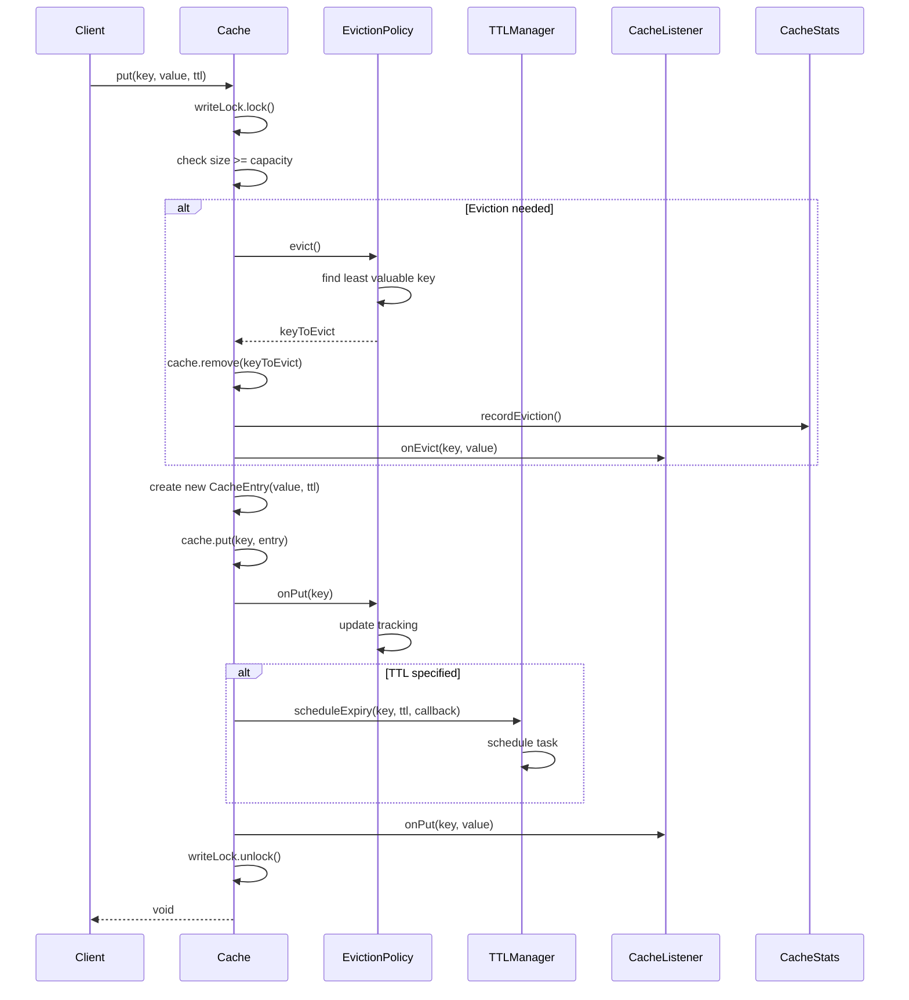
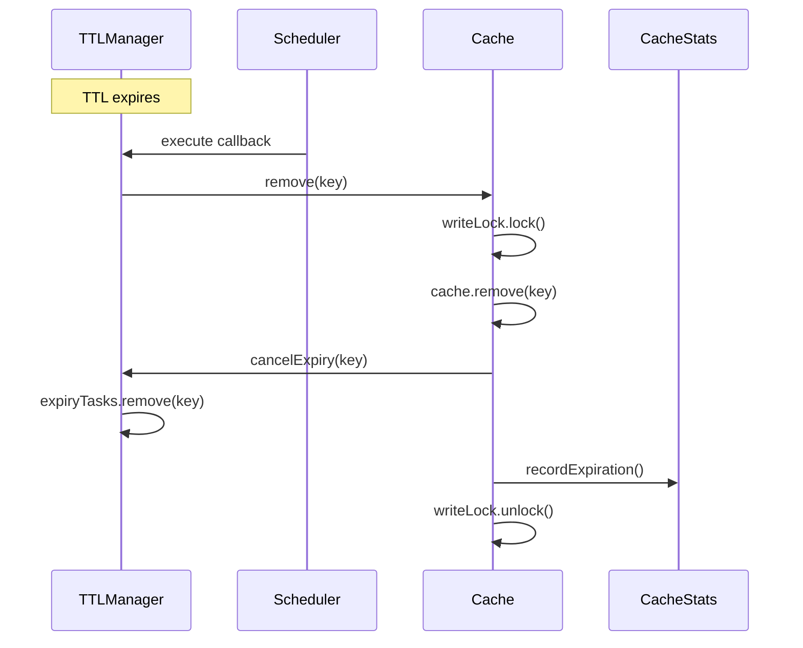
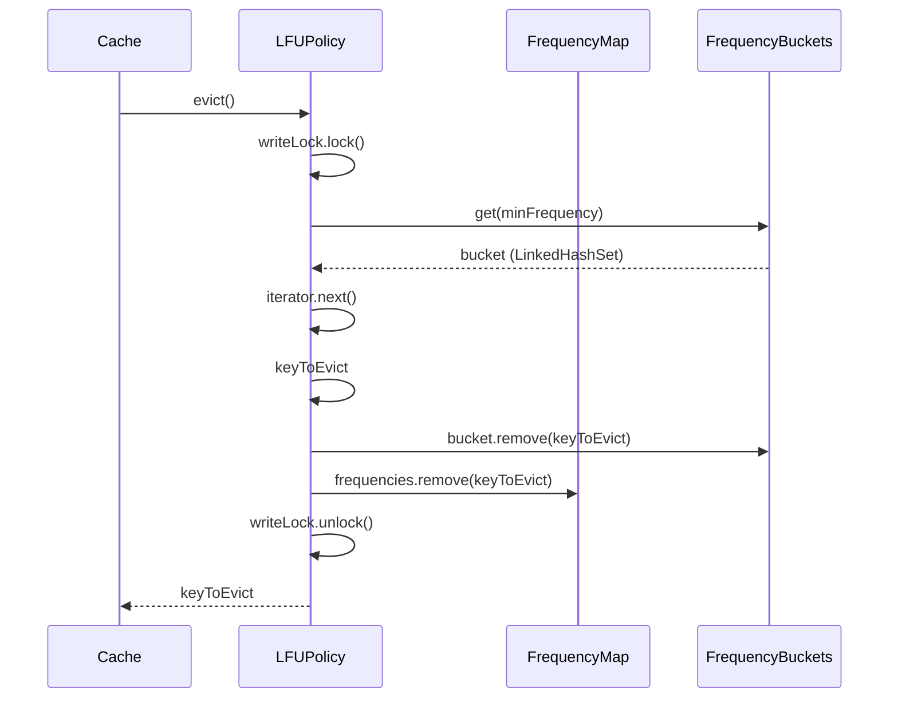

# Cache / In-Memory Store - Low Level Design

## Problem Statement
Design a high-performance in-memory cache/store with support for multiple eviction policies (LRU, LFU), TTL (Time-To-Live), thread safety, and persistence options. The cache should be scalable and handle concurrent read/write operations efficiently.

## Requirements

### Functional Requirements
- Support multiple eviction policies (LRU, LFU, FIFO)
- TTL (Time-To-Live) for cache entries
- Thread-safe operations for concurrent access
- Get, Put, Delete, Clear operations
- Cache statistics (hit rate, miss rate, eviction count)
- Capacity management with configurable size limits
- Optional persistence to disk
- Support for batch operations
- Cache warming and preloading
- Event listeners for cache operations

### Non-Functional Requirements
- O(1) time complexity for get/put operations
- Thread-safe for concurrent access
- Handle 100K+ requests per second
- Low memory overhead
- Configurable cache size and eviction policy
- High cache hit ratio (>80%)

## Core Entities

### Class Diagram



## Design Patterns Used

1. **Strategy Pattern**: Different eviction policies (LRU, LFU, FIFO)
2. **Singleton Pattern**: Single cache instance per configuration
3. **Factory Pattern**: Creating cache with different configurations
4. **Observer Pattern**: Cache listeners for events
5. **Template Method**: Base cache operations template
6. **Builder Pattern**: Complex cache configuration
7. **Decorator Pattern**: Adding features like TTL, persistence

## Key Implementation

### Cache Interface
```java
public interface Cache<K, V> {
    V get(K key);
    void put(K key, V value);
    void put(K key, V value, long ttlMillis);
    V remove(K key);
    void clear();
    int size();
    boolean containsKey(K key);
    CacheStats getStats();
}
```

### CacheImpl.java
```java
public class CacheImpl<K, V> implements Cache<K, V> {
    private final Map<K, CacheEntry<V>> cache;
    private final EvictionPolicy<K> evictionPolicy;
    private final int capacity;
    private final ReadWriteLock lock;
    private final Lock readLock;
    private final Lock writeLock;
    private final CacheStats stats;
    private final TTLManager<K> ttlManager;
    private final List<CacheListener<K, V>> listeners;
    private final PersistenceManager<K, V> persistenceManager;

    public CacheImpl(Builder<K, V> builder) {
        this.capacity = builder.capacity;
        this.cache = new ConcurrentHashMap<>();
        this.evictionPolicy = builder.evictionPolicy;
        this.lock = new ReentrantReadWriteLock();
        this.readLock = lock.readLock();
        this.writeLock = lock.writeLock();
        this.stats = new CacheStats();
        this.ttlManager = new TTLManager<>();
        this.listeners = new CopyOnWriteArrayList<>();
        this.persistenceManager = builder.persistenceManager;

        if (builder.listeners != null) {
            this.listeners.addAll(builder.listeners);
        }

        if (persistenceManager != null) {
            restoreFromPersistence();
        }
    }

    @Override
    public V get(K key) {
        if (key == null) {
            throw new IllegalArgumentException("Key cannot be null");
        }

        readLock.lock();
        try {
            CacheEntry<V> entry = cache.get(key);

            if (entry == null) {
                stats.recordMiss();
                return null;
            }

            if (entry.isExpired()) {
                writeLock.lock();
                try {
                    cache.remove(key);
                    stats.recordExpiration();
                    stats.recordMiss();
                    return null;
                } finally {
                    writeLock.unlock();
                }
            }

            entry.touch();
            evictionPolicy.onAccess(key);
            stats.recordHit();

            return entry.getValue();
        } finally {
            readLock.unlock();
        }
    }

    @Override
    public void put(K key, V value) {
        put(key, value, -1);
    }

    @Override
    public void put(K key, V value, long ttlMillis) {
        if (key == null || value == null) {
            throw new IllegalArgumentException("Key and value cannot be null");
        }

        writeLock.lock();
        try {
            if (cache.size() >= capacity && !cache.containsKey(key)) {
                evict();
            }

            CacheEntry<V> entry = new CacheEntry<>(value, ttlMillis);
            CacheEntry<V> oldEntry = cache.put(key, entry);

            if (oldEntry == null) {
                evictionPolicy.onPut(key);
            } else {
                evictionPolicy.onAccess(key);
            }

            if (ttlMillis > 0) {
                ttlManager.scheduleExpiry(key, ttlMillis, () -> remove(key));
            }

            notifyListeners(listener -> listener.onPut(key, value));

            if (persistenceManager != null) {
                persistenceManager.persistAsync(cache);
            }
        } finally {
            writeLock.unlock();
        }
    }

    @Override
    public V remove(K key) {
        if (key == null) {
            return null;
        }

        writeLock.lock();
        try {
            CacheEntry<V> entry = cache.remove(key);

            if (entry != null) {
                ttlManager.cancelExpiry(key);
                V value = entry.getValue();
                notifyListeners(listener -> listener.onRemove(key, value));
                return value;
            }

            return null;
        } finally {
            writeLock.unlock();
        }
    }

    @Override
    public void clear() {
        writeLock.lock();
        try {
            cache.clear();
            ttlManager.clear();
            stats.reset();
        } finally {
            writeLock.unlock();
        }
    }

    @Override
    public int size() {
        readLock.lock();
        try {
            return cache.size();
        } finally {
            readLock.unlock();
        }
    }

    @Override
    public boolean containsKey(K key) {
        readLock.lock();
        try {
            CacheEntry<V> entry = cache.get(key);
            return entry != null && !entry.isExpired();
        } finally {
            readLock.unlock();
        }
    }

    @Override
    public CacheStats getStats() {
        return stats;
    }

    private void evict() {
        K keyToEvict = evictionPolicy.evict();
        if (keyToEvict != null) {
            CacheEntry<V> entry = cache.remove(keyToEvict);
            if (entry != null) {
                stats.recordEviction();
                V value = entry.getValue();
                notifyListeners(listener -> listener.onEvict(keyToEvict, value));
            }
        }
    }

    private void notifyListeners(Consumer<CacheListener<K, V>> action) {
        for (CacheListener<K, V> listener : listeners) {
            try {
                action.accept(listener);
            } catch (Exception e) {
                System.err.println("Listener error: " + e.getMessage());
            }
        }
    }

    private void restoreFromPersistence() {
        if (persistenceManager != null) {
            Map<K, CacheEntry<V>> restored = persistenceManager.restore();
            if (restored != null) {
                cache.putAll(restored);
            }
        }
    }

    public void addListener(CacheListener<K, V> listener) {
        listeners.add(listener);
    }

    public static class Builder<K, V> {
        private int capacity = 1000;
        private EvictionPolicy<K> evictionPolicy;
        private PersistenceManager<K, V> persistenceManager;
        private List<CacheListener<K, V>> listeners;

        public Builder<K, V> capacity(int capacity) {
            this.capacity = capacity;
            return this;
        }

        public Builder<K, V> evictionPolicy(EvictionPolicy<K> policy) {
            this.evictionPolicy = policy;
            return this;
        }

        public Builder<K, V> persistence(PersistenceManager<K, V> manager) {
            this.persistenceManager = manager;
            return this;
        }

        public Builder<K, V> listeners(List<CacheListener<K, V>> listeners) {
            this.listeners = listeners;
            return this;
        }

        public CacheImpl<K, V> build() {
            if (evictionPolicy == null) {
                evictionPolicy = new LRUEvictionPolicy<>(capacity);
            }
            return new CacheImpl<>(this);
        }
    }
}
```

### CacheEntry.java
```java
public class CacheEntry<V> {
    private final V value;
    private final long createdAt;
    private final long expiryTime;
    private volatile long lastAccessTime;
    private final AtomicInteger accessCount;

    public CacheEntry(V value, long ttlMillis) {
        this.value = value;
        this.createdAt = System.currentTimeMillis();
        this.lastAccessTime = createdAt;
        this.expiryTime = ttlMillis > 0 ? createdAt + ttlMillis : -1;
        this.accessCount = new AtomicInteger(0);
    }

    public boolean isExpired() {
        if (expiryTime < 0) {
            return false;
        }
        return System.currentTimeMillis() > expiryTime;
    }

    public V getValue() {
        return value;
    }

    public void touch() {
        this.lastAccessTime = System.currentTimeMillis();
        this.accessCount.incrementAndGet();
    }

    public long getLastAccessTime() {
        return lastAccessTime;
    }

    public int getAccessCount() {
        return accessCount.get();
    }

    public long getCreatedAt() {
        return createdAt;
    }
}
```

### LRUEvictionPolicy.java
```java
public class LRUEvictionPolicy<K> implements EvictionPolicy<K> {
    private final LinkedHashMap<K, Boolean> accessOrder;
    private final int capacity;
    private final ReadWriteLock lock;

    public LRUEvictionPolicy(int capacity) {
        this.capacity = capacity;
        this.accessOrder = new LinkedHashMap<K, Boolean>(capacity, 0.75f, true) {
            @Override
            protected boolean removeEldestEntry(Map.Entry<K, Boolean> eldest) {
                return size() > capacity;
            }
        };
        this.lock = new ReentrantReadWriteLock();
    }

    @Override
    public void onAccess(K key) {
        lock.writeLock().lock();
        try {
            accessOrder.put(key, Boolean.TRUE);
        } finally {
            lock.writeLock().unlock();
        }
    }

    @Override
    public void onPut(K key) {
        lock.writeLock().lock();
        try {
            accessOrder.put(key, Boolean.TRUE);
        } finally {
            lock.writeLock().unlock();
        }
    }

    @Override
    public K evict() {
        lock.writeLock().lock();
        try {
            if (accessOrder.isEmpty()) {
                return null;
            }

            Iterator<K> iterator = accessOrder.keySet().iterator();
            if (iterator.hasNext()) {
                K key = iterator.next();
                iterator.remove();
                return key;
            }

            return null;
        } finally {
            lock.writeLock().unlock();
        }
    }
}
```

### LFUEvictionPolicy.java
```java
public class LFUEvictionPolicy<K> implements EvictionPolicy<K> {
    private final Map<K, Integer> frequencies;
    private final Map<Integer, LinkedHashSet<K>> frequencyBuckets;
    private int minFrequency;
    private final ReadWriteLock lock;

    public LFUEvictionPolicy() {
        this.frequencies = new ConcurrentHashMap<>();
        this.frequencyBuckets = new ConcurrentHashMap<>();
        this.minFrequency = 0;
        this.lock = new ReentrantReadWriteLock();
    }

    @Override
    public void onAccess(K key) {
        lock.writeLock().lock();
        try {
            int currentFreq = frequencies.getOrDefault(key, 0);
            frequencies.put(key, currentFreq + 1);

            if (currentFreq > 0) {
                frequencyBuckets.get(currentFreq).remove(key);
                if (frequencyBuckets.get(currentFreq).isEmpty() && currentFreq == minFrequency) {
                    minFrequency++;
                }
            }

            int newFreq = currentFreq + 1;
            frequencyBuckets.computeIfAbsent(newFreq, k -> new LinkedHashSet<>()).add(key);
        } finally {
            lock.writeLock().unlock();
        }
    }

    @Override
    public void onPut(K key) {
        lock.writeLock().lock();
        try {
            frequencies.put(key, 1);
            frequencyBuckets.computeIfAbsent(1, k -> new LinkedHashSet<>()).add(key);
            minFrequency = 1;
        } finally {
            lock.writeLock().unlock();
        }
    }

    @Override
    public K evict() {
        lock.writeLock().lock();
        try {
            if (frequencyBuckets.isEmpty()) {
                return null;
            }

            LinkedHashSet<K> bucket = frequencyBuckets.get(minFrequency);
            if (bucket == null || bucket.isEmpty()) {
                return null;
            }

            Iterator<K> iterator = bucket.iterator();
            K keyToEvict = iterator.next();
            iterator.remove();

            frequencies.remove(keyToEvict);

            return keyToEvict;
        } finally {
            lock.writeLock().unlock();
        }
    }
}
```

### TTLManager.java
```java
public class TTLManager<K> {
    private final ScheduledExecutorService scheduler;
    private final ConcurrentHashMap<K, ScheduledFuture<?>> expiryTasks;

    public TTLManager() {
        this.scheduler = Executors.newScheduledThreadPool(2);
        this.expiryTasks = new ConcurrentHashMap<>();
    }

    public void scheduleExpiry(K key, long ttlMillis, Runnable callback) {
        cancelExpiry(key);

        ScheduledFuture<?> future = scheduler.schedule(
            callback,
            ttlMillis,
            TimeUnit.MILLISECONDS
        );

        expiryTasks.put(key, future);
    }

    public void cancelExpiry(K key) {
        ScheduledFuture<?> future = expiryTasks.remove(key);
        if (future != null) {
            future.cancel(false);
        }
    }

    public void clear() {
        for (ScheduledFuture<?> future : expiryTasks.values()) {
            future.cancel(false);
        }
        expiryTasks.clear();
    }

    public void shutdown() {
        clear();
        scheduler.shutdown();
    }
}
```

### CacheStats.java
```java
public class CacheStats {
    private final AtomicLong hits;
    private final AtomicLong misses;
    private final AtomicLong evictions;
    private final AtomicLong expirations;

    public CacheStats() {
        this.hits = new AtomicLong(0);
        this.misses = new AtomicLong(0);
        this.evictions = new AtomicLong(0);
        this.expirations = new AtomicLong(0);
    }

    public void recordHit() {
        hits.incrementAndGet();
    }

    public void recordMiss() {
        misses.incrementAndGet();
    }

    public void recordEviction() {
        evictions.incrementAndGet();
    }

    public void recordExpiration() {
        expirations.incrementAndGet();
    }

    public double getHitRate() {
        long totalRequests = hits.get() + misses.get();
        return totalRequests == 0 ? 0.0 : (double) hits.get() / totalRequests;
    }

    public long getHits() {
        return hits.get();
    }

    public long getMisses() {
        return misses.get();
    }

    public long getEvictions() {
        return evictions.get();
    }

    public long getExpirations() {
        return expirations.get();
    }

    public void reset() {
        hits.set(0);
        misses.set(0);
        evictions.set(0);
        expirations.set(0);
    }

    @Override
    public String toString() {
        return String.format(
            "CacheStats{hits=%d, misses=%d, hitRate=%.2f%%, evictions=%d, expirations=%d}",
            getHits(), getMisses(), getHitRate() * 100, getEvictions(), getExpirations()
        );
    }
}
```

## Sequence Diagrams

### 1. Cache Get Operation Flow



### 2. Cache Put with Eviction Flow



### 3. TTL Expiration Flow



### 4. LFU Eviction Policy Flow



## Thread Safety Considerations

1. **ReadWriteLock**: Allows concurrent reads, exclusive writes
2. **ConcurrentHashMap**: Thread-safe map for cache storage
3. **AtomicLong/AtomicInteger**: For statistics and counters
4. **Synchronized Collections**: For eviction policy data structures
5. **Volatile Fields**: For lastAccessTime in CacheEntry
6. **Lock per Policy**: Separate locks for eviction policy operations
7. **CopyOnWriteArrayList**: For listeners to avoid concurrent modification

## Performance Optimizations

1. **O(1) Operations**: HashMap for cache storage
2. **Read-Write Lock**: Maximize concurrent reads
3. **Lazy Expiration**: Check expiry on access, not proactively
4. **Batch Operations**: Support bulk put/get
5. **Lock Striping**: Different locks for different operations
6. **Async Persistence**: Non-blocking disk writes

## Usage Example

```java
public class CacheExample {
    public static void main(String[] args) {
        Cache<String, String> cache = new CacheImpl.Builder<String, String>()
            .capacity(1000)
            .evictionPolicy(new LRUEvictionPolicy<>(1000))
            .build();

        cache.put("key1", "value1");
        cache.put("key2", "value2", 5000);

        String value = cache.get("key1");
        System.out.println("Retrieved: " + value);

        CacheStats stats = cache.getStats();
        System.out.println(stats);
    }
}
```

## Scalability Considerations

### Distributed Caching
- Use Redis/Memcached for distributed scenarios
- Consistent hashing for cache partitioning
- Replication for high availability

### Memory Management
- Soft/Weak references for large objects
- Off-heap storage for very large caches
- Compression for values

### Monitoring
- JMX metrics exposure
- Cache hit/miss rates
- Eviction frequency
- Memory usage tracking
