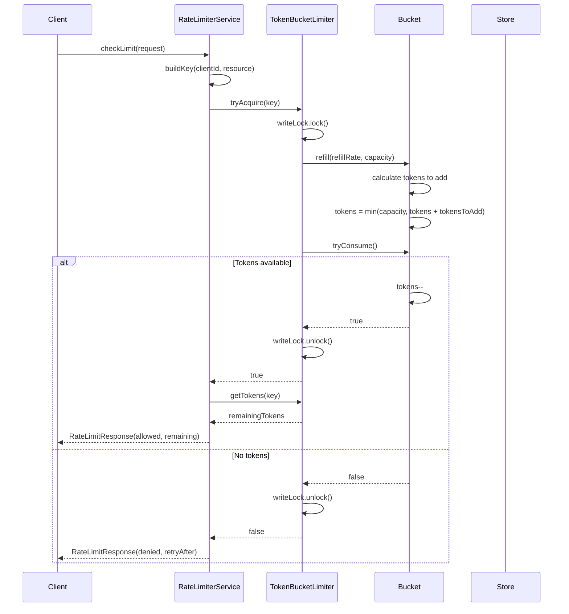
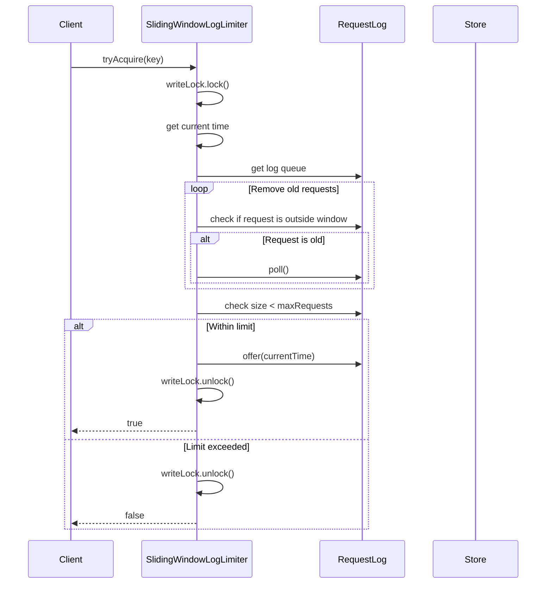
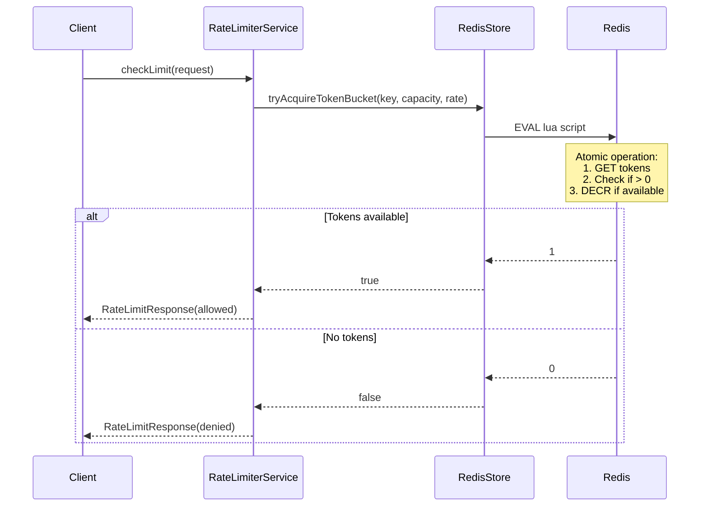
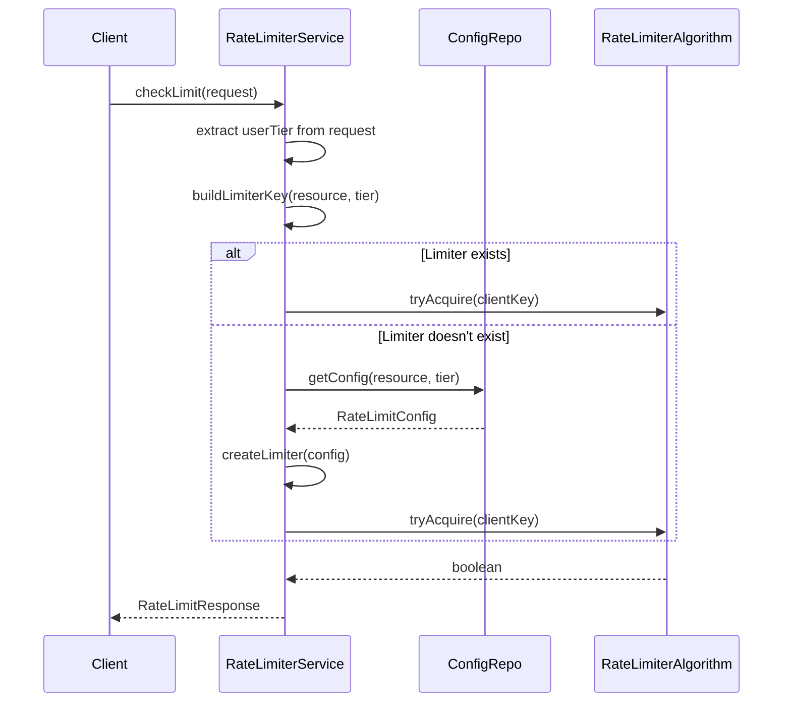

# Rate Limiter / API Gateway - Low Level Design

## Problem Statement
Design a rate limiter system that controls the rate of requests from clients, prevents abuse, and ensures fair resource allocation. Support multiple rate limiting algorithms (Token Bucket, Leaky Bucket, Fixed Window, Sliding Window) and per-client, per-API, and global limits.

## Requirements

### Functional Requirements
- Support multiple rate limiting algorithms
  - Token Bucket
  - Leaky Bucket
  - Fixed Window Counter
  - Sliding Window Log
  - Sliding Window Counter
- Per-client rate limiting
- Per-API endpoint rate limiting
- Global rate limiting
- Distributed rate limiting (multi-server support)
- Rate limit configuration management
- Rate limit exceeded responses
- Allow/deny list (whitelist/blacklist)
- Different limits for different user tiers (free, premium, enterprise)
- Rate limit headers in responses

### Non-Functional Requirements
- Low latency (<10ms overhead)
- Thread-safe for concurrent requests
- Handle 100K+ requests per second
- Accurate rate limiting
- Scalable across multiple servers
- Persistent rate limit state

## Core Entities

### Class Diagram

```mermaid
classDiagram
    class RateLimiter {
        <<interface>>
        +allowRequest(String clientId)
        +allowRequest(String clientId, String resource)
        +getRemainingTokens(String clientId)
        +reset(String clientId)
    }

    class RateLimiterService {
        -Map~String, RateLimiterAlgorithm~ limiters
        -RateLimitConfigRepository configRepo
        -RateLimitStore store
        -AllowDenyList allowDenyList
        +checkLimit(Request request)
        +registerLimiter(String key, RateLimiterAlgorithm limiter)
    }

    class RateLimiterAlgorithm {
        <<interface>>
        +tryAcquire(String key)
        +getTokens(String key)
        +reset(String key)
    }

    class TokenBucketLimiter {
        -int capacity
        -int refillRate
        -Map~String, Bucket~ buckets
        -ReadWriteLock lock
        +tryAcquire(String key)
        +getTokens(String key)
    }

    class Bucket {
        -int tokens
        -long lastRefillTime
        +refill(int refillRate, int capacity)
        +tryConsume()
    }

    class LeakyBucketLimiter {
        -int capacity
        -double leakRate
        -Map~String, LeakyBucket~ buckets
        +tryAcquire(String key)
    }

    class LeakyBucket {
        -Queue~Long~ requests
        -int capacity
        -double leakRate
        +addRequest()
        +leak()
    }

    class FixedWindowLimiter {
        -int maxRequests
        -long windowSizeMs
        -Map~String, WindowCounter~ windows
        +tryAcquire(String key)
    }

    class WindowCounter {
        -int count
        -long windowStart
        +increment()
        +isExpired(long windowSize)
        +reset()
    }

    class SlidingWindowLogLimiter {
        -int maxRequests
        -long windowSizeMs
        -Map~String, Queue~Long~~ requestLogs
        +tryAcquire(String key)
    }

    class SlidingWindowCounterLimiter {
        -int maxRequests
        -long windowSizeMs
        -Map~String, SlidingWindow~ windows
        +tryAcquire(String key)
    }

    class SlidingWindow {
        -int currentWindowCount
        -int previousWindowCount
        -long currentWindowStart
        +addRequest()
        +getWeightedCount()
    }

    class RateLimitConfig {
        -String configId
        -String resource
        -int maxRequests
        -long windowMs
        -RateLimitType type
        -Map~UserTier, Integer~ tierLimits
    }

    class RateLimitStore {
        <<interface>>
        +get(String key)
        +set(String key, Object value, long ttl)
        +increment(String key)
        +delete(String key)
    }

    class InMemoryStore {
        -ConcurrentHashMap~String, Object~ store
        +get(String key)
        +set(String key, Object value, long ttl)
    }

    class RedisStore {
        -RedisClient client
        +get(String key)
        +set(String key, Object value, long ttl)
        +increment(String key)
    }

    class AllowDenyList {
        -Set~String~ allowList
        -Set~String~ denyList
        +isAllowed(String clientId)
        +isDenied(String clientId)
        +addToAllowList(String clientId)
        +addToDenyList(String clientId)
    }

    class RateLimitResponse {
        -boolean allowed
        -int remainingTokens
        -long retryAfterMs
        -Map~String, String~ headers
    }

    class UserTier {
        <<enumeration>>
        FREE
        BASIC
        PREMIUM
        ENTERPRISE
    }

    class RateLimitType {
        <<enumeration>>
        TOKEN_BUCKET
        LEAKY_BUCKET
        FIXED_WINDOW
        SLIDING_WINDOW_LOG
        SLIDING_WINDOW_COUNTER
    }

    RateLimiter <|.. RateLimiterService
    RateLimiterService --> RateLimiterAlgorithm
    RateLimiterService --> RateLimitStore
    RateLimiterService --> AllowDenyList
    RateLimiterService --> RateLimitConfig
    RateLimiterAlgorithm <|.. TokenBucketLimiter
    RateLimiterAlgorithm <|.. LeakyBucketLimiter
    RateLimiterAlgorithm <|.. FixedWindowLimiter
    RateLimiterAlgorithm <|.. SlidingWindowLogLimiter
    RateLimiterAlgorithm <|.. SlidingWindowCounterLimiter
    TokenBucketLimiter --> Bucket
    LeakyBucketLimiter --> LeakyBucket
    FixedWindowLimiter --> WindowCounter
    SlidingWindowLogLimiter --> SlidingWindow
    SlidingWindowCounterLimiter --> SlidingWindow
    RateLimitStore <|.. InMemoryStore
    RateLimitStore <|.. RedisStore
    RateLimitConfig --> UserTier
    RateLimitConfig --> RateLimitType
```



## Design Patterns Used

1. **Strategy Pattern**: Different rate limiting algorithms
2. **Factory Pattern**: Creating rate limiters based on configuration
3. **Singleton Pattern**: Single rate limiter instance per configuration
4. **Decorator Pattern**: Adding features like distributed support
5. **Template Method**: Base rate limiting template
6. **Repository Pattern**: RateLimitConfigRepository

## Key Implementation

### RateLimiterService.java
```java
public class RateLimiterService implements RateLimiter {
    private final Map<String, RateLimiterAlgorithm> limiters;
    private final RateLimitConfigRepository configRepo;
    private final RateLimitStore store;
    private final AllowDenyList allowDenyList;

    public RateLimiterService(
            RateLimitConfigRepository configRepo,
            RateLimitStore store,
            AllowDenyList allowDenyList) {
        this.limiters = new ConcurrentHashMap<>();
        this.configRepo = configRepo;
        this.store = store;
        this.allowDenyList = allowDenyList;
    }

    public RateLimitResponse checkLimit(Request request) {
        String clientId = request.getClientId();
        String resource = request.getResource();

        if (allowDenyList.isDenied(clientId)) {
            return RateLimitResponse.denied("Client is blacklisted");
        }

        if (allowDenyList.isAllowed(clientId)) {
            return RateLimitResponse.allowed();
        }

        String key = buildKey(clientId, resource);
        RateLimiterAlgorithm limiter = getOrCreateLimiter(resource, request.getUserTier());

        boolean allowed = limiter.tryAcquire(key);

        if (allowed) {
            int remainingTokens = limiter.getTokens(key);
            return RateLimitResponse.allowed(remainingTokens);
        } else {
            long retryAfter = calculateRetryAfter(resource);
            return RateLimitResponse.denied(retryAfter);
        }
    }

    @Override
    public boolean allowRequest(String clientId) {
        return allowRequest(clientId, "default");
    }

    @Override
    public boolean allowRequest(String clientId, String resource) {
        String key = buildKey(clientId, resource);
        RateLimiterAlgorithm limiter = getOrCreateLimiter(resource, UserTier.FREE);
        return limiter.tryAcquire(key);
    }

    @Override
    public int getRemainingTokens(String clientId) {
        String key = buildKey(clientId, "default");
        RateLimiterAlgorithm limiter = limiters.get("default");
        return limiter != null ? limiter.getTokens(key) : 0;
    }

    @Override
    public void reset(String clientId) {
        String key = buildKey(clientId, "default");
        RateLimiterAlgorithm limiter = limiters.get("default");
        if (limiter != null) {
            limiter.reset(key);
        }
    }

    private RateLimiterAlgorithm getOrCreateLimiter(String resource, UserTier tier) {
        String limiterKey = resource + ":" + tier.name();

        return limiters.computeIfAbsent(limiterKey, k -> {
            RateLimitConfig config = configRepo.getConfig(resource, tier);
            return createLimiter(config);
        });
    }

    private RateLimiterAlgorithm createLimiter(RateLimitConfig config) {
        switch (config.getType()) {
            case TOKEN_BUCKET:
                return new TokenBucketLimiter(
                    config.getMaxRequests(),
                    config.getMaxRequests(),
                    store
                );
            case LEAKY_BUCKET:
                return new LeakyBucketLimiter(
                    config.getMaxRequests(),
                    config.getMaxRequests() / (config.getWindowMs() / 1000.0),
                    store
                );
            case FIXED_WINDOW:
                return new FixedWindowLimiter(
                    config.getMaxRequests(),
                    config.getWindowMs(),
                    store
                );
            case SLIDING_WINDOW_LOG:
                return new SlidingWindowLogLimiter(
                    config.getMaxRequests(),
                    config.getWindowMs(),
                    store
                );
            case SLIDING_WINDOW_COUNTER:
                return new SlidingWindowCounterLimiter(
                    config.getMaxRequests(),
                    config.getWindowMs(),
                    store
                );
            default:
                return new TokenBucketLimiter(100, 100, store);
        }
    }

    private String buildKey(String clientId, String resource) {
        return clientId + ":" + resource;
    }

    private long calculateRetryAfter(String resource) {
        return 1000;
    }

    public void registerLimiter(String key, RateLimiterAlgorithm limiter) {
        limiters.put(key, limiter);
    }
}
```

### TokenBucketLimiter.java
```java
public class TokenBucketLimiter implements RateLimiterAlgorithm {
    private final int capacity;
    private final int refillRate;
    private final Map<String, Bucket> buckets;
    private final ReadWriteLock lock;
    private final RateLimitStore store;

    public TokenBucketLimiter(int capacity, int refillRate, RateLimitStore store) {
        this.capacity = capacity;
        this.refillRate = refillRate;
        this.buckets = new ConcurrentHashMap<>();
        this.lock = new ReentrantReadWriteLock();
        this.store = store;
    }

    @Override
    public boolean tryAcquire(String key) {
        lock.writeLock().lock();
        try {
            Bucket bucket = buckets.computeIfAbsent(key, k -> new Bucket(capacity));
            bucket.refill(refillRate, capacity);
            return bucket.tryConsume();
        } finally {
            lock.writeLock().unlock();
        }
    }

    @Override
    public int getTokens(String key) {
        lock.readLock().lock();
        try {
            Bucket bucket = buckets.get(key);
            return bucket != null ? bucket.getTokens() : capacity;
        } finally {
            lock.readLock().unlock();
        }
    }

    @Override
    public void reset(String key) {
        lock.writeLock().lock();
        try {
            buckets.remove(key);
        } finally {
            lock.writeLock().unlock();
        }
    }
}
```

### Bucket.java
```java
public class Bucket {
    private int tokens;
    private long lastRefillTime;

    public Bucket(int initialTokens) {
        this.tokens = initialTokens;
        this.lastRefillTime = System.currentTimeMillis();
    }

    public void refill(int refillRate, int capacity) {
        long now = System.currentTimeMillis();
        long timePassed = now - lastRefillTime;

        if (timePassed > 0) {
            int tokensToAdd = (int) ((timePassed / 1000.0) * refillRate);
            tokens = Math.min(capacity, tokens + tokensToAdd);
            lastRefillTime = now;
        }
    }

    public boolean tryConsume() {
        if (tokens > 0) {
            tokens--;
            return true;
        }
        return false;
    }

    public int getTokens() {
        return tokens;
    }
}
```

### FixedWindowLimiter.java
```java
public class FixedWindowLimiter implements RateLimiterAlgorithm {
    private final int maxRequests;
    private final long windowSizeMs;
    private final Map<String, WindowCounter> windows;
    private final ReadWriteLock lock;

    public FixedWindowLimiter(int maxRequests, long windowSizeMs, RateLimitStore store) {
        this.maxRequests = maxRequests;
        this.windowSizeMs = windowSizeMs;
        this.windows = new ConcurrentHashMap<>();
        this.lock = new ReentrantReadWriteLock();
    }

    @Override
    public boolean tryAcquire(String key) {
        lock.writeLock().lock();
        try {
            long now = System.currentTimeMillis();
            WindowCounter window = windows.computeIfAbsent(key, k -> new WindowCounter(now));

            if (window.isExpired(windowSizeMs)) {
                window.reset(now);
            }

            if (window.getCount() < maxRequests) {
                window.increment();
                return true;
            }

            return false;
        } finally {
            lock.writeLock().unlock();
        }
    }

    @Override
    public int getTokens(String key) {
        lock.readLock().lock();
        try {
            WindowCounter window = windows.get(key);
            if (window == null) {
                return maxRequests;
            }

            if (window.isExpired(windowSizeMs)) {
                return maxRequests;
            }

            return maxRequests - window.getCount();
        } finally {
            lock.readLock().unlock();
        }
    }

    @Override
    public void reset(String key) {
        lock.writeLock().lock();
        try {
            windows.remove(key);
        } finally {
            lock.writeLock().unlock();
        }
    }
}
```

### WindowCounter.java
```java
public class WindowCounter {
    private int count;
    private long windowStart;

    public WindowCounter(long windowStart) {
        this.count = 0;
        this.windowStart = windowStart;
    }

    public void increment() {
        count++;
    }

    public int getCount() {
        return count;
    }

    public boolean isExpired(long windowSize) {
        return System.currentTimeMillis() - windowStart >= windowSize;
    }

    public void reset(long newWindowStart) {
        this.count = 0;
        this.windowStart = newWindowStart;
    }
}
```

### SlidingWindowLogLimiter.java
```java
public class SlidingWindowLogLimiter implements RateLimiterAlgorithm {
    private final int maxRequests;
    private final long windowSizeMs;
    private final Map<String, Queue<Long>> requestLogs;
    private final ReadWriteLock lock;

    public SlidingWindowLogLimiter(int maxRequests, long windowSizeMs, RateLimitStore store) {
        this.maxRequests = maxRequests;
        this.windowSizeMs = windowSizeMs;
        this.requestLogs = new ConcurrentHashMap<>();
        this.lock = new ReentrantReadWriteLock();
    }

    @Override
    public boolean tryAcquire(String key) {
        lock.writeLock().lock();
        try {
            long now = System.currentTimeMillis();
            Queue<Long> logs = requestLogs.computeIfAbsent(key, k -> new LinkedList<>());

            while (!logs.isEmpty() && now - logs.peek() >= windowSizeMs) {
                logs.poll();
            }

            if (logs.size() < maxRequests) {
                logs.offer(now);
                return true;
            }

            return false;
        } finally {
            lock.writeLock().unlock();
        }
    }

    @Override
    public int getTokens(String key) {
        lock.readLock().lock();
        try {
            Queue<Long> logs = requestLogs.get(key);
            if (logs == null) {
                return maxRequests;
            }

            long now = System.currentTimeMillis();
            long validRequests = logs.stream()
                .filter(timestamp -> now - timestamp < windowSizeMs)
                .count();

            return (int) (maxRequests - validRequests);
        } finally {
            lock.readLock().unlock();
        }
    }

    @Override
    public void reset(String key) {
        lock.writeLock().lock();
        try {
            requestLogs.remove(key);
        } finally {
            lock.writeLock().unlock();
        }
    }
}
```

### SlidingWindowCounterLimiter.java
```java
public class SlidingWindowCounterLimiter implements RateLimiterAlgorithm {
    private final int maxRequests;
    private final long windowSizeMs;
    private final Map<String, SlidingWindow> windows;
    private final ReadWriteLock lock;

    public SlidingWindowCounterLimiter(int maxRequests, long windowSizeMs, RateLimitStore store) {
        this.maxRequests = maxRequests;
        this.windowSizeMs = windowSizeMs;
        this.windows = new ConcurrentHashMap<>();
        this.lock = new ReentrantReadWriteLock();
    }

    @Override
    public boolean tryAcquire(String key) {
        lock.writeLock().lock();
        try {
            long now = System.currentTimeMillis();
            SlidingWindow window = windows.computeIfAbsent(key, k -> new SlidingWindow(now, windowSizeMs));

            window.update(now, windowSizeMs);

            double weightedCount = window.getWeightedCount(now, windowSizeMs);

            if (weightedCount < maxRequests) {
                window.addRequest();
                return true;
            }

            return false;
        } finally {
            lock.writeLock().unlock();
        }
    }

    @Override
    public int getTokens(String key) {
        lock.readLock().lock();
        try {
            SlidingWindow window = windows.get(key);
            if (window == null) {
                return maxRequests;
            }

            long now = System.currentTimeMillis();
            double weightedCount = window.getWeightedCount(now, windowSizeMs);
            return (int) Math.max(0, maxRequests - weightedCount);
        } finally {
            lock.readLock().unlock();
        }
    }

    @Override
    public void reset(String key) {
        lock.writeLock().lock();
        try {
            windows.remove(key);
        } finally {
            lock.writeLock().unlock();
        }
    }
}
```

### SlidingWindow.java
```java
public class SlidingWindow {
    private int currentWindowCount;
    private int previousWindowCount;
    private long currentWindowStart;
    private final long windowSize;

    public SlidingWindow(long now, long windowSize) {
        this.currentWindowCount = 0;
        this.previousWindowCount = 0;
        this.currentWindowStart = now;
        this.windowSize = windowSize;
    }

    public void update(long now, long windowSize) {
        long elapsedTime = now - currentWindowStart;

        if (elapsedTime >= windowSize) {
            previousWindowCount = currentWindowCount;
            currentWindowCount = 0;
            currentWindowStart = now;
        }
    }

    public void addRequest() {
        currentWindowCount++;
    }

    public double getWeightedCount(long now, long windowSize) {
        long elapsedTime = now - currentWindowStart;
        double previousWeight = 1.0 - (double) elapsedTime / windowSize;

        return previousWindowCount * Math.max(0, previousWeight) + currentWindowCount;
    }
}
```

### RateLimitResponse.java
```java
public class RateLimitResponse {
    private final boolean allowed;
    private final int remainingTokens;
    private final long retryAfterMs;
    private final Map<String, String> headers;

    private RateLimitResponse(boolean allowed, int remainingTokens, long retryAfterMs) {
        this.allowed = allowed;
        this.remainingTokens = remainingTokens;
        this.retryAfterMs = retryAfterMs;
        this.headers = new HashMap<>();

        headers.put("X-RateLimit-Remaining", String.valueOf(remainingTokens));
        if (!allowed) {
            headers.put("Retry-After", String.valueOf(retryAfterMs / 1000));
        }
    }

    public static RateLimitResponse allowed() {
        return new RateLimitResponse(true, -1, 0);
    }

    public static RateLimitResponse allowed(int remainingTokens) {
        return new RateLimitResponse(true, remainingTokens, 0);
    }

    public static RateLimitResponse denied(long retryAfterMs) {
        return new RateLimitResponse(false, 0, retryAfterMs);
    }

    public static RateLimitResponse denied(String reason) {
        return new RateLimitResponse(false, 0, 0);
    }

    public boolean isAllowed() {
        return allowed;
    }

    public int getRemainingTokens() {
        return remainingTokens;
    }

    public long getRetryAfterMs() {
        return retryAfterMs;
    }

    public Map<String, String> getHeaders() {
        return headers;
    }
}
```

### RedisStore.java (for distributed rate limiting)
```java
public class RedisStore implements RateLimitStore {
    private final RedisClient client;

    public RedisStore(RedisClient client) {
        this.client = client;
    }

    @Override
    public Object get(String key) {
        return client.get(key);
    }

    @Override
    public void set(String key, Object value, long ttl) {
        client.setex(key, ttl, value.toString());
    }

    @Override
    public long increment(String key) {
        return client.incr(key);
    }

    @Override
    public void delete(String key) {
        client.del(key);
    }

    public boolean tryAcquireTokenBucket(String key, int capacity, int refillRate) {
        String script =
            "local tokens = redis.call('get', KEYS[1]) " +
            "if not tokens then tokens = ARGV[1] end " +
            "if tonumber(tokens) > 0 then " +
            "  redis.call('decr', KEYS[1]) " +
            "  return 1 " +
            "else " +
            "  return 0 " +
            "end";

        Object result = client.eval(script, Collections.singletonList(key),
            Collections.singletonList(String.valueOf(capacity)));

        return "1".equals(result.toString());
    }
}
```

## Sequence Diagrams

### 1. Token Bucket Rate Limiting Flow



### 2. Sliding Window Log Flow



### 3. Distributed Rate Limiting with Redis



### 4. Tier-Based Rate Limiting Flow



## Thread Safety Considerations

1. **ReadWriteLock**: In all algorithm implementations
2. **ConcurrentHashMap**: For bucket/window storage
3. **Atomic Operations**: For counters in distributed scenario
4. **Redis Lua Scripts**: Atomic multi-step operations
5. **Lock per Key**: Fine-grained locking to reduce contention

## Performance Optimizations

1. **Lock Striping**: Separate locks per client/resource
2. **Lazy Cleanup**: Remove expired entries on access
3. **Local Caching**: Cache rate limit state locally with Redis sync
4. **Batch Operations**: Group multiple checks
5. **Fast Path**: Skip lock for whitelisted clients

## Database Schema (for persistence)

```sql
CREATE TABLE rate_limit_configs (
    config_id VARCHAR(50) PRIMARY KEY,
    resource VARCHAR(100) NOT NULL,
    max_requests INT NOT NULL,
    window_ms BIGINT NOT NULL,
    type VARCHAR(50) NOT NULL,
    tier_limits JSON,
    created_at TIMESTAMP DEFAULT CURRENT_TIMESTAMP,
    INDEX idx_resource (resource)
);

CREATE TABLE allow_deny_lists (
    client_id VARCHAR(50) PRIMARY KEY,
    list_type VARCHAR(10) NOT NULL,
    reason TEXT,
    created_at TIMESTAMP DEFAULT CURRENT_TIMESTAMP,
    INDEX idx_list_type (list_type)
);
```

## Scalability Considerations

### Distributed Rate Limiting
- Use Redis for shared state across servers
- Lua scripts for atomic operations
- Consistent hashing for key distribution

### High Availability
- Redis cluster with replication
- Fallback to local rate limiting if Redis fails
- Circuit breaker for Redis calls

### Monitoring
- Track rate limit hits per client
- Alert on unusual patterns
- Dashboard for rate limit metrics
