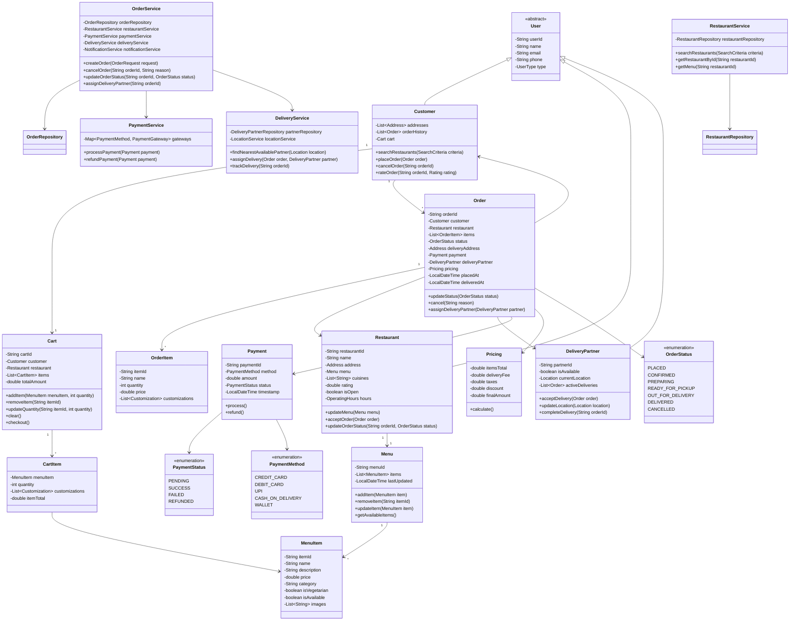
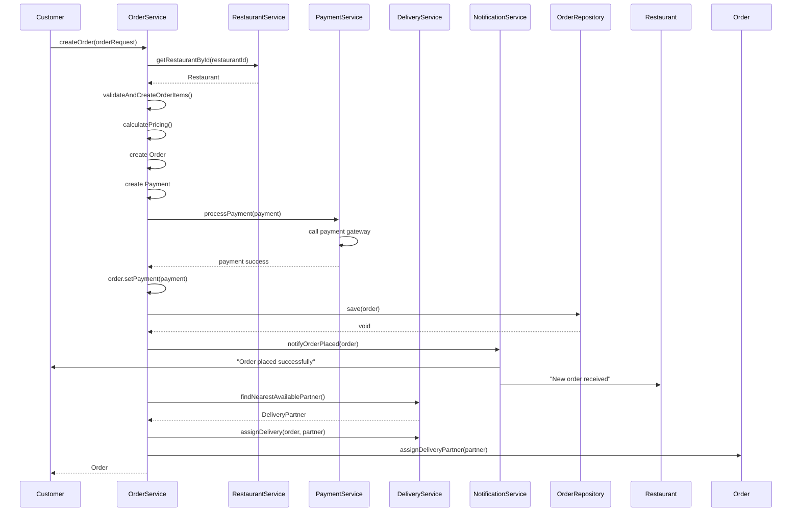
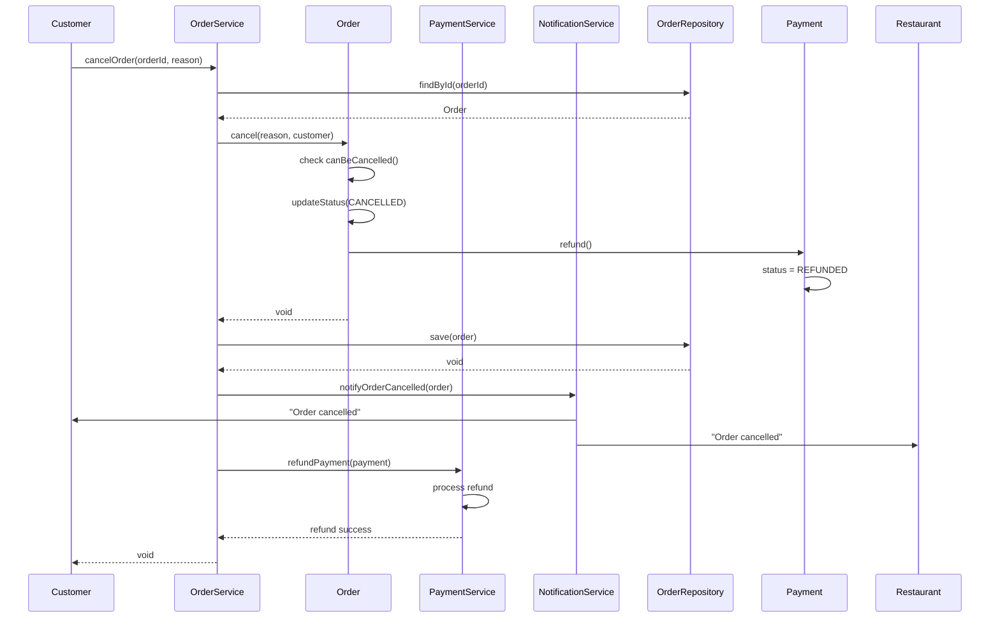
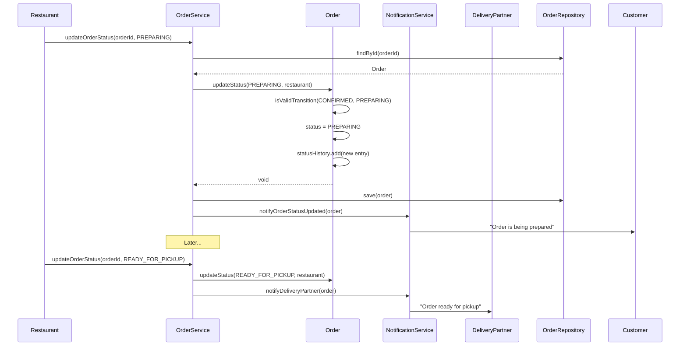
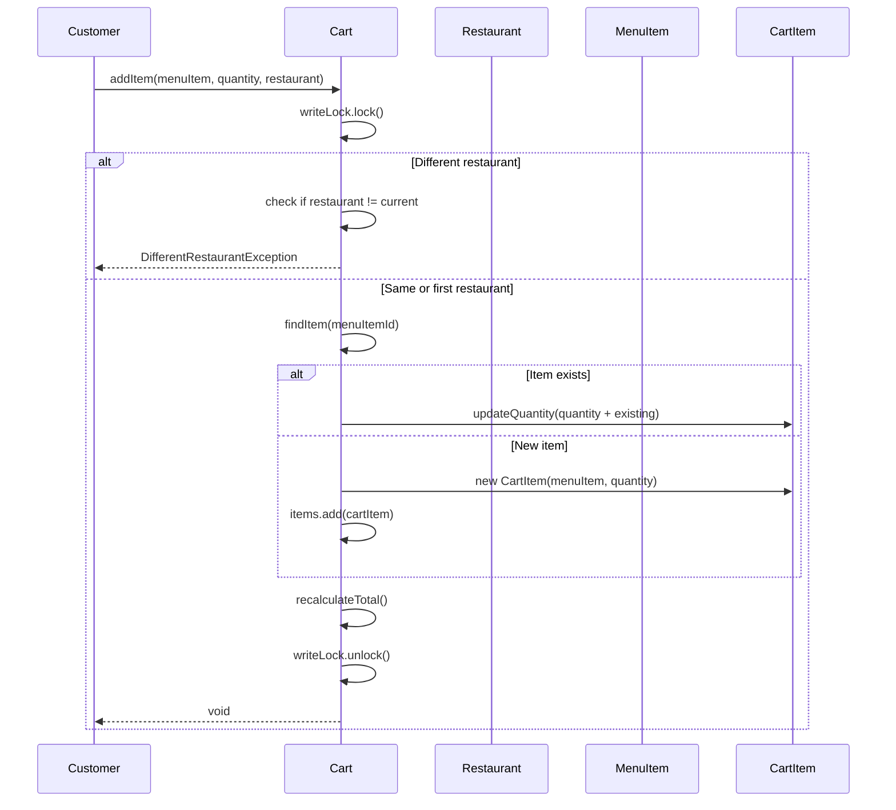

# Food Ordering System (Swiggy/Zomato) - Low Level Design

## Problem Statement
Design a food ordering platform like Swiggy/Zomato that allows customers to browse restaurants, view menus, place orders with multiple items, make payments, and handle order cancellations. The system should support restaurants, delivery partners, and customers.

## Requirements

### Functional Requirements
- User registration and authentication (Customer, Restaurant, Delivery Partner)
- Restaurant management (menu, availability, operating hours)
- Search and filter restaurants (cuisine, rating, price, delivery time)
- Browse menu and add items to cart
- Place order with multiple items
- Order pricing (item price, taxes, delivery fee, discounts)
- Payment processing (multiple payment methods)
- Order tracking (Placed, Confirmed, Preparing, Out for Delivery, Delivered)
- Order cancellation with refund handling
- Rating and review system
- Delivery partner assignment
- Real-time order status updates

### Non-Functional Requirements
- Handle 10K+ concurrent orders
- Low latency for search (<200ms)
- High availability (99.9%)
- Consistent pricing calculations
- Thread-safe inventory management
- Transaction integrity for payments

## Core Entities

### Class Diagram



## Design Patterns Used

1. **Factory Pattern**: Creating different user types, payment gateways
2. **Strategy Pattern**: Different payment methods, search strategies
3. **Observer Pattern**: Order status notifications
4. **State Pattern**: Order status transitions
5. **Repository Pattern**: Data access abstraction
6. **Builder Pattern**: Complex order creation
7. **Facade Pattern**: OrderService simplifies complex operations

## Key Implementation

### Order.java
```java
public class Order {
    private final String orderId;
    private final Customer customer;
    private final Restaurant restaurant;
    private final List<OrderItem> items;
    private OrderStatus status;
    private final Address deliveryAddress;
    private Payment payment;
    private DeliveryPartner deliveryPartner;
    private final Pricing pricing;
    private final LocalDateTime placedAt;
    private LocalDateTime deliveredAt;
    private String cancellationReason;
    private final List<OrderStatusHistory> statusHistory;

    private Order(Builder builder) {
        this.orderId = builder.orderId;
        this.customer = builder.customer;
        this.restaurant = builder.restaurant;
        this.items = builder.items;
        this.status = OrderStatus.PLACED;
        this.deliveryAddress = builder.deliveryAddress;
        this.pricing = builder.pricing;
        this.placedAt = LocalDateTime.now();
        this.statusHistory = new ArrayList<>();
        this.statusHistory.add(new OrderStatusHistory(status, placedAt));
    }

    public synchronized void updateStatus(OrderStatus newStatus, User updatedBy) {
        if (!isValidTransition(this.status, newStatus)) {
            throw new InvalidStatusTransitionException(
                "Cannot transition from " + this.status + " to " + newStatus
            );
        }

        this.status = newStatus;
        this.statusHistory.add(new OrderStatusHistory(newStatus, LocalDateTime.now()));

        if (newStatus == OrderStatus.DELIVERED) {
            this.deliveredAt = LocalDateTime.now();
        }
    }

    public synchronized void cancel(String reason, User cancelledBy) {
        if (!canBeCancelled()) {
            throw new OrderCancellationException("Order cannot be cancelled in status: " + status);
        }

        this.cancellationReason = reason;
        updateStatus(OrderStatus.CANCELLED, cancelledBy);

        if (payment != null && payment.getStatus() == PaymentStatus.SUCCESS) {
            payment.refund();
        }
    }

    private boolean canBeCancelled() {
        return status == OrderStatus.PLACED ||
               status == OrderStatus.CONFIRMED ||
               status == OrderStatus.PREPARING;
    }

    private boolean isValidTransition(OrderStatus current, OrderStatus next) {
        switch (current) {
            case PLACED:
                return next == OrderStatus.CONFIRMED || next == OrderStatus.CANCELLED;
            case CONFIRMED:
                return next == OrderStatus.PREPARING || next == OrderStatus.CANCELLED;
            case PREPARING:
                return next == OrderStatus.READY_FOR_PICKUP || next == OrderStatus.CANCELLED;
            case READY_FOR_PICKUP:
                return next == OrderStatus.OUT_FOR_DELIVERY;
            case OUT_FOR_DELIVERY:
                return next == OrderStatus.DELIVERED;
            default:
                return false;
        }
    }

    public void assignDeliveryPartner(DeliveryPartner partner) {
        if (this.deliveryPartner != null) {
            throw new IllegalStateException("Delivery partner already assigned");
        }
        this.deliveryPartner = partner;
    }

    public void setPayment(Payment payment) {
        this.payment = payment;
    }

    public static class Builder {
        private String orderId;
        private Customer customer;
        private Restaurant restaurant;
        private List<OrderItem> items;
        private Address deliveryAddress;
        private Pricing pricing;

        public Builder orderId(String orderId) {
            this.orderId = orderId;
            return this;
        }

        public Builder customer(Customer customer) {
            this.customer = customer;
            return this;
        }

        public Builder restaurant(Restaurant restaurant) {
            this.restaurant = restaurant;
            return this;
        }

        public Builder items(List<OrderItem> items) {
            this.items = items;
            return this;
        }

        public Builder deliveryAddress(Address deliveryAddress) {
            this.deliveryAddress = deliveryAddress;
            return this;
        }

        public Builder pricing(Pricing pricing) {
            this.pricing = pricing;
            return this;
        }

        public Order build() {
            if (orderId == null || customer == null || restaurant == null ||
                items == null || items.isEmpty()) {
                throw new IllegalStateException("Required fields missing");
            }
            return new Order(this);
        }
    }

    public String getOrderId() {
        return orderId;
    }

    public OrderStatus getStatus() {
        return status;
    }

    public Payment getPayment() {
        return payment;
    }

    public Pricing getPricing() {
        return pricing;
    }
}
```

### OrderService.java
```java
public class OrderService {
    private final OrderRepository orderRepository;
    private final RestaurantService restaurantService;
    private final PaymentService paymentService;
    private final DeliveryService deliveryService;
    private final NotificationService notificationService;
    private final InventoryService inventoryService;

    public OrderService(
            OrderRepository orderRepository,
            RestaurantService restaurantService,
            PaymentService paymentService,
            DeliveryService deliveryService,
            NotificationService notificationService,
            InventoryService inventoryService) {
        this.orderRepository = orderRepository;
        this.restaurantService = restaurantService;
        this.paymentService = paymentService;
        this.deliveryService = deliveryService;
        this.notificationService = notificationService;
        this.inventoryService = inventoryService;
    }

    public Order createOrder(OrderRequest request) {
        Restaurant restaurant = restaurantService.getRestaurantById(request.getRestaurantId());

        if (!restaurant.isOpen()) {
            throw new RestaurantClosedException("Restaurant is currently closed");
        }

        List<OrderItem> orderItems = validateAndCreateOrderItems(request.getCartItems(), restaurant);

        Pricing pricing = calculatePricing(orderItems, request.getDeliveryAddress());

        String orderId = generateOrderId();

        Order order = new Order.Builder()
            .orderId(orderId)
            .customer(request.getCustomer())
            .restaurant(restaurant)
            .items(orderItems)
            .deliveryAddress(request.getDeliveryAddress())
            .pricing(pricing)
            .build();

        Payment payment = new Payment.Builder()
            .paymentId(generatePaymentId())
            .amount(pricing.getFinalAmount())
            .method(request.getPaymentMethod())
            .build();

        try {
            paymentService.processPayment(payment);
            order.setPayment(payment);

            orderRepository.save(order);

            notifyOrderPlaced(order);

            assignDeliveryPartner(order.getOrderId());

            return order;

        } catch (PaymentFailedException e) {
            payment.setStatus(PaymentStatus.FAILED);
            throw new OrderCreationException("Payment failed: " + e.getMessage());
        }
    }

    public void cancelOrder(String orderId, String reason, User cancelledBy) {
        Order order = orderRepository.findById(orderId)
            .orElseThrow(() -> new OrderNotFoundException(orderId));

        order.cancel(reason, cancelledBy);
        orderRepository.save(order);

        notificationService.notifyOrderCancelled(order);

        if (order.getPayment() != null) {
            paymentService.refundPayment(order.getPayment());
        }
    }

    public void updateOrderStatus(String orderId, OrderStatus newStatus, User updatedBy) {
        Order order = orderRepository.findById(orderId)
            .orElseThrow(() -> new OrderNotFoundException(orderId));

        order.updateStatus(newStatus, updatedBy);
        orderRepository.save(order);

        notificationService.notifyOrderStatusUpdated(order);

        if (newStatus == OrderStatus.READY_FOR_PICKUP) {
            notifyDeliveryPartner(order);
        }
    }

    private List<OrderItem> validateAndCreateOrderItems(List<CartItem> cartItems, Restaurant restaurant) {
        List<OrderItem> orderItems = new ArrayList<>();

        for (CartItem cartItem : cartItems) {
            MenuItem menuItem = restaurant.getMenu().getItem(cartItem.getMenuItemId());

            if (menuItem == null) {
                throw new MenuItemNotFoundException(cartItem.getMenuItemId());
            }

            if (!menuItem.isAvailable()) {
                throw new MenuItemUnavailableException(menuItem.getName() + " is not available");
            }

            OrderItem orderItem = new OrderItem(
                menuItem.getItemId(),
                menuItem.getName(),
                cartItem.getQuantity(),
                menuItem.getPrice(),
                cartItem.getCustomizations()
            );

            orderItems.add(orderItem);
        }

        return orderItems;
    }

    private Pricing calculatePricing(List<OrderItem> items, Address deliveryAddress) {
        double itemsTotal = items.stream()
            .mapToDouble(item -> item.getPrice() * item.getQuantity())
            .sum();

        double deliveryFee = calculateDeliveryFee(deliveryAddress);
        double taxes = itemsTotal * 0.05;
        double discount = 0.0;

        return new Pricing(itemsTotal, deliveryFee, taxes, discount);
    }

    private double calculateDeliveryFee(Address address) {
        return 40.0;
    }

    private void assignDeliveryPartner(String orderId) {
        Order order = orderRepository.findById(orderId)
            .orElseThrow(() -> new OrderNotFoundException(orderId));

        DeliveryPartner partner = deliveryService.findNearestAvailablePartner(
            order.getDeliveryAddress().getLocation()
        );

        if (partner != null) {
            deliveryService.assignDelivery(order, partner);
            order.assignDeliveryPartner(partner);
            orderRepository.save(order);
        }
    }

    private void notifyOrderPlaced(Order order) {
        notificationService.notifyCustomer(order.getCustomer(), "Order placed successfully");
        notificationService.notifyRestaurant(order.getRestaurant(), "New order received");
    }

    private void notifyDeliveryPartner(Order order) {
        if (order.getDeliveryPartner() != null) {
            notificationService.notifyDeliveryPartner(
                order.getDeliveryPartner(),
                "Order ready for pickup"
            );
        }
    }

    private String generateOrderId() {
        return "ORD-" + System.currentTimeMillis();
    }

    private String generatePaymentId() {
        return "PAY-" + System.currentTimeMillis();
    }
}
```

### Cart.java
```java
public class Cart {
    private final String cartId;
    private final Customer customer;
    private Restaurant restaurant;
    private final List<CartItem> items;
    private double totalAmount;
    private final ReadWriteLock lock;

    public Cart(String cartId, Customer customer) {
        this.cartId = cartId;
        this.customer = customer;
        this.items = new ArrayList<>();
        this.totalAmount = 0.0;
        this.lock = new ReentrantReadWriteLock();
    }

    public void addItem(MenuItem menuItem, int quantity, Restaurant restaurant) {
        lock.writeLock().lock();
        try {
            if (this.restaurant != null && !this.restaurant.equals(restaurant)) {
                throw new DifferentRestaurantException("Cannot add items from different restaurants");
            }

            this.restaurant = restaurant;

            CartItem existingItem = findItem(menuItem.getItemId());

            if (existingItem != null) {
                existingItem.updateQuantity(existingItem.getQuantity() + quantity);
            } else {
                CartItem newItem = new CartItem(menuItem, quantity);
                items.add(newItem);
            }

            recalculateTotal();
        } finally {
            lock.writeLock().unlock();
        }
    }

    public void removeItem(String itemId) {
        lock.writeLock().lock();
        try {
            items.removeIf(item -> item.getMenuItem().getItemId().equals(itemId));
            recalculateTotal();

            if (items.isEmpty()) {
                restaurant = null;
            }
        } finally {
            lock.writeLock().unlock();
        }
    }

    public void updateQuantity(String itemId, int newQuantity) {
        lock.writeLock().lock();
        try {
            if (newQuantity <= 0) {
                removeItem(itemId);
                return;
            }

            CartItem item = findItem(itemId);
            if (item != null) {
                item.updateQuantity(newQuantity);
                recalculateTotal();
            }
        } finally {
            lock.writeLock().unlock();
        }
    }

    public void clear() {
        lock.writeLock().lock();
        try {
            items.clear();
            restaurant = null;
            totalAmount = 0.0;
        } finally {
            lock.writeLock().unlock();
        }
    }

    private CartItem findItem(String itemId) {
        return items.stream()
            .filter(item -> item.getMenuItem().getItemId().equals(itemId))
            .findFirst()
            .orElse(null);
    }

    private void recalculateTotal() {
        totalAmount = items.stream()
            .mapToDouble(CartItem::getItemTotal)
            .sum();
    }

    public List<CartItem> getItems() {
        lock.readLock().lock();
        try {
            return new ArrayList<>(items);
        } finally {
            lock.readLock().unlock();
        }
    }

    public double getTotalAmount() {
        return totalAmount;
    }

    public Restaurant getRestaurant() {
        return restaurant;
    }
}
```

### Payment.java
```java
public class Payment {
    private final String paymentId;
    private final PaymentMethod method;
    private final double amount;
    private PaymentStatus status;
    private final LocalDateTime timestamp;
    private String transactionId;
    private String refundId;

    private Payment(Builder builder) {
        this.paymentId = builder.paymentId;
        this.method = builder.method;
        this.amount = builder.amount;
        this.status = PaymentStatus.PENDING;
        this.timestamp = LocalDateTime.now();
    }

    public void process() {
        this.status = PaymentStatus.SUCCESS;
        this.transactionId = "TXN-" + UUID.randomUUID().toString();
    }

    public void fail() {
        this.status = PaymentStatus.FAILED;
    }

    public void refund() {
        if (this.status != PaymentStatus.SUCCESS) {
            throw new IllegalStateException("Cannot refund a non-successful payment");
        }

        this.status = PaymentStatus.REFUNDED;
        this.refundId = "REF-" + UUID.randomUUID().toString();
    }

    public static class Builder {
        private String paymentId;
        private PaymentMethod method;
        private double amount;

        public Builder paymentId(String paymentId) {
            this.paymentId = paymentId;
            return this;
        }

        public Builder method(PaymentMethod method) {
            this.method = method;
            return this;
        }

        public Builder amount(double amount) {
            this.amount = amount;
            return this;
        }

        public Payment build() {
            return new Payment(this);
        }
    }

    public void setStatus(PaymentStatus status) {
        this.status = status;
    }

    public PaymentStatus getStatus() {
        return status;
    }

    public String getPaymentId() {
        return paymentId;
    }
}
```

## Sequence Diagrams

### 1. Place Order Flow



### 2. Cancel Order Flow



### 3. Update Order Status Flow



### 4. Add to Cart Flow



## Database Schema

```sql
CREATE TABLE users (
    user_id VARCHAR(50) PRIMARY KEY,
    name VARCHAR(100) NOT NULL,
    email VARCHAR(100) UNIQUE NOT NULL,
    phone VARCHAR(20) NOT NULL,
    user_type VARCHAR(20) NOT NULL,
    created_at TIMESTAMP DEFAULT CURRENT_TIMESTAMP
);

CREATE TABLE restaurants (
    restaurant_id VARCHAR(50) PRIMARY KEY,
    name VARCHAR(100) NOT NULL,
    address_json JSON NOT NULL,
    cuisines JSON,
    rating DECIMAL(3,2),
    is_open BOOLEAN DEFAULT TRUE,
    operating_hours JSON,
    created_at TIMESTAMP DEFAULT CURRENT_TIMESTAMP,
    INDEX idx_rating (rating),
    INDEX idx_is_open (is_open)
);

CREATE TABLE menu_items (
    item_id VARCHAR(50) PRIMARY KEY,
    restaurant_id VARCHAR(50) NOT NULL,
    name VARCHAR(100) NOT NULL,
    description TEXT,
    price DECIMAL(10,2) NOT NULL,
    category VARCHAR(50),
    is_vegetarian BOOLEAN DEFAULT FALSE,
    is_available BOOLEAN DEFAULT TRUE,
    FOREIGN KEY (restaurant_id) REFERENCES restaurants(restaurant_id),
    INDEX idx_restaurant (restaurant_id),
    INDEX idx_category (category)
);

CREATE TABLE orders (
    order_id VARCHAR(50) PRIMARY KEY,
    customer_id VARCHAR(50) NOT NULL,
    restaurant_id VARCHAR(50) NOT NULL,
    delivery_partner_id VARCHAR(50),
    status VARCHAR(20) NOT NULL,
    delivery_address JSON NOT NULL,
    pricing JSON NOT NULL,
    placed_at TIMESTAMP NOT NULL,
    delivered_at TIMESTAMP,
    cancellation_reason TEXT,
    FOREIGN KEY (customer_id) REFERENCES users(user_id),
    FOREIGN KEY (restaurant_id) REFERENCES restaurants(restaurant_id),
    FOREIGN KEY (delivery_partner_id) REFERENCES users(user_id),
    INDEX idx_customer_status (customer_id, status),
    INDEX idx_restaurant_status (restaurant_id, status),
    INDEX idx_placed_at (placed_at)
);

CREATE TABLE order_items (
    id BIGINT AUTO_INCREMENT PRIMARY KEY,
    order_id VARCHAR(50) NOT NULL,
    item_id VARCHAR(50) NOT NULL,
    name VARCHAR(100) NOT NULL,
    quantity INT NOT NULL,
    price DECIMAL(10,2) NOT NULL,
    customizations JSON,
    FOREIGN KEY (order_id) REFERENCES orders(order_id),
    INDEX idx_order (order_id)
);

CREATE TABLE payments (
    payment_id VARCHAR(50) PRIMARY KEY,
    order_id VARCHAR(50) NOT NULL,
    method VARCHAR(20) NOT NULL,
    amount DECIMAL(10,2) NOT NULL,
    status VARCHAR(20) NOT NULL,
    transaction_id VARCHAR(100),
    refund_id VARCHAR(100),
    timestamp TIMESTAMP DEFAULT CURRENT_TIMESTAMP,
    FOREIGN KEY (order_id) REFERENCES orders(order_id),
    INDEX idx_order (order_id),
    INDEX idx_status (status)
);
```

## Thread Safety Considerations

1. **Synchronized Methods**: Order status updates
2. **ReadWriteLock**: Cart operations
3. **Atomic Operations**: Inventory management
4. **Transaction Isolation**: Payment processing
5. **Optimistic Locking**: Concurrent order updates

## Scalability Considerations

### Performance Optimization
- Cache restaurant and menu data
- Index on frequently queried fields
- Async notifications
- Database connection pooling

### Horizontal Scaling
- Microservices architecture (Order, Restaurant, Delivery, Payment)
- Message queue for order processing
- Event-driven architecture
- Database sharding by restaurant_id or customer_id

### High Availability
- Load balancing
- Database replication
- Circuit breaker for external services
- Retry mechanism for failed operations
