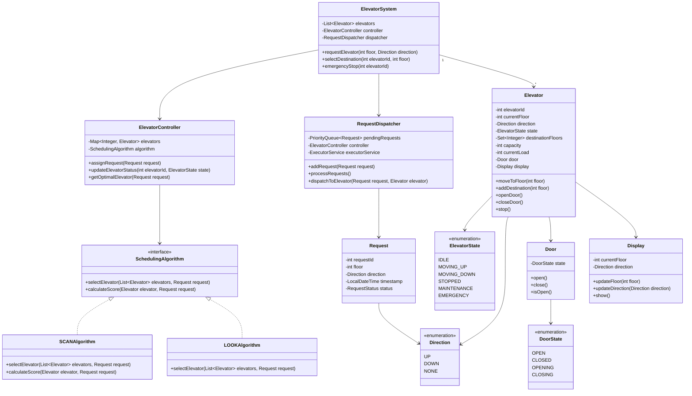
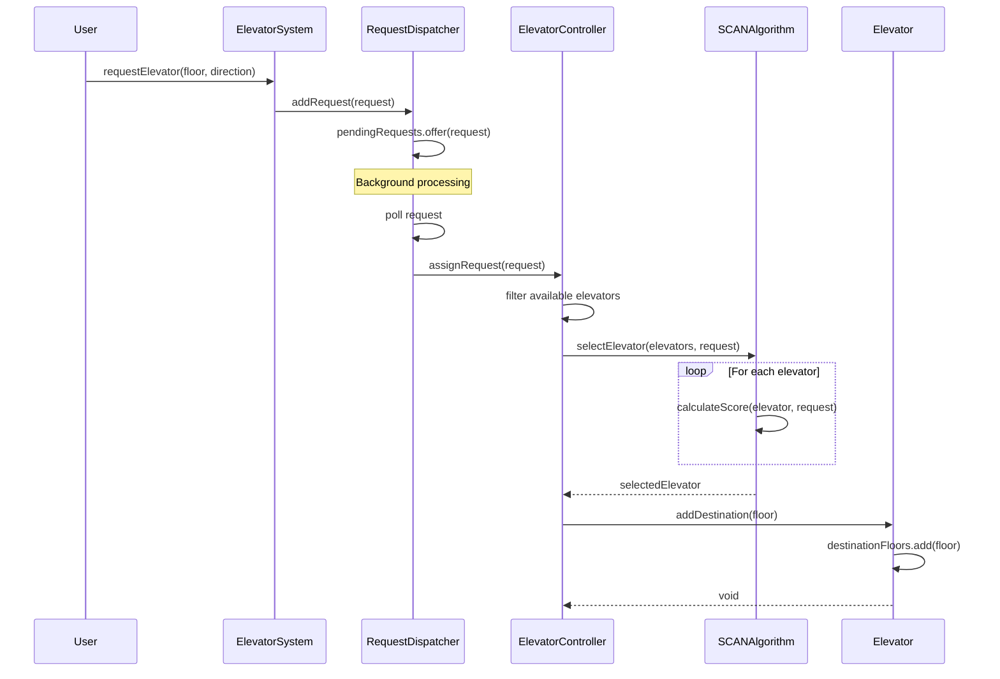
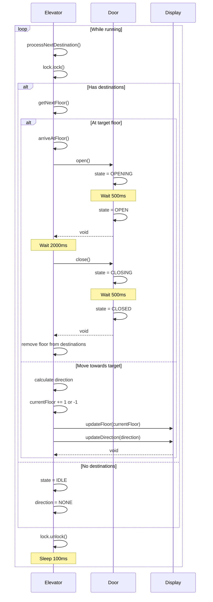
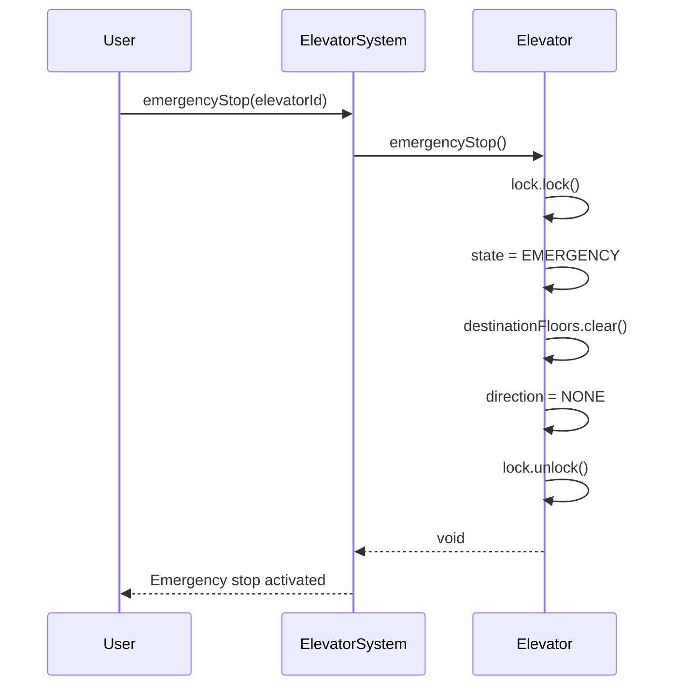

# Elevator System - Low Level Design

## Problem Statement
Design an elevator control system for a multi-story building with multiple elevators. The system should efficiently handle requests, optimize for minimal wait time, and manage elevator movement and door operations.

## Requirements

### Functional Requirements
- Multiple elevators in a building
- Request elevator from any floor (up/down)
- Select destination floor from inside elevator
- Door open/close operations
- Emergency stop functionality
- Display current floor and direction
- Load capacity management
- Maintenance mode support

### Non-Functional Requirements
- Minimize average wait time
- Optimize energy consumption
- Handle concurrent requests
- Thread-safe operations
- Fair distribution of requests
- Support 10+ elevators and 100+ floors

## Core Entities

### Class Diagram



## Design Patterns Used

1. **Strategy Pattern**: Different scheduling algorithms (SCAN, LOOK, FCFS)
2. **State Pattern**: Elevator states and door states
3. **Observer Pattern**: Notify when elevator arrives at floor
4. **Singleton Pattern**: ElevatorSystem instance
5. **Command Pattern**: Elevator requests as commands
6. **Factory Pattern**: Creating scheduling algorithms

## Key Implementation

### Elevator.java
```java
public class Elevator implements Runnable {
    private final int elevatorId;
    private volatile int currentFloor;
    private volatile Direction direction;
    private volatile ElevatorState state;
    private final Set<Integer> destinationFloors;
    private final int capacity;
    private int currentLoad;
    private final Door door;
    private final Display display;
    private final ReentrantLock lock;
    private final Thread elevatorThread;
    private volatile boolean running;

    public Elevator(int elevatorId, int initialFloor, int capacity) {
        this.elevatorId = elevatorId;
        this.currentFloor = initialFloor;
        this.direction = Direction.NONE;
        this.state = ElevatorState.IDLE;
        this.destinationFloors = new TreeSet<>();
        this.capacity = capacity;
        this.currentLoad = 0;
        this.door = new Door();
        this.display = new Display();
        this.lock = new ReentrantLock();
        this.running = true;
        this.elevatorThread = new Thread(this, "Elevator-" + elevatorId);
        this.elevatorThread.start();
    }

    @Override
    public void run() {
        while (running) {
            try {
                processNextDestination();
                Thread.sleep(100);
            } catch (InterruptedException e) {
                Thread.currentThread().interrupt();
                break;
            }
        }
    }

    private void processNextDestination() {
        lock.lock();
        try {
            if (destinationFloors.isEmpty()) {
                if (state != ElevatorState.IDLE) {
                    state = ElevatorState.IDLE;
                    direction = Direction.NONE;
                    display.updateDirection(direction);
                }
                return;
            }

            int nextFloor = getNextFloor();

            if (nextFloor == currentFloor) {
                arriveAtFloor();
                destinationFloors.remove(currentFloor);
            } else {
                moveTowards(nextFloor);
            }

        } finally {
            lock.unlock();
        }
    }

    private int getNextFloor() {
        if (direction == Direction.UP) {
            return destinationFloors.stream()
                .filter(floor -> floor >= currentFloor)
                .min(Integer::compareTo)
                .orElseGet(() -> destinationFloors.stream()
                    .max(Integer::compareTo)
                    .orElse(currentFloor));
        } else if (direction == Direction.DOWN) {
            return destinationFloors.stream()
                .filter(floor -> floor <= currentFloor)
                .max(Integer::compareTo)
                .orElseGet(() -> destinationFloors.stream()
                    .min(Integer::compareTo)
                    .orElse(currentFloor));
        } else {
            return destinationFloors.stream()
                .min(Comparator.comparingInt(f -> Math.abs(f - currentFloor)))
                .orElse(currentFloor);
        }
    }

    private void moveTowards(int targetFloor) {
        if (targetFloor > currentFloor) {
            direction = Direction.UP;
            state = ElevatorState.MOVING_UP;
        } else {
            direction = Direction.DOWN;
            state = ElevatorState.MOVING_DOWN;
        }

        currentFloor += (targetFloor > currentFloor) ? 1 : -1;
        display.updateFloor(currentFloor);
        display.updateDirection(direction);

        System.out.println("Elevator " + elevatorId + " moving " + direction +
                          " to floor " + currentFloor);

        if (destinationFloors.contains(currentFloor)) {
            arriveAtFloor();
            destinationFloors.remove(currentFloor);
        }
    }

    private void arriveAtFloor() {
        state = ElevatorState.STOPPED;
        System.out.println("Elevator " + elevatorId + " arrived at floor " + currentFloor);

        door.open();

        try {
            Thread.sleep(2000);
        } catch (InterruptedException e) {
            Thread.currentThread().interrupt();
        }

        door.close();
    }

    public void addDestination(int floor) {
        lock.lock();
        try {
            if (floor < 0 || state == ElevatorState.MAINTENANCE || state == ElevatorState.EMERGENCY) {
                return;
            }

            destinationFloors.add(floor);

            if (direction == Direction.NONE) {
                if (floor > currentFloor) {
                    direction = Direction.UP;
                } else if (floor < currentFloor) {
                    direction = Direction.DOWN;
                }
            }

            System.out.println("Elevator " + elevatorId + " added destination: floor " + floor);
        } finally {
            lock.unlock();
        }
    }

    public void emergencyStop() {
        lock.lock();
        try {
            state = ElevatorState.EMERGENCY;
            destinationFloors.clear();
            direction = Direction.NONE;
            System.out.println("Elevator " + elevatorId + " EMERGENCY STOP at floor " + currentFloor);
        } finally {
            lock.unlock();
        }
    }

    public void setMaintenanceMode(boolean maintenance) {
        lock.lock();
        try {
            if (maintenance) {
                state = ElevatorState.MAINTENANCE;
                destinationFloors.clear();
            } else {
                state = ElevatorState.IDLE;
            }
        } finally {
            lock.unlock();
        }
    }

    public boolean canTakeRequest(int floor, Direction requestDirection) {
        lock.lock();
        try {
            if (state == ElevatorState.MAINTENANCE || state == ElevatorState.EMERGENCY) {
                return false;
            }

            if (state == ElevatorState.IDLE) {
                return true;
            }

            if (direction == requestDirection) {
                if (direction == Direction.UP && floor >= currentFloor) {
                    return true;
                }
                if (direction == Direction.DOWN && floor <= currentFloor) {
                    return true;
                }
            }

            return false;
        } finally {
            lock.unlock();
        }
    }

    public int calculateDistance(int floor) {
        return Math.abs(currentFloor - floor);
    }

    public void shutdown() {
        running = false;
        elevatorThread.interrupt();
    }

    public int getElevatorId() {
        return elevatorId;
    }

    public int getCurrentFloor() {
        return currentFloor;
    }

    public Direction getDirection() {
        return direction;
    }

    public ElevatorState getState() {
        return state;
    }

    public Set<Integer> getDestinationFloors() {
        lock.lock();
        try {
            return new TreeSet<>(destinationFloors);
        } finally {
            lock.unlock();
        }
    }
}
```

### ElevatorController.java
```java
public class ElevatorController {
    private final Map<Integer, Elevator> elevators;
    private final SchedulingAlgorithm algorithm;
    private final ReadWriteLock lock;

    public ElevatorController(List<Elevator> elevatorList, SchedulingAlgorithm algorithm) {
        this.elevators = new ConcurrentHashMap<>();
        for (Elevator elevator : elevatorList) {
            elevators.put(elevator.getElevatorId(), elevator);
        }
        this.algorithm = algorithm;
        this.lock = new ReentrantReadWriteLock();
    }

    public void assignRequest(Request request) {
        lock.readLock().lock();
        try {
            List<Elevator> availableElevators = elevators.values().stream()
                .filter(e -> e.getState() != ElevatorState.MAINTENANCE &&
                           e.getState() != ElevatorState.EMERGENCY)
                .collect(Collectors.toList());

            if (availableElevators.isEmpty()) {
                System.out.println("No elevators available for request at floor " + request.getFloor());
                return;
            }

            Elevator selectedElevator = algorithm.selectElevator(availableElevators, request);

            if (selectedElevator != null) {
                selectedElevator.addDestination(request.getFloor());
                request.setStatus(RequestStatus.ASSIGNED);
                System.out.println("Request at floor " + request.getFloor() +
                                 " assigned to Elevator " + selectedElevator.getElevatorId());
            }

        } finally {
            lock.readLock().unlock();
        }
    }

    public Elevator getElevator(int elevatorId) {
        return elevators.get(elevatorId);
    }

    public List<Elevator> getAllElevators() {
        return new ArrayList<>(elevators.values());
    }

    public void updateElevatorStatus(int elevatorId, ElevatorState state) {
        Elevator elevator = elevators.get(elevatorId);
        if (elevator != null) {
            System.out.println("Elevator " + elevatorId + " status updated to " + state);
        }
    }
}
```

### SCANAlgorithm.java
```java
public class SCANAlgorithm implements SchedulingAlgorithm {

    @Override
    public Elevator selectElevator(List<Elevator> elevators, Request request) {
        return elevators.stream()
            .min(Comparator.comparingDouble(e -> calculateScore(e, request)))
            .orElse(null);
    }

    @Override
    public double calculateScore(Elevator elevator, Request request) {
        int distance = elevator.calculateDistance(request.getFloor());
        ElevatorState state = elevator.getState();
        Direction elevatorDir = elevator.getDirection();
        Direction requestDir = request.getDirection();

        double score = distance;

        if (state == ElevatorState.IDLE) {
            return score;
        }

        if (elevatorDir == requestDir) {
            if (elevatorDir == Direction.UP && request.getFloor() >= elevator.getCurrentFloor()) {
                score *= 0.5;
            } else if (elevatorDir == Direction.DOWN && request.getFloor() <= elevator.getCurrentFloor()) {
                score *= 0.5;
            } else {
                score *= 1.5;
            }
        } else {
            score *= 2.0;
        }

        score += elevator.getDestinationFloors().size() * 2;

        return score;
    }
}
```

### RequestDispatcher.java
```java
public class RequestDispatcher {
    private final PriorityQueue<Request> pendingRequests;
    private final ElevatorController controller;
    private final ExecutorService executorService;
    private final ReentrantLock lock;
    private volatile boolean running;

    public RequestDispatcher(ElevatorController controller) {
        this.pendingRequests = new PriorityQueue<>(
            Comparator.comparing(Request::getTimestamp)
        );
        this.controller = controller;
        this.executorService = Executors.newSingleThreadExecutor();
        this.lock = new ReentrantLock();
        this.running = true;

        executorService.submit(this::processRequests);
    }

    public void addRequest(Request request) {
        lock.lock();
        try {
            pendingRequests.offer(request);
            request.setStatus(RequestStatus.PENDING);
            System.out.println("Added request: Floor " + request.getFloor() +
                             ", Direction: " + request.getDirection());
        } finally {
            lock.unlock();
        }
    }

    private void processRequests() {
        while (running) {
            try {
                Request request = null;

                lock.lock();
                try {
                    if (!pendingRequests.isEmpty()) {
                        request = pendingRequests.poll();
                    }
                } finally {
                    lock.unlock();
                }

                if (request != null) {
                    controller.assignRequest(request);
                }

                Thread.sleep(500);

            } catch (InterruptedException e) {
                Thread.currentThread().interrupt();
                break;
            }
        }
    }

    public void shutdown() {
        running = false;
        executorService.shutdown();
    }
}
```

### Door.java
```java
public class Door {
    private volatile DoorState state;
    private final ReentrantLock lock;

    public Door() {
        this.state = DoorState.CLOSED;
        this.lock = new ReentrantLock();
    }

    public void open() {
        lock.lock();
        try {
            if (state == DoorState.CLOSED) {
                state = DoorState.OPENING;
                System.out.println("Door opening...");

                try {
                    Thread.sleep(500);
                } catch (InterruptedException e) {
                    Thread.currentThread().interrupt();
                }

                state = DoorState.OPEN;
                System.out.println("Door open");
            }
        } finally {
            lock.unlock();
        }
    }

    public void close() {
        lock.lock();
        try {
            if (state == DoorState.OPEN) {
                state = DoorState.CLOSING;
                System.out.println("Door closing...");

                try {
                    Thread.sleep(500);
                } catch (InterruptedException e) {
                    Thread.currentThread().interrupt();
                }

                state = DoorState.CLOSED;
                System.out.println("Door closed");
            }
        } finally {
            lock.unlock();
        }
    }

    public boolean isOpen() {
        return state == DoorState.OPEN;
    }

    public DoorState getState() {
        return state;
    }
}
```

### ElevatorSystem.java
```java
public class ElevatorSystem {
    private static ElevatorSystem instance;
    private final List<Elevator> elevators;
    private final ElevatorController controller;
    private final RequestDispatcher dispatcher;
    private final int totalFloors;

    private ElevatorSystem(int numElevators, int totalFloors, int capacity) {
        this.totalFloors = totalFloors;
        this.elevators = new ArrayList<>();

        for (int i = 0; i < numElevators; i++) {
            Elevator elevator = new Elevator(i + 1, 0, capacity);
            elevators.add(elevator);
        }

        SchedulingAlgorithm algorithm = new SCANAlgorithm();
        this.controller = new ElevatorController(elevators, algorithm);
        this.dispatcher = new RequestDispatcher(controller);
    }

    public static synchronized ElevatorSystem getInstance(int numElevators, int totalFloors, int capacity) {
        if (instance == null) {
            instance = new ElevatorSystem(numElevators, totalFloors, capacity);
        }
        return instance;
    }

    public void requestElevator(int floor, Direction direction) {
        if (floor < 0 || floor >= totalFloors) {
            throw new IllegalArgumentException("Invalid floor: " + floor);
        }

        Request request = new Request(floor, direction);
        dispatcher.addRequest(request);
    }

    public void selectDestination(int elevatorId, int floor) {
        if (floor < 0 || floor >= totalFloors) {
            throw new IllegalArgumentException("Invalid floor: " + floor);
        }

        Elevator elevator = controller.getElevator(elevatorId);
        if (elevator != null) {
            elevator.addDestination(floor);
        }
    }

    public void emergencyStop(int elevatorId) {
        Elevator elevator = controller.getElevator(elevatorId);
        if (elevator != null) {
            elevator.emergencyStop();
        }
    }

    public void setMaintenanceMode(int elevatorId, boolean maintenance) {
        Elevator elevator = controller.getElevator(elevatorId);
        if (elevator != null) {
            elevator.setMaintenanceMode(maintenance);
        }
    }

    public void shutdown() {
        dispatcher.shutdown();
        for (Elevator elevator : elevators) {
            elevator.shutdown();
        }
    }

    public List<Elevator> getElevators() {
        return new ArrayList<>(elevators);
    }
}
```

## Sequence Diagrams

### 1. Request Elevator Flow



### 2. Elevator Movement Flow



### 3. Emergency Stop Flow



## Thread Safety Considerations

1. **ReentrantLock**: In Elevator for destination management
2. **Volatile Fields**: For state, direction, currentFloor
3. **ConcurrentHashMap**: For elevator storage in controller
4. **ReadWriteLock**: In controller for concurrent access
5. **Synchronized Collections**: TreeSet wrapped for destinations
6. **Thread per Elevator**: Each elevator runs in separate thread

## Optimization Strategies

### SCAN Algorithm Benefits
- Serves requests in current direction first
- Reduces back-and-forth movement
- Better average wait time

### Performance Optimizations
- Anticipatory scheduling (predict future requests)
- Group nearby requests
- Prefer elevators already moving in request direction
- Load balancing across elevators

## Usage Example

```java
public class ElevatorSystemDemo {
    public static void main(String[] args) throws InterruptedException {
        ElevatorSystem system = ElevatorSystem.getInstance(3, 20, 10);

        system.requestElevator(5, Direction.UP);
        system.requestElevator(3, Direction.DOWN);
        system.requestElevator(7, Direction.UP);

        Thread.sleep(2000);

        system.selectDestination(1, 10);

        Thread.sleep(30000);

        system.shutdown();
    }
}
```

## Scalability Considerations

- Support for multiple buildings/zones
- Distributed elevator control
- ML-based predictive algorithms
- Real-time monitoring and analytics
